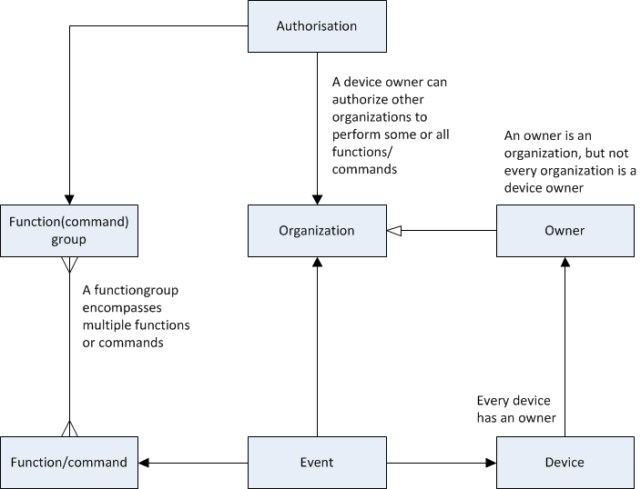

## Logical Authorisation Data Model

#### Authentication of open smart grid platform

The Open Smart Grid Platform contains an extensive authorization model, which enables a device owner to give certain rights on certain devices to other organizations. Every organization will only see devices they have rights to.

This model displays the most important entities of the open smart grid platform system and their mutual relationships.

_Image of Logical Authorisation Data Model_
 

The logic of the model above:

At the top of the image is the entity "authorisation". This represents the permissions of an organization on a certain device. In general an organisation will have a lot of permissions, at least one for each device it needs to manage.

The functions an organisation can execute on a device are determined by the function group the authorisation refers to. Function groups are collections of functions and are predefined in the software. The following function groups have been predefined.

- Owner-group (this contains all functions)
- Ad hoc-group (Functions for ad hoc switching of lighting)
- Management-group (Platform functions)
- Installation-group (Functions to install devices)
- Firmware-group (Functions for updating firmware)
- Schedule-group (Functions to create lighting schedules)
- Tariff scheme-group (Functions to create tariff groups)
- Configuration-group (Functions to configure devices)
- Monitoring-group (Functions to monitor devices)

This structure provides maximum flexibility when assigning rights to devices. Devices always belong to an Owner. An owner is an organisation, but not every organisation is an owner. The entity "Event", at the bottom of the image, is the execution of a function by an organisation on a device.

Details like device-type, device-status etcetera have been omitted in this model.

One security requirement is that each event must be traced back to a 'natural'  person, also known as an audit trail. Although the open smart grid platform does not register individual users we can meet this requirement by registering a data-item with each event. This enables the user organisation to investigate which events belongs to which 'natural' person. This data-item can for example be an user-ID provided by the user-organisation which doesn't have to be unique in the open smart grid platform.

Table describing the entities in the logical data-model

| **Entity** | **Description** |
| --- | --- |
| authorization | Authorization – Permissions of an organisation to execute a certain function  (member of a role) on a certain device |
| device | Electronics present in a "container" (for example a lamp post), connecting to the open smart grid platform  and (in case of a lamp post) controls the lights. One device has one owner. |
| audit trail | The actions of an organization on a device. A combination of [time, organization, function and device]. |
| function | An end-to-end operation. For example "set schedule". A function belongs to multiple function groups. |
| function group | Usually this will be larger groups than the "function clusters" in this document. All functions available to end users could be in a single group for example. |
| organization | A party playing a role in the management and control of the devices, for example municipalities. |
| owner | An organization role. Each device has an owner. |
| event | An event reported by the device (which is not the action of a natural person) for example an error or security problem. |

An organization can get rights from the device owner to specific functions of a device, for instance reading value _x_ on device _y_. Every other function of the device has to offer will not be available to this organization.

To ensure that devices can only receive instructions from a 'genuine' open smart grid platform it must be possible to authenticate the open smart grid platform. This is implemented through a standard technology based on asymmetric encryption. The open smart grid platform will receive an unique key to enable the devices to tell if the messages come from a 'genuine' open smart grid platform. To prevent replay-attacks each message will get an index number (this is standard practice as well).

#### Authentication of devices

To make sure the open smart grid platform can distinguish between 'genuine' devices and 'illegal' devices all devices are supplied with a manufacturer key. Each device has an unique key. Because of the asymmetrical encryption the platform contains the public part of each key. In this way devices can be identified by their unique key and their unique hardware ID. The device-ID will be encrypted in each message sent from the device to the platform.

All communication between the open smart grid platform and the devices will be signed with these keys to ensure (1) the source is legitimate and (2) to ensure the integrity of the message. It is not necessary to encrypt the whole message because confidentiality is not important. This results in a less computationally intensive process.

When a key is stolen (by hacking a device) this will not affect the integrity of the other devices. Each device has an unique key after all and only the hacked device has to be excluded from communicating in the platform.

The security is independent from the carrier (GPRS, CDMA, Ethernet, etc.). The open smart grid platform supports symmetric and asymmetric encryption (depends on device and protocol).

The firmware will be used to distribute keys to devices. In this way we can use the existing secure firmware update mechanism for updating keys and certificates.

#### Authorisation of organisations

Authorisation for use of the platform functionalities is handled by roles. Roles are defined for both platform functionality and device functionality. Each role has one or more functions. Access to device functions can be set per device. The tables below respectively show an overview of all device-roles and device-functions and platform-roles and platform-functions.

|   | **Roles** |
| --- | --- |
| **Functions** | OWNER | INSTALLATION | AD\_HOC | MANAGEMENT | FIRMWARE | SCHEDULING | TARIFF\_SCHEDULING | CONFIGURATION | MONITORING |
| GET\_DEVICE\_AUTHORISATION | X | X | X | X | X | X | X | X | X |
| SET\_DEVICE\_AUTHORISATION | X |   |   |   |   |   |   |   |   |
| START\_SELF\_TEST | X | X |   |   |   |   |   |   |   |
| STOP\_SELF\_TEST | X | X |   |   |   |   |   |   |   |
| SET\_LIGHT | X |   | X |   |   |   |   |   |   |
| GET\_STATUS | X |   | X |   |   |   |   |   |   |
| RESUME\_SCHEDULE | X |   | X |   |   |   |   |   |   |
| SET\_REBOOT | X |   | X |   |   |   |   |   |   |
| SET\_TRANSITION | X |   | X |   |   |   |   |   |   |
| SET\_EVENT\_NOTIFICATIONS | X |   |   | X |   |   |   |   |   |
| GET\_EVENT\_NOTIFICATIONS | X |   |   | X |   |   |   |   |   |
| REMOVE\_DEVICE | X |   |   | X |   |   |   |   |   |
| UPDATE\_FIRMWARE | X |   |   |   | X |   |   |   |   |
| GET\_FIRMWARE\_VERSION | X |   |   |   | X |   |   |   |   |
| SET\_SCHEDULE | X |   |   |   |   | X |   |   |   |
| SET\_TARIFF\_SCHEDULE | X |   |   |   |   |   | X |   |   |
| SET\_CONFIGURATION | X |   |   |   |   |   |   | x |   |
| GET\_CONFIGURATION | X |   |   |   |   |   |   | X |   |
| GET\_ACTUAL\_POWER\_USAGE | X |   |   |   |   |   |   |   | X |
| GET\_POWER\_USAGE\_HISTORY | X |   |   |   |   |   |   |   | X |

|   | **Roles** |
| --- | --- |
| **Functions** | ADMIN | USER |
| CREATE\_ORGANISATION | X |   |
| GET\_ORGANISATIONS | X | X |
| GET\_DEVICE\_NO\_OWNER | X |   |
| GET\_MESSAGES | X |   |
| FIND\_DEVICES | X |   |
| SET\_OWNER | X |   |