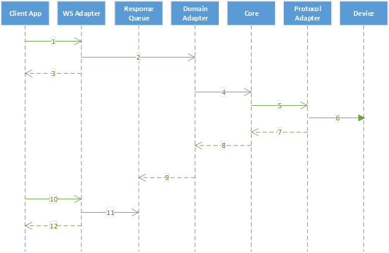

# Messageflow examples 
This are some examples how a message flows in the Open Smart Grid Platform.

## Message Flow:  Request/Acknowledge/Poll

 

| **Step**  | **Description** |
| --- | --- |
| 1 | WS adapter receives client soap request with organization certificate and organization id in soap header |
| 2 | WS adapter authenticates organization, checks authorizations and sends request message to domain adapter (via queue) |
| 3 | WS adapter returns soap acknowledgement with correlation id |
| 4 | Domain adapter sends request message to core (via queue) |
| 5 | Core determines protocol for device and sends request message to protocol adapter (via queue) |  
| 6 | Protocol adapter translates domain request message, sends request to device and receives response from device | 
| 7 | Protocol adapter sends response message to core (via queue) |  
| 8 | Core forwards response message to domain adapter (via queue) |
| 9 | Domain adapter forwards response message to response queue |  
| 10 | Client app polls for response using correlation id (with organization certificate and organization id in soap header) | 
| 11 | WS adapter retrieves response message from response queue |
| 12 | WS adapter sends soap response to client app |

## Message Flow: Request/Acknowledge/Notify

 

| **Step**  | **Description** |
| --- | --- |
| 1-8 | Same as request/acknowledge/poll message flow |
| 9 | Domain adapter forwards response message to WS adapter |  
| 10 | WS adapter stores response in DB | 
| 11 | WS adapter sends soap notification with correlation id to client app |
| 12 | Client app sends soap request with correlation id to retrieve the response |
| 13 | WS adapter retrieves (and deletes) response from DB |
| 14 | WS adapter sends soap response to client app |

*In case the response is not timely retrieved by the client app, OSGP will resend the notification with correlation id to the client app. The amount of retries is configurable. 
