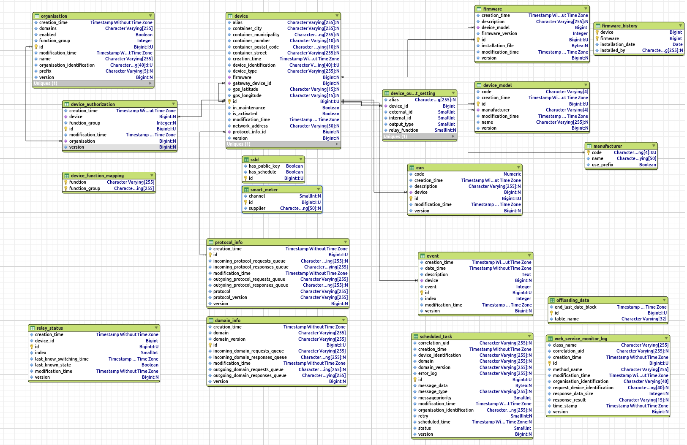
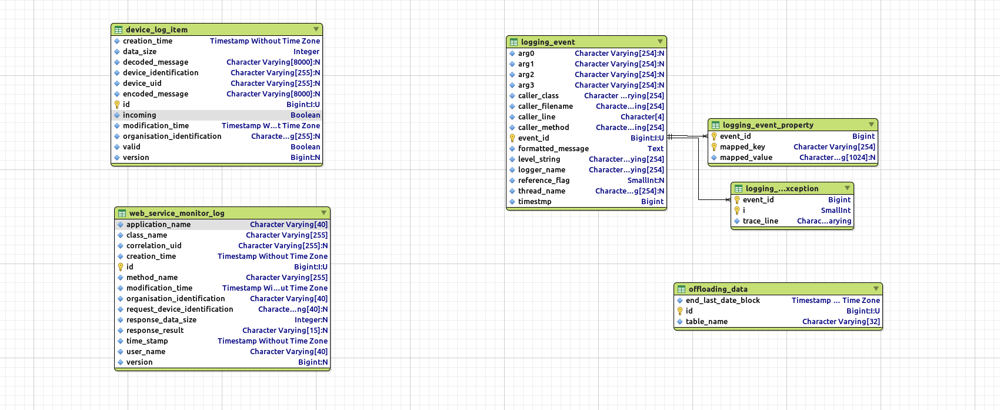
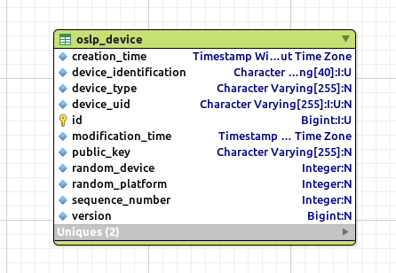

## 1.3 Description of each of the platform components

### 1.3.1 Application Layering

The use of layers improves the separation of responsibilities. Each application contains the following layers:

- Presentation layer: responsible for providing information to users (persons and/or systems) and the handling of user requests
- Application layer: responsible for executing system tasks including authorization control
- Domain layer: responsible for the representation of the problem domain.
- Infrastructure: responsible for technical matters supporting other layers. For instance persistence, messaging, etc

**Layers:**
 

1. Audit logger
2. Webservices
3. Functions
4. Queue
5. Worklow engine
6. Protocol framework
7. Protocol implementations
8. Workflow engine
9. Queue
10. Communication

### 1.3.2 HTTPS/SOAP communication

The web server is configured with a SSL certificate to encrypt the incoming and outgoing communication. The SOAP Web service (Spring Framework web service) uses a Java Keystore and a certificate for each organization. Only organizations that are know within the platform and are authorized to use the web service.

### 1.3.3 Web services per functional domain

For the several functional domains separate SOAP Web services are offered. This separation offers authorization per functional domain. Each of the web service components send a queue message to the corresponding domain component.

WSDL
A separate WSDL is implemented for each functional cluster. All SOAP operations have a request object parameter and return a response object. For Synchronized Webservices  the result is immediately included in the response.
For asynchronous web services the response contains a correlation ID. This Correlation ID  is to be used by the requester to receive the actual result from the platform. The following diagram is an example of such an asynchronous request.

Furthermore each SOAP message has a header which contains the user's organisation ID. This table displays an overview of the WSDL's including operations and fields in the request and response objects.

### 1.3.4 Business logic

For each functional domain business logic is implemented using a separate domain component. Common functionality like authorization should be abstracted to a shared component. Domain components receive queue messages from web service components and send queue messages to the OSGP core component.

More information on the specific domains can be found in the [domain chapter](/Domains/README.md)

### 1.3.5 Core

The OSGP core component receives queue messages from domain components. These messages from domain components are forwarded to a protocol adapter project. The OSGP core component also offers logic for a protocol adapter project to send the response of a smart device back to a domain project.
The Core component routes messages from domain adapter components to protocol adapter components and vice versa.

The internal datamodel in the Core layer:

### 1.3.6 Open protocols

The open smart grid platform supports multiple protocols.

- OSLP (Open Street Light Protocol)
- DLMS/COSEM
- IEC61850

The protocols can use of the of the security layers:
- TLS (Transport Layer Security encryption)
- SSL (Secure Sockets Layer encryption)

Other protocols can easily be added to the platform. Protocols based on open standards are prefered (if possible).
A full list of current supported protocols can be found in the [protocols chapter](/Protocols/README.md).

### 1.3.7 Smart devices

The open smart grid platform can connect to any device as long as the device supports one of the supported protocols.
Smart devices can receive messages from or send messages to protocol adapter components. In case of SSLD's this is done using TCP/IP over mobile internet connections (GPRS/CDMA). The communication is encrypted using public key cryptography.
