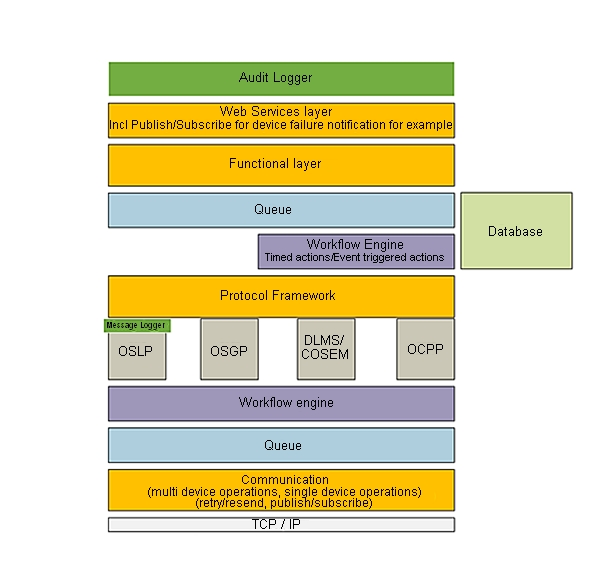

## 1.5 Description of each of the platform components

### 1.5.1 Application Layering

The use of layers improves the separation of responsibilities. Each application contains the following layers:

- Presentation layer: responsible for providing information to users (persons and/or systems) and the handling of user requests
- Application layer: responsible for executing system tasks including authorization control
- Domain layer: responsible for the representation of the problem domain.
- Infrastructure: responsible for technical matters supporting other layers. For instance persistence, messaging, etc

**Layers:**
 

1. Audit logger
2. Webservices
3. Functions
4. Queue
5. Worklow engine
6. Protocol framework
7. Protocol implementations
8. Workflow engine
9. Queue
10. Communication

### 1.5.2 HTTPS/SOAP communication

The web server is configured with a SSL certificate to encrypt the incoming and outgoing communication. The SOAP Web service (Spring Framework web service) uses a Java Keystore and a certificate for each organization. Only organizations that are know within the platform and are authorized to use the web service.

### 1.5.3 Web services per functional domain

For the several functional domains separate SOAP Web services are offered. This separation offers authorization per functional domain. Each of the web service components send a queue message to the corresponding domain component.

### 1.5.4 Business logic

For each functional domain business logic is implemented using a separate domain component. Common functionality like authorization should be abstracted to a shared component. Domain components receive queue messages from web service components and send queue messages to the OSGP core component.

### 1.5.5 Core

The OSGP core component receives queue messages from domain components. These messages from domain components are forwarded to a protocol adapter project. The OSGP core component also offers logic for a protocol adapter project to send the response of a smart device back to a domain project.

### 1.5.6 Open protocols

- TLS (Transport Layer Security encryption)
- SSL (Secure Sockets Layer encryption)
- OSLP (Open Street Light Protocol)

At the moment only the OSLP protocol is supported but other protocols can easily be added to the platform.

The Open Street Light Protocol is based on Google Protocol Buffers and is used for communication with SSLD devices (and device simulators). Google Protocol Buffers is used to generate the protocol implementations for Java (for the platform) and C/C++ (for the SSLD devices).

The DLMS protocol is the next protocol which will be added in order to be able to communicate with smart meters.

### 1.5.7 Smart devices

Smart devices can receive messages from or send messages to protocol adapter components. In case of SSLD's this is done using TCP/IP over mobile internet connections (GPRS/CDMA). The communication is encrypted using public key cryptography.
