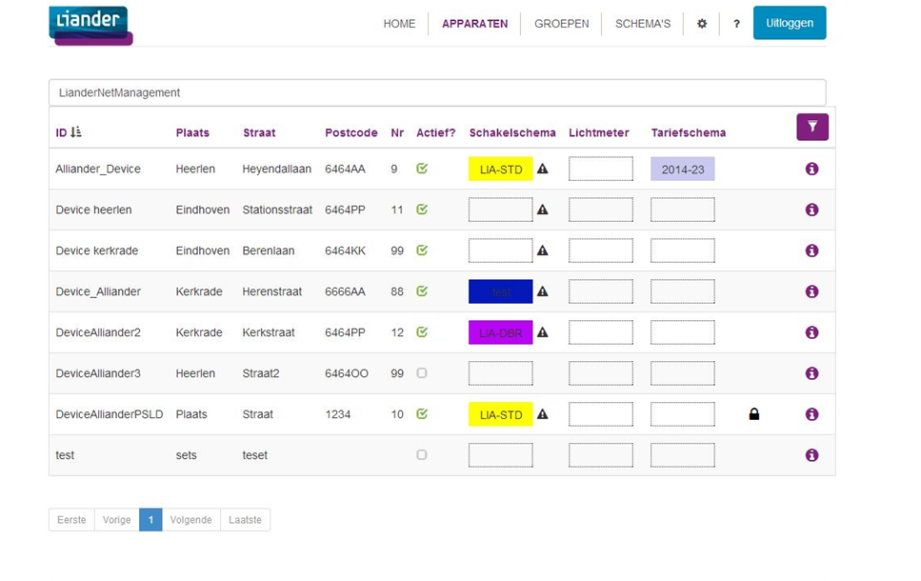

## 1.9 Applications

//TODO

### 1.9.1 Use cases

#### 1.9.1.1 Reference implementation in The Netherlands:  Flexible system for operating public lighting (FlexOVL)

FlexOVL, a new and flexible switching system of public lighting delivers more control for municipalities and is the first solution which is powered by the Open Smart Grid Platform.

**Technical drivers for Alliander**

- Replacing Ripple Control
- Decrease future investments
- Decrease outages

**Customer drivers (Municipalities)**

- Be more in control, by controlling switching times themselves
- Resolve power failures faster, through up-to-date information
- Reduction in costs, through energy saving and more efficient maintenance and management
- No vendor lock-in, not dependent on one supplier

**Implementation/roll-out**

- Small scale roll-out started jan-2015
- 200 Sub Stations will be fitted with an SSLD to control public lighting and tariff switching
- 15 municipalities in the Liander grid operator area will be participating
- Goal is to allow municipalities to use the application, give feedback and to see if the services offered to municipalities are adequate

- Large scale roll-out will start around 2016
- The entire Liander grid operator area will use SSLD's to controll all public lighting and tariff switching
- About 25.000 Sub Stations (middenspanningsruimtes)
- About 800.000 street lights will be switched by the SSLD's mounted in the 25.000 Sub Stations

**FlexOVL web application (not open source available)**

Municipalities are free to choose their own (web)application (using the webservices of the Open Smart Grid Platform), or they could use the default web application developed by Smart Society Services.

**Functionality of the default  web application as used by grid operator Liander (example)**

- Create switching schedules and assign those schedules to one or more SSLD's
- Create groups of SSLD's in order to be able to assign schedules to many SSLD's at once
- On demand switching of public lighting
- Review current status of an SSLD in order to review public lighting and tariff switching states
- Abilities to monitor power consumption of public lighting (available if the SSLD is fitted with an Electricity Meter)
- Monthly report offering insight into switch moments and power consumption

#### 1.9.1.2 Smart Meter Head-end System

**Technical drivers for Alliander**

- Replacement or addition to the current head-end system
- During the coming years, many smart meters will be placed in houses, companies and other properties, therefore grid operators need a scalable solution
- E(lectricity) Meters can host up to 4 other smart devices, Gas Meters for example
- DLMS/COSEM is used by many(if not all) Smart Meters

**Customer drivers**

- People will have more insight in their power consumption
- Meter values can be gathered by the grid operator, instead of relying on people reporting the meter values

**Implementation**

Features available within the platform so far:

- Add smart meter to the platform, so the device is known and additonal actions can be performed for the device
- Process shipment file, which adds several smart meters to the platform along with all needed information
- Synchronize time between smart meters and head-end system, incase the smart meter adjusts it's time, some events will be logged
- Retrieve events from the smart meter, several event logs are available
- Retrieve periodic meter reads from the smart meter
 
Soon, these features will be available for the protocol adapter as well.

