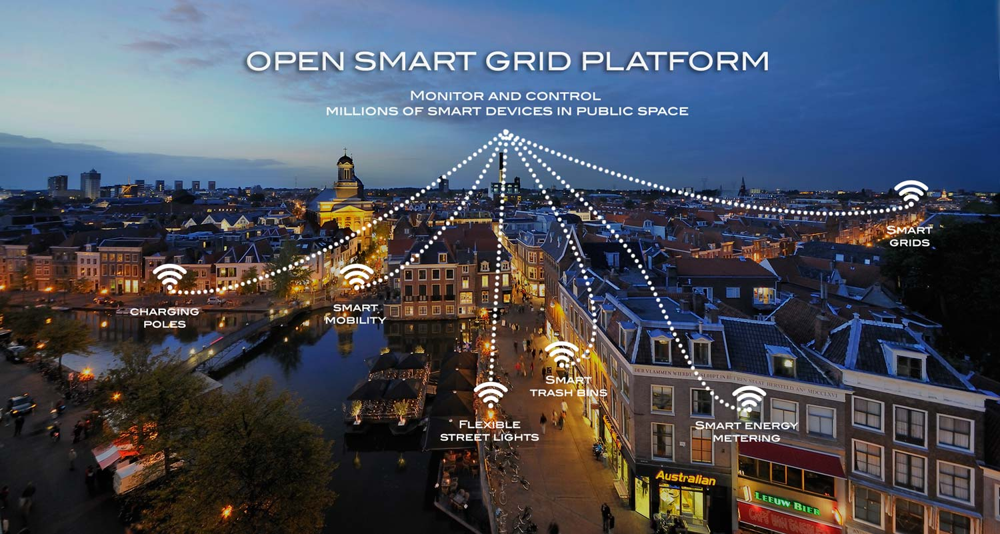

# Introduction to the Open Smart Grid Platform

The Open Smart Grid Platform (OSGP) is an open, generic, scalable and independent 'Internet of Things' platform, which enables various connected smart objects in the public space to be easily controlled and monitored. Our platform allows the use of any (web)application and with any IP communication infrastructure.

Our goal is to stimulate the development of smart and sustainable solutions. Smart devices and smart apps play a central role in the development of smart grids and smart societies. The OSGP software enables you to connect to thousands of devices, control them, and monitor their performance. This is done in an open and secure way, so you can use it for your own applications and devices, thereby reducing the time to market and decreasing development costs.

**Using the platform**

The Open Smart Grid Platform is used in the following way:

- A user or operator uses one or more (web) applications to monitor and/or control devices
- The applications connect to the open smart grid platform via several web services which are divided into functional domains, i.e. Public Lighting, Smart Metering, Power Quality, etc. Third party developers can use the web services  for the development or integration of new applications
- The platform handles all these application requests in a secure way and uses various functions and services to do so (e.g. authorization, authentication, device management, logging)
- For the 'translation' and communication of user/operator commands to the various smart devices, the platform uses multiple (open) protocols
- The platform supports various IP based data telecommunication technologies and protocols to communicate with the devices

More technical and user information about the open smart grid platform can be found in this document. More generic/product information about the open smart grid platform can be found on the [open smart grid platform website](http://opensmartgridplatform.org/).

### Example use case for the OSGP
Use cases of the OSGP are only limited by your imagination. Here are some examples:
- Ad-hoc and scheduled Switching of Public Lighting
- Electrical Transportation
- Smart Metering
- Traffic Control (LED/matrix signs, traffic lights)
- Flexible load management ( solar energy and wind energy)
- Power Quality monitoring

### Getting started
- [Visit the userguide section to try the open smart grid platform on your local machine](./Userguide/Installation/Installationguide.md)
- [The Architecture section provides information on platform architecture](./Architecture/README.md)
- [Check out the domain section if you want to know about the the existing domains](./Architecture/README.md)
- [Check out the protocol section to find out more on the existing supported protocols](./Protocols/README.md)
- [Read the open source section how to contribute!](./Opensourcecommunity/README.md)
