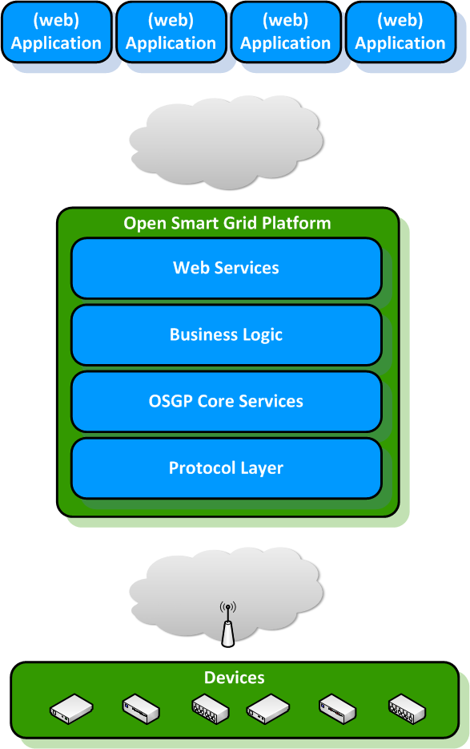

# Introduction to the Open Smart Grid Platform

The Open Smart Grid Platform (OSGP) is an open, generic, scalable and independent 'Internet of Things' platform, which enables various connected smart objects in the public space to be easily controlled and monitored. Our platform allows the use of any (web)application and with any IP communication infrastructure.

Our goal is to stimulate the development of smart and sustainable solutions. Smart devices and smart apps play a central role in the development of smart grids and smart societies. The OSGP software enables you to connect to thousands of devices, control them, and monitor their performance. This is done in an open and secure way, so you can use it for your own applications and devices, thereby reducing the time to market and decreasing development costs.

**Using the platform**

The Open Smart Grid Platform is used in the following way:

- A user or operator uses one or more (web) applications to monitor and/or control devices
- The applications connect to the platform via several web services which are divided into functional domains, i.e. Public Lighting, Smart Metering, Power Quality, etc. Third party developers can use the web services  for the development or integration of new applications
- The platform handles all these application requests in a secure way and uses various functions and services to do so (e.g. authorization, authentication, device management, logging)
- For the 'translation' and communication of user/operator commands to the various smart devices, the platform uses multiple (open) protocols
- The platform supports various IP data communication infrastructures to communicate with the devices

More (technical information) about the platform operation can be found later on in this document.

### I.1.2 Example use case for the OSGP
Use cases of the OSGP are only limited by your imagination. Here are some examples:
- Ad-hoc and scheduled Switching of Public Lighting
- Electrical Transportation
- Smart Metering
- Traffic Control (LED/matrix signs, traffic lights)
- Flexible load management ( solar energy and wind energy)
- Power Quality monitoring

**The basic architecture**

 

Basic Overview

## I.2 Layered architecture

The Open Smart Grid Platform environment consists of six layers:

1. (Web) Applications 
2. Web services layer
3. Domain logic layer
4. OSGP Core layer
5. Protocol layer
6. Devices

### I.2.1 (Web) Applications

Applications can use the web services layer to provide functions relevant for your domain such as web applications to control public lighting. The applications are outside the scope of the OSGP.

### I.2.2 Web services layer

In this layer the web services are exposed to the outside world. Applications can connect to the web services to implement the required functionality of the OSGP. The web services are divided into functional domains, i.e. Public Lighting, Smart Metering, Power Quality, etc. Additional functional domains can be created.

### I.2.3 Domain logic layer

Every functional domain has a separate set of web services and a corresponding domain logic block. In the domain logic block the business logic of that functional domain can be found. This is where the translation of a functional named command will be translated into a generic intermediate format. In the case of public lighting the command "Turn light on" will be translated into a command like "set switch(1) in closed position". In this layer it could also be decided that one functional command results in multiple commands to a device. The domain logic is closely related to the webservices layers and can be added as well.

### I.2.4 OSGP core layer

In the core of the Open Smart Grid Platform the generic functions are found:

- Device management
- Time synchronization
- Firmware management
- Workflow engine
- Device installation services
- Scheduler
- Device status monitoring
- Routing of device commands to appropriate device protocol

### I.2.5 Protocol layer

The different protocol adapters are found in this layer. Here the generic intermediate format of a command for a specific device will be translated into the protocol message the device understands. This message will be sent to the device. For communication failures there is a retry mechanism. The listeners for messages initiated by a device are implemented here. Examples are the DLMS/COSEM protocol adaptor for smart meters.

### I.2.6 Devices

Any device in the public space with an internet connection may be connected to the platform. The platform is independent of the device used, therefore this part of the set-up is not part of the platform.

## I.3 Open Source approach

We use an open source approach, which has proven to be a very powerful mechanism that can lead to global and large-scale innovations and implementations. We believe that an open source and open innovation approach in the field of smart grids, public infrastructures and smart cities will lead to

- An acceleration of (open) innovation
- Encouragement of ecosystem development
- More open standards
- More use of smart applications
- Reducing (IT) complexity
- The prevention of vendor/technology lock-in
- Lower costs

### I.3.1 Independent Software Foundation

To ensure future and independent development of the platform, the OSGP founders founded an independent software foundation. This foundation promotes and facilitates the use of and future development of the Open Smart Grid Platform. In addition, the Foundation also supports the community of developers and users of the Open Smart Grid Platform to accelerate future development and to develop a larger user base of the platform. This foundation also encourages the development of the ecosystem.

The foundation is for non-profit. Our aim is that companies / organizations can make a sponsorship contribution to the foundation, in order to support the use and development of the open source platform.

**Key activities of the foundation are:**

- Maintaining and developing the Open Smart Grid Platform via a publicly accessible source with an open source initiative recognized license (Apache 2.0).
- Providing information (manuals, publications, release notes, white papers, etc.)
- Taking care of legal conditions
- Community management, events for users and developers
- Marketing and promotion of the software

