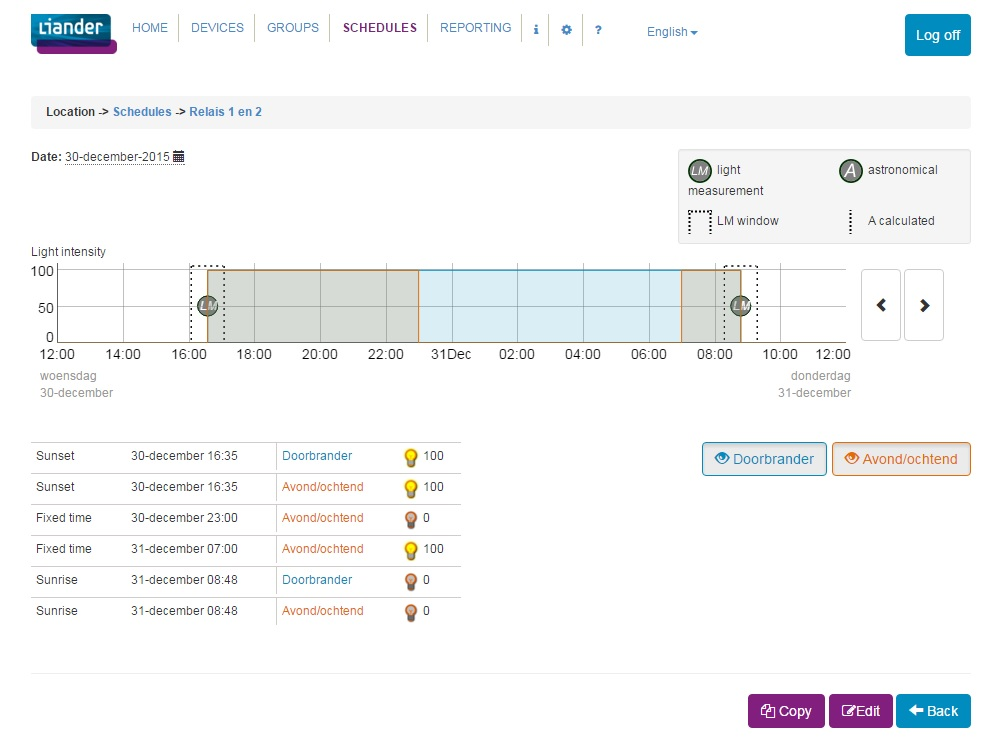

## SetSchedule messages

### Description

Request to set a light or tariff schedule on a device.

Response communicates status.

### Message definitions

``` json
message SetScheduleRequest {
    repeated Schedule schedules = 1; // [(nanopb).max_count = 50];
    optional PageInfo pageInfo = 2;
    required RelayType scheduleType = 3; // RT_NOT_SET is NOT supported!
}

message SetScheduleResponse {
    required Status status = 1;
}
```

### Datatypes

``` json
message Schedule {
    required Weekday weekday = 1;
    optional string startDay = 2; // [(nanopb).max_size = 9]; //- Format YYYYMMDD UTC, indicates the range of a schedule entry, from startDay.
    optional string endDay = 3; // [(nanopb).max_size = 9]; // - Format YYYYMMDD UTC, including endDay.
    required ActionTime actionTime = 4;
    optional string time = 5; // [(nanopb).max_size = 7]; // - Format hhmmss localtime set when actionTime = ABSOLUTETIME.
    optional Window window = 6;           // Window to wait for light sensor trigger.
    repeated LightValue value = 7; // [(nanopb).max_count = 6];
    optional TriggerType triggerType = 8; // React to setTransition or switch astronomical.
    optional uint32 minimumLightsOn = 9;  // Minimal time (in seconds) the lights should burn before deciding to switch the lights on.
    optional uint32 index = 10;           // Index of schedule entry in the schedule list.
    optional bool isEnabled = 11;         // Is this schedule entry enabled?
}

enum Weekday {
    MONDAY = 1;
    TUESDAY = 2;
    WEDNESDAY = 3;
    THURSDAY = 4;
    FRIDAY = 5;
    SATURDAY = 6;
    SUNDAY = 7;
    WEEKDAY = 8;
    WEEKEND = 9;
    ABSOLUTEDAY = 10;
    ALL = 11;
}

enum ActionTime {
    ABSOLUTETIME = 1;
    SUNRISE = 2;
    SUNSET = 3;
}

message Window {
    required uint32 minutesBefore = 1; // minutes before sunset / sunrise
    required uint32 minutesAfter = 2; // minutes after sunset / sunrise
}

message LightValue {
    optional bytes index = 1; // [(nanopb).max_size = 1]; // index number of connected light (DALI), none means all connected ligts.
    required bool on = 2;
    optional bytes dimValue = 3; // [(nanopb).max_size = 1]; // 1 - 100 %
}

enum TriggerType {
    TT_NOT_SET = 0;
    LIGHT_TRIGGER = 1;
    ASTRONOMICAL = 2;
}

message PageInfo {
    required uint32 currentPage = 1; // Pages start from 1
    required uint32 pageSize = 2;
    required uint32 totalPages = 3;
}

enum RelayType {
    RT_NOT_SET = 0;
    LIGHT = 1;
    TARIFF = 2;
}

enum Status {
    OK = 0;
    FAILURE = 1; // general failure
    REJECTED = 2; // request received in wrong state
}
```

### Examples

#### Example 1: Light schedule based on light-measurement

Screenshot of this schedule in an OSGP client application.



SOAP Request Message for Platform web-service:

``` xml
<soapenv:Envelope 
xmlns:soapenv="http://schemas.xmlsoap.org/soap/envelope/" 
xmlns:com="http://www.alliander.com/schemas/osgp/publiclighting/2014/10" 
xmlns:sch="http://www.alliander.com/schemas/osgp/publiclighting/schedulemanagement/2014/10">
   <soapenv:Header>   
	 <com:OrganisationIdentification>LianderNetManagement</com:OrganisationIdentification>
	 <com:UserName>Kevin</com:UserName>
	 <com:ApplicationName>SoapUI</com:ApplicationName>	   
   </soapenv:Header>
   <soapenv:Body>
      
      <sch:SetScheduleRequest>
         <!--type: Identification-->
         <sch:DeviceIdentification>device-01</sch:DeviceIdentification>
         <!--1 to 50 repetitions:-->
         <sch:Schedules>
            <!--type: WeekDayType - enumeration: [MONDAY,TUESDAY,WEDNESDAY,THURSDAY,FRIDAY,SATURDAY,SUNDAY,WEEKDAY,WEEKEND,ABSOLUTEDAY,ALL]-->
            <sch:WeekDay>ALL</sch:WeekDay>
            <!--type: ActionTimeType - enumeration: [ABSOLUTETIME,SUNRISE,SUNSET]-->
            <sch:ActionTime>SUNRISE</sch:ActionTime>
            <!--Optional:-->
            <sch:TriggerWindow>
               <!--type: long-->
               <sch:minutesBefore>15</sch:minutesBefore>
               <!--type: long-->
               <sch:minutesAfter>15</sch:minutesAfter>
            </sch:TriggerWindow>
            <!--1 to 6 repetitions:-->
            <sch:LightValue>
               <!--Optional:-->
               <!--anonymous type-->
               <sch:Index>0</sch:Index>
               <!--type: boolean-->
               <sch:On>false</sch:On>
            </sch:LightValue>
            <!--Optional:-->
            <!--type: TriggerType - enumeration: [LIGHT_TRIGGER,ASTRONOMICAL]-->
            <sch:TriggerType>LIGHT_TRIGGER</sch:TriggerType>
         </sch:Schedules>
         
         <sch:Schedules>
            <!--type: WeekDayType - enumeration: [MONDAY,TUESDAY,WEDNESDAY,THURSDAY,FRIDAY,SATURDAY,SUNDAY,WEEKDAY,WEEKEND,ABSOLUTEDAY,ALL]-->
            <sch:WeekDay>ALL</sch:WeekDay>
            <!--type: ActionTimeType - enumeration: [ABSOLUTETIME,SUNRISE,SUNSET]-->
            <sch:ActionTime>SUNSET</sch:ActionTime>
            <!--Optional:-->
            <sch:TriggerWindow>
               <!--type: long-->
               <sch:minutesBefore>15</sch:minutesBefore>
               <!--type: long-->
               <sch:minutesAfter>15</sch:minutesAfter>
            </sch:TriggerWindow>
            <!--1 to 6 repetitions:-->
            <sch:LightValue>
               <!--Optional:-->
               <!--anonymous type-->
               <sch:Index>0</sch:Index>
               <!--type: boolean-->
               <sch:On>true</sch:On>
            </sch:LightValue>
            <!--Optional:-->
            <!--type: TriggerType - enumeration: [LIGHT_TRIGGER,ASTRONOMICAL]-->
            <sch:TriggerType>LIGHT_TRIGGER</sch:TriggerType>
         </sch:Schedules>
         
         <sch:Schedules>
            <!--type: WeekDayType - enumeration: [MONDAY,TUESDAY,WEDNESDAY,THURSDAY,FRIDAY,SATURDAY,SUNDAY,WEEKDAY,WEEKEND,ABSOLUTEDAY,ALL]-->
            <sch:WeekDay>ALL</sch:WeekDay>
            <!--type: ActionTimeType - enumeration: [ABSOLUTETIME,SUNRISE,SUNSET]-->
            <sch:ActionTime>ABSOLUTETIME</sch:ActionTime>
            <!--Optional:-->
            <!--type: string-->
            <sch:Time>23:00:00</sch:Time>
            <!--Optional:-->
            <sch:TriggerWindow>
               <!--type: long-->
               <sch:minutesBefore>30</sch:minutesBefore>
               <!--type: long-->
               <sch:minutesAfter>30</sch:minutesAfter>
            </sch:TriggerWindow>
            <!--1 to 6 repetitions:-->
            <sch:LightValue>
               <!--Optional:-->
               <!--anonymous type-->
               <sch:Index>2</sch:Index>
               <!--type: boolean-->
               <sch:On>false</sch:On>
            </sch:LightValue>
         </sch:Schedules>
         
         <sch:Schedules>
            <!--type: WeekDayType - enumeration: [MONDAY,TUESDAY,WEDNESDAY,THURSDAY,FRIDAY,SATURDAY,SUNDAY,WEEKDAY,WEEKEND,ABSOLUTEDAY,ALL]-->
            <sch:WeekDay>ALL</sch:WeekDay>
            <!--type: ActionTimeType - enumeration: [ABSOLUTETIME,SUNRISE,SUNSET]-->
            <sch:ActionTime>ABSOLUTETIME</sch:ActionTime>
            <!--Optional:-->
            <!--type: string-->
            <sch:Time>07:00:00</sch:Time>
            <!--Optional:-->
            <sch:TriggerWindow>
               <!--type: long-->
               <sch:minutesBefore>150</sch:minutesBefore>
               <!--type: long-->
               <sch:minutesAfter>41</sch:minutesAfter>
            </sch:TriggerWindow>
            <!--1 to 6 repetitions:-->
            <sch:LightValue>
               <!--Optional:-->
               <!--anonymous type-->
               <sch:Index>2</sch:Index>
               <!--type: boolean-->
               <sch:On>true</sch:On>
               <!--Optional:-->
               <!--anonymous type-->
               <!--<sch:DimValue>100</sch:DimValue>-->
            </sch:LightValue>
         </sch:Schedules>

      </sch:SetScheduleRequest>
   
   </soapenv:Body>
</soapenv:Envelope>
```

SOAP Response Message: 

``` xml
<SOAP-ENV:Envelope xmlns:SOAP-ENV="http://schemas.xmlsoap.org/soap/envelope/">
   <SOAP-ENV:Header/>
   <SOAP-ENV:Body>   
      <ns3:SetScheduleAsyncResponse xmlns:ns2="http://www.alliander.com/schemas/osgp/common/2014/10" xmlns:ns3="http://www.alliander.com/schemas/osgp/publiclighting/schedulemanagement/2014/10">	  
         <ns3:AsyncResponse>
            <ns2:CorrelationUid>LianderNetManagement|||device-01|||20151230104608559</ns2:CorrelationUid>
            <ns2:DeviceId>device-01</ns2:DeviceId>
         </ns3:AsyncResponse>		 
      </ns3:SetScheduleAsyncResponse>	  
   </SOAP-ENV:Body>
</SOAP-ENV:Envelope>
```


OSLP SetScheduleRequest sent to 'device-01' to set a Light Schedule (1 page in this case, therefore no pagingInfo needed):

``` json
setScheduleRequest {
  schedules {
    weekday: ALL
    actionTime: SUNRISE
    window {
      minutesBefore: 15
      minutesAfter: 15
    }
    value {
      index: "\000"
      on: false
    }
    triggerType: LIGHT_TRIGGER
  }
  schedules {
    weekday: ALL
    actionTime: SUNSET
    window {
      minutesBefore: 15
      minutesAfter: 15
    }
    value {
      index: "\000"
      on: true
    }
    triggerType: LIGHT_TRIGGER
  }
  schedules {
    weekday: ALL
    actionTime: ABSOLUTETIME
    time: "230000"
    window {
      minutesBefore: 30
      minutesAfter: 30
    }
    value {
      index: "\002"
      on: false
    }
  }
  schedules {
    weekday: ALL
    actionTime: ABSOLUTETIME
    time: "070000"
    window {
      minutesBefore: 150
      minutesAfter: 41
    }
    value {
      index: "\002"
      on: true
    }
  }
  scheduleType: LIGHT
}
```

OSLP SetScheduleResponse from 'device-01':

``` json
setScheduleResponse {
  status: OK
}
```


Description for this schedule:

This schedule combines a 'morning/evening light' with an 'all night light'. Relay 1 and 2 will be switched on using a light-measurement trigger. Relay 2 will be switched off at 23:00 using an absolute time. Relay 2 will be switched on at 07:00, but only when no light-measurement trigger has been received yet. Relay 1 and 2 will be switched off using a light-measurement trigger.

The first schedule-entry:
``` json
  schedules {
    weekday: ALL
    actionTime: SUNRISE
    window {
      minutesBefore: 15
      minutesAfter: 15
    }
    value {
      index: "\000"
      on: false
    }
    triggerType: LIGHT_TRIGGER
  }
```
Definitions:
- 'index: "\000"' means: all device relays configured as LIGHT relays (see SetConfigurationRequest message)
- 'light-measurement trigger' is defined as: a SetTransitionRequest message containing a TransitionType matching the schedule-entry's actionTime value (SUNRISE matches NIGHT_DAY and SUNSET matches DAY_NIGHT)

Specifies:
For all (weekday: ALL) 7 days of the week,
when a light-measurement trigger is received in the morning (actionTime: SUNRISE),
then all device relays configured as LIGHT relays have to switch off (on: false).

When and only when a SUNRISE transition is received via a light-measurement trigger (LIGHT_TRIGGER) within a window of 15 minutesBefore and 15 minutesAfter the calculated astronomical time for sunrise,
then the device shall switch for the received light-measurement trigger.

When no SUNRISE transition is received via a light-measurement trigger (LIGHT_TRIGGER) within a window of 15 minutesBefore and 15 minutesAfter the calculated astronomical time for sunrise,
then the device shall switch at the end of the window.

The triggerType (LIGHT_TRIGGER) defines how a SUNRISE (actionTime) transition will be triggered.

The second schedule-entry:
``` json
  schedules {
    weekday: ALL
    actionTime: SUNSET
    window {
      minutesBefore: 15
      minutesAfter: 15
    }
    value {
      index: "\000"
      on: true
    }
    triggerType: LIGHT_TRIGGER
  }
```
Definitions:
- 'index: "\000"' means: all device relays configured as LIGHT relays (see SetConfigurationRequest message)
- 'light-measurement trigger' is defined as: a SetTransitionRequest message containing a TransitionType matching the schedule-entry's actionTime value (SUNRISE matches NIGHT_DAY and SUNSET matches DAY_NIGHT)

Specifies:
For all (weekday: ALL) 7 days of the week,
when a light-measurement trigger is received in the morning (actionTime: SUNSET),
then all device relays configured as LIGHT relays have to switch on (on: true).

When and only when a SUNSET transition is received via a light-measurement trigger (triggerType: LIGHT_TRIGGER) within a window of 15 minutesBefore and 15 minutesAfter the calculated astronomical time for sunset,
then the device shall switch for the received light-measurement trigger.

When no SUNSET transition is received via a light-measurement trigger (triggerType: LIGHT_TRIGGER) within a window of 15 minutesBefore and 15 minutesAfter the calculated astronomical time for sunrise,
then the device shall switch at the end of the window.

The triggerType (LIGHT_TRIGGER) defines how a SUNSET (actionTime) transition will be triggered.

The third schedule-entry:
``` json
  schedules {
    weekday: ALL
    actionTime: ABSOLUTETIME
    time: "230000"
    window {
      minutesBefore: 30
      minutesAfter: 30
    }
    value {
      index: "\002"
      on: false
    }
  }
```
Specifies:
For all (weekday: ALL) 7 days of the week,
when its 11 'o clock in the evening (actionTime: ABSOLUTETIME and time: "230000")
then device relay 2 has to switch off (on: false).

Since actionTime is ABSOLUTETIME, the triggerType value must be omitted from this schedule-entry.

The fourth schedule-entry:
``` json
  schedules {
    weekday: ALL
    actionTime: ABSOLUTETIME
    time: "070000"
    window {
      minutesBefore: 150
      minutesAfter: 41
    }
    value {
      index: "\002"
      on: true
    }
  }
```

For all (weekday: ALL) 7 days of the week,
when its 7 'o clock in the morning (actionTime: ABSOLUTETIME and time: "070000")
and there are no other schedule-entries that have caused the switching of device relay 2 within the window defined (minutesBefore: 150 and minutesAfter)
then device relay 2 has to switch on (on: true).

Since actionTime is ABSOLUTETIME, the triggerType value must be omitted from this schedule-entry.

The last element of the SetScheduleRequest:
``` json
  scheduleType: LIGHT
```
specifies that this is a light schedule.


SOAP Request to obtain response from 'device-01':

``` xml
<soapenv:Envelope 
xmlns:soapenv="http://schemas.xmlsoap.org/soap/envelope/" 
xmlns:com="http://www.alliander.com/schemas/osgp/common/2014/10" 
xmlns:sch="http://www.alliander.com/schemas/osgp/publiclighting/schedulemanagement/2014/10">
   <soapenv:Header>   
	   <com:OrganisationIdentification>LianderNetManagement</com:OrganisationIdentification>
	   <com:UserName>Kevin</com:UserName>
	   <com:ApplicationName>SoapUI</com:ApplicationName>
   </soapenv:Header>
   <soapenv:Body>   
      <sch:SetScheduleAsyncRequest>	  
         <sch:AsyncRequest>
            <com:CorrelationUid>LianderNetManagement|||device-01|||20151230104608559</com:CorrelationUid>
            <com:DeviceId>device-01</com:DeviceId>
         </sch:AsyncRequest>		 
      </sch:SetScheduleAsyncRequest>	  
   </soapenv:Body>
</soapenv:Envelope>
````

SOAP Response containing response from 'device-01':

``` xml
<SOAP-ENV:Envelope xmlns:SOAP-ENV="http://schemas.xmlsoap.org/soap/envelope/">
   <SOAP-ENV:Header/>
   <SOAP-ENV:Body>   
      <ns3:SetScheduleResponse xmlns:ns2="http://www.alliander.com/schemas/osgp/common/2014/10" xmlns:ns3="http://www.alliander.com/schemas/osgp/publiclighting/schedulemanagement/2014/10">	  
         <ns3:Result>OK</ns3:Result>		 
      </ns3:SetScheduleResponse>	  
   </SOAP-ENV:Body>
</SOAP-ENV:Envelope>
```


#### Example 2: Light schedule based on absolute time and day

SOAP messages:

``` xml
<SOAP-ENV:Envelope xmlns:SOAP-ENV="http://schemas.xmlsoap.org/soap/envelope/">
   <SOAP-ENV:Header>
      <OrganisationIdentification xmlns="http://www.alliander.com/schemas/osp/common">LianderNetManagement</OrganisationIdentification>
      <ApplicationName xmlns="http://www.alliander.com/schemas/osp/common">SoapUI</ApplicationName>
      <UserName xmlns="http://www.alliander.com/schemas/osp/common">Kevin</UserName>
   </SOAP-ENV:Header>
   <SOAP-ENV:Body>
      <ns3:SetScheduleRequest xmlns:ns3="http://www.alliander.com/schemas/osgp/publiclighting/schedulemanagement/2014/10" xmlns:ns2="http://www.alliander.com/schemas/osgp/common/2014/10">
         <ns3:DeviceIdentification>device-01</ns3:DeviceIdentification>
         <ns3:Schedules>
            <ns3:WeekDay>ABSOLUTEDAY</ns3:WeekDay>
            <ns3:startDay>2016-01-01Z</ns3:startDay>
            <ns3:ActionTime>ABSOLUTETIME</ns3:ActionTime>
            <ns3:Time>07:00:00.000</ns3:Time>
            <ns3:LightValue>
               <ns3:Index>1</ns3:Index>
               <ns3:On>false</ns3:On>
            </ns3:LightValue>
         </ns3:Schedules>
      </ns3:SetScheduleRequest>
   </SOAP-ENV:Body>
</SOAP-ENV:Envelope>

<SOAP-ENV:Envelope xmlns:SOAP-ENV="http://schemas.xmlsoap.org/soap/envelope/">
   <SOAP-ENV:Header />
   <SOAP-ENV:Body>
      <ns3:SetScheduleAsyncResponse xmlns:ns3="http://www.alliander.com/schemas/osgp/publiclighting/schedulemanagement/2014/10" xmlns:ns2="http://www.alliander.com/schemas/osgp/common/2014/10">
         <ns3:AsyncResponse>
            <ns2:CorrelationUid>LianderNetManagement|||device-01|||20160113131032759</ns2:CorrelationUid>
            <ns2:DeviceId>device-01</ns2:DeviceId>
         </ns3:AsyncResponse>
      </ns3:SetScheduleAsyncResponse>
   </SOAP-ENV:Body>
</SOAP-ENV:Envelope>

<SOAP-ENV:Envelope xmlns:SOAP-ENV="http://schemas.xmlsoap.org/soap/envelope/">
   <SOAP-ENV:Header>
      <OrganisationIdentification xmlns="http://www.alliander.com/schemas/osp/common">LianderNetManagement</OrganisationIdentification>
      <ApplicationName xmlns="http://www.alliander.com/schemas/osp/common">SoapUI</ApplicationName>
      <UserName xmlns="http://www.alliander.com/schemas/osp/common">Kevin</UserName>
   </SOAP-ENV:Header>
   <SOAP-ENV:Body>
      <ns3:SetScheduleAsyncRequest xmlns:ns3="http://www.alliander.com/schemas/osgp/publiclighting/schedulemanagement/2014/10" xmlns:ns2="http://www.alliander.com/schemas/osgp/common/2014/10">
         <ns3:AsyncRequest>
            <ns2:CorrelationUid>LianderNetManagement|||device-01|||20160113131032759</ns2:CorrelationUid>
            <ns2:DeviceId>device-01</ns2:DeviceId>
         </ns3:AsyncRequest>
      </ns3:SetScheduleAsyncRequest>
   </SOAP-ENV:Body>
</SOAP-ENV:Envelope>

<SOAP-ENV:Envelope xmlns:SOAP-ENV="http://schemas.xmlsoap.org/soap/envelope/">
   <SOAP-ENV:Header />
   <SOAP-ENV:Body>
      <ns3:SetScheduleResponse xmlns:ns3="http://www.alliander.com/schemas/osgp/publiclighting/schedulemanagement/2014/10" xmlns:ns2="http://www.alliander.com/schemas/osgp/common/2014/10">
         <ns3:Result>OK</ns3:Result>
      </ns3:SetScheduleResponse>
   </SOAP-ENV:Body>
</SOAP-ENV:Envelope>
```

OSLP SetScheduleRequest sent to 'device-01' to set a Light Schedule:

``` json
setScheduleRequest {
  schedules {
    weekday: ABSOLUTEDAY
    startDay: "20160101"
    actionTime: ABSOLUTETIME
    time: "070000"
    value {
      index: "\001"
      on: false
    }
  }
  scheduleType: LIGHT
}
```
OSLP SetScheduleResponse sent to platform:

``` json
setScheduleResponse {
  status: OK
}
```

Description for this schedule:

This schedule has one entry which switches light relay 1 (index: "\001") off at January 1st 2016 at 7 'o clock in the morning. When 'weekday' is set to ABSOLUTEDAY, the date will be placed in 'startDay'.


#### Example 3: Schedule using OSLP v0.6.1 specific properties

SOAP messages:

```xml
<soapenv:Envelope 
xmlns:soapenv="http://schemas.xmlsoap.org/soap/envelope/" 
xmlns:com="http://www.alliander.com/schemas/osgp/publiclighting/2014/10" 
xmlns:sch="http://www.alliander.com/schemas/osgp/publiclighting/schedulemanagement/2014/10">
   <soapenv:Header>   
   <com:OrganisationIdentification>LianderNetManagement</com:OrganisationIdentification>
   <com:UserName>Kevin</com:UserName>
   <com:ApplicationName>SoapUI</com:ApplicationName>
   </soapenv:Header>
   <soapenv:Body>      
      <sch:SetScheduleRequest>
         <!--type: Identification-->
         <sch:DeviceIdentification>device-01</sch:DeviceIdentification>
         <!--1 to 50 repetitions:-->
         <sch:Schedules>
            <!--type: WeekDayType - enumeration: [MONDAY,TUESDAY,WEDNESDAY,THURSDAY,FRIDAY,SATURDAY,SUNDAY,WEEKDAY,WEEKEND,ABSOLUTEDAY,ALL]-->
            <sch:WeekDay>ALL</sch:WeekDay>
            <!--type: ActionTimeType - enumeration: [ABSOLUTETIME,SUNRISE,SUNSET]-->
            <sch:ActionTime>SUNRISE</sch:ActionTime>
            <!--Optional:-->
            <sch:TriggerWindow>
               <!--type: long-->
               <sch:minutesBefore>15</sch:minutesBefore>
               <!--type: long-->
               <sch:minutesAfter>15</sch:minutesAfter>
            </sch:TriggerWindow>
            <!--1 to 6 repetitions:-->
            <sch:LightValue>
               <!--Optional:-->
               <!--anonymous type-->
               <sch:Index>0</sch:Index>
               <!--type: boolean-->
               <sch:On>false</sch:On>
            </sch:LightValue>
            <!--Optional:-->
            <!--type: TriggerType - enumeration: [LIGHT_TRIGGER,ASTRONOMICAL]-->
            <sch:TriggerType>LIGHT_TRIGGER</sch:TriggerType>
            <!--Optional:-->
            <!--type: int, index of this schedule-entry-->
            <sch:Index>0</sch:Index>
            <!--Optional:-->
            <!--type: boolean-->
            <sch:IsEnabled>true</sch:IsEnabled>
            <!--Optional:-->
            <!--type: int, minimal burning time in seconds-->
            <!--<sch:minimumLightsOn>300</sch:minimumLightsOn>-->
         </sch:Schedules>
         
         <sch:Schedules>
            <!--type: WeekDayType - enumeration: [MONDAY,TUESDAY,WEDNESDAY,THURSDAY,FRIDAY,SATURDAY,SUNDAY,WEEKDAY,WEEKEND,ABSOLUTEDAY,ALL]-->
            <sch:WeekDay>ALL</sch:WeekDay>
            <!--type: ActionTimeType - enumeration: [ABSOLUTETIME,SUNRISE,SUNSET]-->
            <sch:ActionTime>SUNSET</sch:ActionTime>
            <!--Optional:-->
            <sch:TriggerWindow>
               <!--type: long-->
               <sch:minutesBefore>15</sch:minutesBefore>
               <!--type: long-->
               <sch:minutesAfter>15</sch:minutesAfter>
            </sch:TriggerWindow>
            <!--1 to 6 repetitions:-->
            <sch:LightValue>
               <!--Optional:-->
               <!--anonymous type-->
               <sch:Index>0</sch:Index>
               <!--type: boolean-->
               <sch:On>true</sch:On>
            </sch:LightValue>
            <!--Optional:-->
            <!--type: TriggerType - enumeration: [LIGHT_TRIGGER,ASTRONOMICAL]-->
            <sch:TriggerType>LIGHT_TRIGGER</sch:TriggerType>
            <!--Optional:-->
            <!--type: int, index of this schedule-entry-->
            <sch:Index>1</sch:Index>
            <!--Optional:-->
            <!--type: boolean-->
            <sch:IsEnabled>true</sch:IsEnabled>
            <!--Optional:-->
            <!--type: int, minimal burning time in seconds-->
            <!--<sch:minimumLightsOn>300</sch:minimumLightsOn>-->
         </sch:Schedules>
         
         <sch:Schedules>
            <!--type: WeekDayType - enumeration: [MONDAY,TUESDAY,WEDNESDAY,THURSDAY,FRIDAY,SATURDAY,SUNDAY,WEEKDAY,WEEKEND,ABSOLUTEDAY,ALL]-->
            <sch:WeekDay>ALL</sch:WeekDay>
            <!--type: ActionTimeType - enumeration: [ABSOLUTETIME,SUNRISE,SUNSET]-->
            <sch:ActionTime>ABSOLUTETIME</sch:ActionTime>
            <!--Optional:-->
            <!--type: string-->
            <sch:Time>23:00:00</sch:Time>
            <!--Optional:-->
            <sch:TriggerWindow>
               <!--type: long-->
               <sch:minutesBefore>30</sch:minutesBefore>
               <!--type: long-->
               <sch:minutesAfter>30</sch:minutesAfter>
            </sch:TriggerWindow>
            <!--1 to 6 repetitions:-->
            <sch:LightValue>
               <!--Optional:-->
               <!--anonymous type-->
               <sch:Index>1</sch:Index>
               <!--type: boolean-->
               <sch:On>false</sch:On>
            </sch:LightValue>
            <!--Optional:-->
            <!--type: int, index of this schedule-entry-->
            <sch:Index>2</sch:Index>
            <!--Optional:-->
            <!--type: boolean-->
            <sch:IsEnabled>true</sch:IsEnabled>
            <!--Optional:-->
            <!--type: int, minimal burning time in seconds-->
            <!--<sch:minimumLightsOn>300</sch:minimumLightsOn>-->
         </sch:Schedules>
         
         <sch:Schedules>
            <!--type: WeekDayType - enumeration: [MONDAY,TUESDAY,WEDNESDAY,THURSDAY,FRIDAY,SATURDAY,SUNDAY,WEEKDAY,WEEKEND,ABSOLUTEDAY,ALL]-->
            <sch:WeekDay>ALL</sch:WeekDay>
            <!--type: ActionTimeType - enumeration: [ABSOLUTETIME,SUNRISE,SUNSET]-->
            <sch:ActionTime>ABSOLUTETIME</sch:ActionTime>
            <!--Optional:-->
            <!--type: string-->
            <sch:Time>07:00:00</sch:Time>
            <!--Optional:-->
            <sch:TriggerWindow>
               <!--type: long-->
               <sch:minutesBefore>30</sch:minutesBefore>
               <!--type: long-->
               <sch:minutesAfter>30</sch:minutesAfter>
            </sch:TriggerWindow>
            <!--1 to 6 repetitions:-->
            <sch:LightValue>
               <!--Optional:-->
               <!--anonymous type-->
               <sch:Index>1</sch:Index>
               <!--type: boolean-->
               <sch:On>true</sch:On>
               <!--Optional:-->
               <!--anonymous type-->
               <!--<sch:DimValue>100</sch:DimValue>-->
            </sch:LightValue>
            <!--Optional:-->
            <!--type: int, index of this schedule-entry-->
            <sch:Index>3</sch:Index>
            <!--Optional:-->
            <!--type: boolean-->
            <sch:IsEnabled>true</sch:IsEnabled>
            <!--Optional:-->
            <!--type: int, minimal burning time in seconds-->
            <sch:minimumLightsOn>300</sch:minimumLightsOn>
         </sch:Schedules>
      </sch:SetScheduleRequest>
   </soapenv:Body>
</soapenv:Envelope>

<SOAP-ENV:Envelope xmlns:SOAP-ENV="http://schemas.xmlsoap.org/soap/envelope/">
   <SOAP-ENV:Header/>
   <SOAP-ENV:Body>
      <ns2:SetScheduleAsyncResponse xmlns:ns2="http://www.alliander.com/schemas/osgp/publiclighting/schedulemanagement/2014/10" xmlns:ns3="http://www.alliander.com/schemas/osgp/common/2014/10">
         <ns2:AsyncResponse>
            <ns3:CorrelationUid>LianderNetManagement|||device-01|||20160313162236547</ns3:CorrelationUid>
            <ns3:DeviceId>device-01</ns3:DeviceId>
         </ns2:AsyncResponse>
      </ns2:SetScheduleAsyncResponse>
   </SOAP-ENV:Body>
</SOAP-ENV:Envelope>

<soapenv:Envelope xmlns:soapenv="http://schemas.xmlsoap.org/soap/envelope/" xmlns:ns="http://www.alliander.com/schemas/osgp/common/2014/10" xmlns:ns1="http://www.alliander.com/schemas/osgp/publiclighting/schedulemanagement/2014/10">
   <soapenv:Header>
      <ns:ApplicationName>SoapUI</ns:ApplicationName>
      <ns:UserName>Kevin</ns:UserName>
      <ns:OrganisationIdentification>LianderNetManagement</ns:OrganisationIdentification>
   </soapenv:Header>
   <soapenv:Body>
      <ns1:SetScheduleAsyncRequest>
         <ns1:AsyncRequest>
            <ns:CorrelationUid>LianderNetManagement|||device-01|||20160313162236547</ns:CorrelationUid>
            <ns:DeviceId>device-01</ns:DeviceId>
         </ns1:AsyncRequest>
      </ns1:SetScheduleAsyncRequest>
   </soapenv:Body>
</soapenv:Envelope>

<SOAP-ENV:Envelope xmlns:SOAP-ENV="http://schemas.xmlsoap.org/soap/envelope/">
   <SOAP-ENV:Header/>
   <SOAP-ENV:Body>
      <ns2:SetScheduleResponse xmlns:ns2="http://www.alliander.com/schemas/osgp/publiclighting/schedulemanagement/2014/10" xmlns:ns3="http://www.alliander.com/schemas/osgp/common/2014/10">
         <ns2:Result>OK</ns2:Result>
      </ns2:SetScheduleResponse>
   </SOAP-ENV:Body>
</SOAP-ENV:Envelope>
```

OSLP SetScheduleRequest sent to 'device-01':
```json
setScheduleRequest {
  schedules {
    weekday: ALL
    actionTime: SUNRISE
    window {
      minutesBefore: 15
      minutesAfter: 15
    }
    value {
      index: "\000"
      on: false
    }
    triggerType: LIGHT_TRIGGER
    index: 0
    isEnabled: true
  }
  schedules {
    weekday: ALL
    actionTime: SUNSET
    window {
      minutesBefore: 15
      minutesAfter: 15
    }
    value {
      index: "\000"
      on: true
    }
    triggerType: LIGHT_TRIGGER
    index: 1
    isEnabled: true
  }
  schedules {
    weekday: ALL
    actionTime: ABSOLUTETIME
    time: "230000"
    window {
      minutesBefore: 30
      minutesAfter: 30
    }
    value {
      index: "\001"
      on: false
    }
    index: 2
    isEnabled: true
  }
  schedules {
    weekday: ALL
    actionTime: ABSOLUTETIME
    time: "070000"
    window {
      minutesBefore: 30
      minutesAfter: 30
    }
    value {
      index: "\001"
      on: true
    }
    minimumLightsOn: 300
    index: 3
    isEnabled: true
  }
  scheduleType: LIGHT
}

```

OSLP SetScheduleResponse from 'device-01':
```json
setScheduleResponse {
  status: OK
}

```

Description for this schedule:

This schedule consists of 1 page, and uses 'minimumLightOn' to indicate a minimal burning time in seconds. Further it uses 'index' and 'isEnabled' variables for the Schedule struct, to indicate what index this schedule-entry has within the list of schedule-entries and whether or not the schedule-entry is enabled.


#### Example 4: Astronomical Time Light Schedule

SOAP Request Message for Platform web-service:

``` xml
TODO
```

SOAP Response Message:

``` xml
TODO
```
OSLP SetScheduleRequest sent to 'device-01':

``` json
setScheduleRequest {
  schedules {
    weekday: ALL
    actionTime: SUNRISE
    window {
      minutesBefore: 0
      minutesAfter: 60
    }
    value {
      index: "\000"
      on: false
    }
    triggerType: ASTRONOMICAL
    minimumLightsOn: 0
  }
  schedules {
    weekday: ALL
    actionTime: SUNSET
    window {
      minutesBefore: 60
      minutesAfter: 0
    }
    value {
      index: "\000"
      on: true
    }
    triggerType: ASTRONOMICAL
    minimumLightsOn: 0
  }
  scheduleType: LIGHT
}
```
OSLP SetScheduleResponse from 'device-01' for page 2:
``` json
setScheduleResponse {
  status: OK
}
```


Description for this schedule:
This light schedule defines astronomical switch moments. The switch time will be calculated by the device, using the location information (GPS coordinates). If a value is set for variable 'offset', the offset in minutes shall be used to adjust the calculated time for a switch moment.


SOAP Request to obtain response from 'device-01':

``` xml
TODO
```

SOAP Response containing response from 'device-01':

``` xml
TODO
```


#### Example 5: Tariff Schedule

SOAP Request Message for Platform web-service:

``` xml
<soapenv:Envelope xmlns:soapenv="http://schemas.xmlsoap.org/soap/envelope/" xmlns:com="http://www.alliander.com/schemas/osgp/common/2014/10" xmlns:sch="http://www.alliander.com/schemas/osgp/tariffswitching/schedulemanagement/2014/10">
   <soapenv:Header>
      <com:OrganisationIdentification>LianderNetManagement</com:OrganisationIdentification>
      <com:UserName>Kevin</com:UserName>
      <com:ApplicationName>SoapUI</com:ApplicationName>
   </soapenv:Header>
   <soapenv:Body>
      <sch:SetScheduleRequest>
         <sch:DeviceIdentification>device-01</sch:DeviceIdentification>
         <!--1 to 50 repetitions:-->
         <sch:Schedules>
            <sch:WeekDay>WEEKDAY</sch:WeekDay>
            <sch:StartDay>2015-01-01</sch:StartDay>
            <sch:EndDay>2016-02-01</sch:EndDay>
            <sch:Time>23:00:00</sch:Time>
            <!--1 to 6 repetitions:-->
            <sch:TariffValue>
               <sch:Index>3</sch:Index>
               <sch:High>0</sch:High>
            </sch:TariffValue>
         </sch:Schedules>         

         <sch:Schedules>
            <sch:WeekDay>WEEKDAY</sch:WeekDay>
            <sch:StartDay>2015-01-01</sch:StartDay>
            <sch:EndDay>2016-02-01</sch:EndDay>
            <sch:Time>07:00:00</sch:Time>
            <!--1 to 6 repetitions:-->
            <sch:TariffValue>
               <sch:Index>3</sch:Index>
               <sch:High>1</sch:High>
            </sch:TariffValue>
         </sch:Schedules>
         
         <sch:Schedules>
            <sch:WeekDay>WEEKDAY</sch:WeekDay>
            <sch:StartDay>2015-01-01</sch:StartDay>
            <sch:EndDay>2015-01-01</sch:EndDay>
            <sch:Time>07:00:00</sch:Time>
            <!--1 to 6 repetitions:-->
            <sch:TariffValue>
               <sch:Index>3</sch:Index>
               <sch:High>0</sch:High>
            </sch:TariffValue>
         </sch:Schedules>
         
         <sch:Schedules>
            <sch:WeekDay>WEEKDAY</sch:WeekDay>
            <sch:StartDay>2015-04-06</sch:StartDay>
            <sch:EndDay>2015-04-06</sch:EndDay>
            <sch:Time>07:00:00</sch:Time>
            <!--1 to 6 repetitions:-->
            <sch:TariffValue>
               <sch:Index>3</sch:Index>
               <sch:High>0</sch:High>
            </sch:TariffValue>
         </sch:Schedules>
         
         <sch:Schedules>
            <sch:WeekDay>WEEKDAY</sch:WeekDay>
            <sch:StartDay>2015-04-27</sch:StartDay>
            <sch:EndDay>2015-04-27</sch:EndDay>
            <sch:Time>07:00:00</sch:Time>
            <!--1 to 6 repetitions:-->
            <sch:TariffValue>
               <sch:Index>3</sch:Index>
               <sch:High>0</sch:High>
            </sch:TariffValue>
         </sch:Schedules>
         
         <sch:Schedules>
            <sch:WeekDay>WEEKDAY</sch:WeekDay>
            <sch:StartDay>2015-05-14</sch:StartDay>
            <sch:EndDay>2015-05-14</sch:EndDay>
            <sch:Time>07:00:00</sch:Time>
            <!--1 to 6 repetitions:-->
            <sch:TariffValue>
               <sch:Index>3</sch:Index>
               <sch:High>0</sch:High>
            </sch:TariffValue>
         </sch:Schedules>
         
         <sch:Schedules>
            <sch:WeekDay>WEEKDAY</sch:WeekDay>
            <sch:StartDay>2015-05-25</sch:StartDay>
            <sch:EndDay>2015-05-25</sch:EndDay>
            <sch:Time>07:00:00</sch:Time>
            <!--1 to 6 repetitions:-->
            <sch:TariffValue>
               <sch:Index>3</sch:Index>
               <sch:High>0</sch:High>
            </sch:TariffValue>
         </sch:Schedules>
         
         <sch:Schedules>
            <sch:WeekDay>WEEKDAY</sch:WeekDay>
            <sch:StartDay>2015-12-25</sch:StartDay>
            <sch:EndDay>2015-12-25</sch:EndDay>
            <sch:Time>07:00:00</sch:Time>
            <!--1 to 6 repetitions:-->
            <sch:TariffValue>
               <sch:Index>3</sch:Index>
               <sch:High>0</sch:High>
            </sch:TariffValue>
         </sch:Schedules>
         
         <sch:Schedules>
            <sch:WeekDay>WEEKDAY</sch:WeekDay>
            <sch:StartDay>2015-12-26</sch:StartDay>
            <sch:EndDay>2015-12-26</sch:EndDay>
            <sch:Time>07:00:00</sch:Time>
            <!--1 to 6 repetitions:-->
            <sch:TariffValue>
               <sch:Index>3</sch:Index>
               <sch:High>0</sch:High>
            </sch:TariffValue>
         </sch:Schedules>
         
         <sch:Schedules>
            <sch:WeekDay>WEEKDAY</sch:WeekDay>
            <sch:StartDay>2016-01-01</sch:StartDay>
            <sch:EndDay>2016-01-01</sch:EndDay>
            <sch:Time>07:00:00</sch:Time>
            <!--1 to 6 repetitions:-->
            <sch:TariffValue>
               <sch:Index>3</sch:Index>
               <sch:High>0</sch:High>
            </sch:TariffValue>
         </sch:Schedules>
         
      </sch:SetScheduleRequest>
      
   </soapenv:Body>
</soapenv:Envelope>
```

SOAP Response Message: 

``` xml
<SOAP-ENV:Envelope xmlns:SOAP-ENV="http://schemas.xmlsoap.org/soap/envelope/">
   <SOAP-ENV:Header/>
   <SOAP-ENV:Body>
      <ns3:SetScheduleAsyncResponse xmlns:ns2="http://www.alliander.com/schemas/osgp/common/2014/10" xmlns:ns3="http://www.alliander.com/schemas/osgp/tariffswitching/schedulemanagement/2014/10">
         <ns3:AsyncResponse>
            <ns2:CorrelationUid>LianderNetManagement|||device-01|||20151230132054477</ns2:CorrelationUid>
            <ns2:DeviceId>device-01</ns2:DeviceId>
         </ns3:AsyncResponse>
      </ns3:SetScheduleAsyncResponse>
   </SOAP-ENV:Body>
</SOAP-ENV:Envelope>
```
OSLP SetScheduleRequest sent to 'device-01' to set a Tariff Schedule (2 pages in this case):

``` json
setScheduleRequest {
  schedules {
    weekday: WEEKDAY
    startDay: "20150101"
    endDay: "20160201"
    actionTime: ABSOLUTETIME
    time: "230000"
    value {
      index: "\003"
      on: true
    }
  }
  schedules {
    weekday: WEEKDAY
    startDay: "20150101"
    endDay: "20160201"
    actionTime: ABSOLUTETIME
    time: "070000"
    value {
      index: "\003"
      on: false
    }
  }
  schedules {
    weekday: WEEKDAY
    startDay: "20150101"
    endDay: "20150101"
    actionTime: ABSOLUTETIME
    time: "070000"
    value {
      index: "\003"
      on: true
    }
  }
  schedules {
    weekday: WEEKDAY
    startDay: "20150406"
    endDay: "20150406"
    actionTime: ABSOLUTETIME
    time: "070000"
    value {
      index: "\003"
      on: true
    }
  }
  schedules {
    weekday: WEEKDAY
    startDay: "20150427"
    endDay: "20150427"
    actionTime: ABSOLUTETIME
    time: "070000"
    value {
      index: "\003"
      on: true
    }
  }
  pageInfo {
    currentPage: 1
    pageSize: 5
    totalPages: 2
  }
  scheduleType: TARIFF
}
```

OSLP SetScheduleResponse from 'device-01' for page 1:
``` json
setScheduleResponse {
  status: OK
}
```

``` json
setScheduleRequest {
  schedules {
    weekday: WEEKDAY
    startDay: "20150514"
    endDay: "20150514"
    actionTime: ABSOLUTETIME
    time: "070000"
    value {
      index: "\003"
      on: true
    }
  }
  schedules {
    weekday: WEEKDAY
    startDay: "20150525"
    endDay: "20150525"
    actionTime: ABSOLUTETIME
    time: "070000"
    value {
      index: "\003"
      on: true
    }
  }
  schedules {
    weekday: WEEKDAY
    startDay: "20151225"
    endDay: "20151225"
    actionTime: ABSOLUTETIME
    time: "070000"
    value {
      index: "\003"
      on: true
    }
  }
  schedules {
    weekday: WEEKDAY
    startDay: "20151226"
    endDay: "20151226"
    actionTime: ABSOLUTETIME
    time: "070000"
    value {
      index: "\003"
      on: true
    }
  }
  schedules {
    weekday: WEEKDAY
    startDay: "20160101"
    endDay: "20160101"
    actionTime: ABSOLUTETIME
    time: "070000"
    value {
      index: "\003"
      on: true
    }
  }
  pageInfo {
    currentPage: 2
    pageSize: 5
    totalPages: 2
  }
  scheduleType: TARIFF
}
```

OSLP SetScheduleResponse from 'device-01' for page 2:
``` json
setScheduleResponse {
  status: OK
}
```


Description for this schedule:

This schedule defines the tariff switching moments. For most weekdays of the year the tariff is high from 7 'o clock in the morning until 11 'o clock in the evening. During the night and weekend, the tariff is low. However for certain days, like Christmas Day, the tariff has to be low as well (Christmas Day may be weekday).

The first schedule-entry:
``` json
  schedules {
    weekday: WEEKDAY
    startDay: "20150101"
    endDay: "20160201"
    actionTime: ABSOLUTETIME
    time: "230000"
    value {
      index: "\003"
      on: true
    }
  }
```
specifies that for every work day of the week (weekday: WEEKDAY meaning from Monday until Friday) from 1st of January 2015 until 1st of February 2016 (startDay: "20150101" and endDay: "20160201") at 11 'o clock in the evening (actionTime: ABSOLUTETIME and time: "230000") the relay with index 3 (index: "\003") has to switch on (on: true). When a device is configured to have relay 3 as TARIFF relay, this means the tariff will be low. When a device is configured to have relay 3 as TARIFF_REVERSED, this means the tariff will be high.

The second schedule-entry:
``` json
  schedules {
    weekday: WEEKDAY
    startDay: "20150101"
    endDay: "20160201"
    actionTime: ABSOLUTETIME
    time: "070000"
    value {
      index: "\003"
      on: false
    }
  }
```
specifies that for every work day of the week (weekday: WEEKDAY meaning from Monday until Friday) from 1st of January 2015 until 1st of February 2016 (startDay: "20150101" and endDay: "20160201") at 7 'o clock in the morning (actionTime: ABSOLUTETIME and time: "070000") the relay with index 3 (index: "\003") has to switch off (on: false). When a device is configured to have relay 3 as TARIFF relay, this means the tariff will be high. When a device is configured to have relay 3 as TARIFF_REVERSED, this means the tariff will be low.

The third schedule-entry:
``` json
  schedules {
    weekday: WEEKDAY
    startDay: "20150101"
    endDay: "20150101"
    actionTime: ABSOLUTETIME
    time: "070000"
    value {
      index: "\003"
      on: true
    }
  }
```
specifies that for every work day of the week (weekday: WEEKDAY meaning from Monday until Friday) from 1st of January 2015 until 1st of January 2015 (startDay: "20150101" and endDay: "20150101") at 7 'o clock in the morning (actionTime: ABSOLUTETIME and time: "070000") the relay with index 3 (index: "\003") has to switch on (on: true). When a device is configured to have relay 3 as TARIFF relay, this means the tariff will be low. When a device is configured to have relay 3 as TARIFF_REVERSED, this means the tariff will be high. This schedule entry is needed to make sure that the tariff is low for a particular day of the year (New Year's Day).

The fourth schedule-entry:
``` json
  schedules {
    weekday: WEEKDAY
    startDay: "20150406"
    endDay: "20150406"
    actionTime: ABSOLUTETIME
    time: "070000"
    value {
      index: "\003"
      on: true
    }
  }
```
specifies that for every work day of the week (weekday: WEEKDAY meaning from Monday until Friday) from 6st of April 2015 until 6st of April 2015 (startDay: "20150406" and endDay: "20150406") at 7 'o clock in the morning (actionTime: ABSOLUTETIME and time: "070000") the relay with index 3 (index: "\003") has to switch on (on: true). When a device is configured to have relay 3 as TARIFF relay, this means the tariff will be low. When a device is configured to have relay 3 as TARIFF_REVERSED, this means the tariff will be high. This schedule entry is needed to make sure that the tariff is low for a particular day of the year (Easter Monday).

The fifth schedule-entry:
``` json
  schedules {
    weekday: WEEKDAY
    startDay: "20150427"
    endDay: "20150427"
    actionTime: ABSOLUTETIME
    time: "070000"
    value {
      index: "\003"
      on: true
    }
  }
```
specifies that for every work day of the week (weekday: WEEKDAY meaning from Monday until Friday) from 27st of April 2015 until 27st of April 2015 (startDay: "20150427" and endDay: "20150427") at 7 'o clock in the morning (actionTime: ABSOLUTETIME and time: "070000") the relay with index 3 (index: "\003") has to switch on (on: true). When a device is configured to have relay 3 as TARIFF relay, this means the tariff will be low. When a device is configured to have relay 3 as TARIFF_REVERSED, this means the tariff will be high. This schedule entry is needed to make sure that the tariff is low for a particular day of the year (Dutch Kings Day).

The pagination info:
``` json
  pageInfo {
    currentPage: 1
    pageSize: 5
    totalPages: 2
  }
```
specifies that this is the first page of a total of 2 pages. The pageSize is set by the platform and can be any value from 1 to 50.

The last element of the SetScheduleRequest:
``` json
  scheduleType: TARIFF
```
specifies that this is a tariff schedule.


The sixth schedule-entry (page 2):
``` json
    weekday: WEEKDAY
    startDay: "20150514"
    endDay: "20150514"
    actionTime: ABSOLUTETIME
    time: "070000"
    value {
      index: "\003"
      on: true
    }
  }
```
specifies that for every work day of the week (weekday: WEEKDAY meaning from Monday until Friday) from 14th of May 2015 until 14th of May 2015 (startDay: "20150514" and endDay: "20150514") at 7 'o clock in the morning (actionTime: ABSOLUTETIME and time: "070000") the relay with index 3 (index: "\003") has to switch on (on: true). When a device is configured to have relay 3 as TARIFF relay, this means the tariff will be low. When a device is configured to have relay 3 as TARIFF_REVERSED, this means the tariff will be high. This schedule entry is needed to make sure that the tariff is low for a particular day of the year (Ascension Day).

The seventh schedule-entry (page 2):
``` json
  schedules {
    weekday: WEEKDAY
    startDay: "20150525"
    endDay: "20150525"
    actionTime: ABSOLUTETIME
    time: "070000"
    value {
      index: "\003"
      on: true
    }
  }
```
specifies that for every work day of the week (weekday: WEEKDAY meaning from Monday until Friday) from 25th of May 2015 until 25th of May 2015 (startDay: "20150525" and endDay: "20150525") at 7 'o clock in the morning (actionTime: ABSOLUTETIME and time: "070000") the relay with index 3 (index: "\003") has to switch on (on: true). When a device is configured to have relay 3 as TARIFF relay, this means the tariff will be low. When a device is configured to have relay 3 as TARIFF_REVERSED, this means the tariff will be high. This schedule entry is needed to make sure that the tariff is low for a particular day of the year (Whit Monday).

The eighth schedule-entry (page 2):
``` json
  schedules {
    weekday: WEEKDAY
    startDay: "20151225"
    endDay: "20151225"
    actionTime: ABSOLUTETIME
    time: "070000"
    value {
      index: "\003"
      on: true
    }
  }
```
specifies that for every work day of the week (weekday: WEEKDAY meaning from Monday until Friday) from 25th of December 2015 until 25th of December 2015 (startDay: "20151225" and endDay: "20151225") at 7 'o clock in the morning (actionTime: ABSOLUTETIME and time: "070000") the relay with index 3 (index: "\003") has to switch on (on: true). When a device is configured to have relay 3 as TARIFF relay, this means the tariff will be low. When a device is configured to have relay 3 as TARIFF_REVERSED, this means the tariff will be high. This schedule entry is needed to make sure that the tariff is low for a particular day of the year (Christmas Day).

The ninth schedule-entry (page 2):
``` json
  schedules {
    weekday: WEEKDAY
    startDay: "20160101"
    endDay: "20160101"
    actionTime: ABSOLUTETIME
    time: "070000"
    value {
      index: "\003"
      on: true
    }
```
specifies that for every work day of the week (weekday: WEEKDAY meaning from Monday until Friday) from 1st of January 2016 until 1st of January 2016 (startDay: "20160101" and endDay: "20160101") at 7 'o clock in the morning (actionTime: ABSOLUTETIME and time: "070000") the relay with index 3 (index: "\003") has to switch on (on: true). When a device is configured to have relay 3 as TARIFF relay, this means the tariff will be low. When a device is configured to have relay 3 as TARIFF_REVERSED, this means the tariff will be high. This schedule entry is needed to make sure that the tariff is low for a particular day of the year (New Year's Day).

The pagination info (page 2):
``` json
  pageInfo {
    currentPage: 2
    pageSize: 5
    totalPages: 2
  }
```
specifies that this is the second page of a total of 2 pages. The pageSize is set by the platform and can be any value from 1 to 50.

The last element of the SetScheduleRequest:
``` json
  scheduleType: TARIFF
```
specifies that this is a tariff schedule.


SOAP Request to obtain response from 'device-01':

``` xml
<soapenv:Envelope xmlns:soapenv="http://schemas.xmlsoap.org/soap/envelope/" xmlns:com="http://www.alliander.com/schemas/osgp/common/2014/10" xmlns:sch="http://www.alliander.com/schemas/osgp/tariffswitching/schedulemanagement/2014/10">
   <soapenv:Header>
      <com:OrganisationIdentification>LianderNetManagement</com:OrganisationIdentification>
      <com:UserName>Kevin</com:UserName>
      <com:ApplicationName>SoapUI</com:ApplicationName>
   </soapenv:Header>
   <soapenv:Body>   
      <sch:SetScheduleAsyncRequest>	  
         <sch:AsyncRequest>		 
            <com:CorrelationUid>LianderNetManagement|||device-01|||20151230132054477</com:CorrelationUid>
            <com:DeviceId>device-01</com:DeviceId>			
         </sch:AsyncRequest>		 
      </sch:SetScheduleAsyncRequest>
   </soapenv:Body>
</soapenv:Envelope>
```

SOAP Response containing response from 'device-01':

``` xml
<SOAP-ENV:Envelope xmlns:SOAP-ENV="http://schemas.xmlsoap.org/soap/envelope/">
   <SOAP-ENV:Header/>
   <SOAP-ENV:Body>   
      <ns3:SetScheduleResponse xmlns:ns2="http://www.alliander.com/schemas/osgp/common/2014/10" xmlns:ns3="http://www.alliander.com/schemas/osgp/tariffswitching/schedulemanagement/2014/10">	  
         <ns3:Result>OK</ns3:Result>		 
      </ns3:SetScheduleResponse>	  
   </SOAP-ENV:Body>
</SOAP-ENV:Envelope>
```
