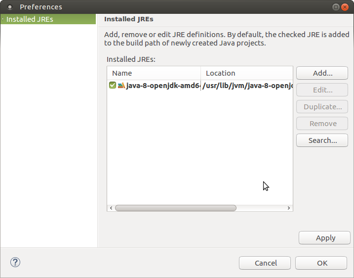
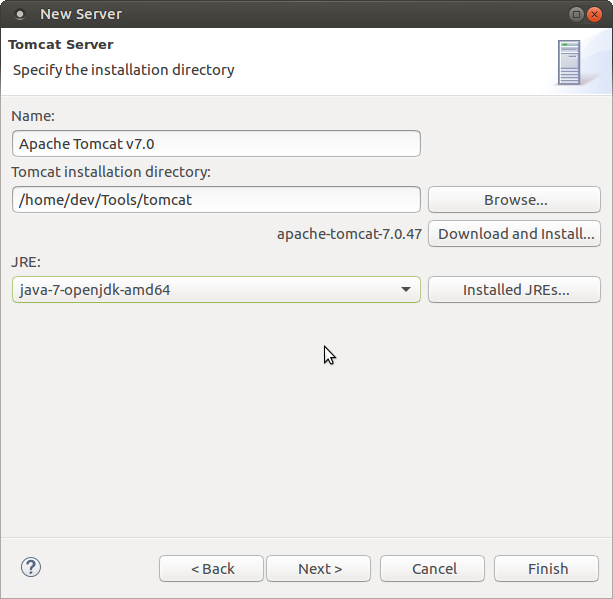

### Installing [Ubuntu](http://www.ubuntu.com/desktop)

### Starting Ubuntu for the First Time

### Updating the Software

Find the Software Updater link on the left icon menu bar. Click it to start Ubuntu Software update.

### Installing Virtual Box Guest Additions

### Installing Virtual Box Guest Additions, Again

In case the Virtual Box version is not the latest, there might be a problem with the Virtual Box Guest Additions.
To fix it, use the latest version of Virtual Box Guest Additions.

### Ubuntu installed and Virtual Box Guest Additons Up and Running

Optionally, Shared Clipboard and Drag 'n' Drop can be set to Bidirectional.

