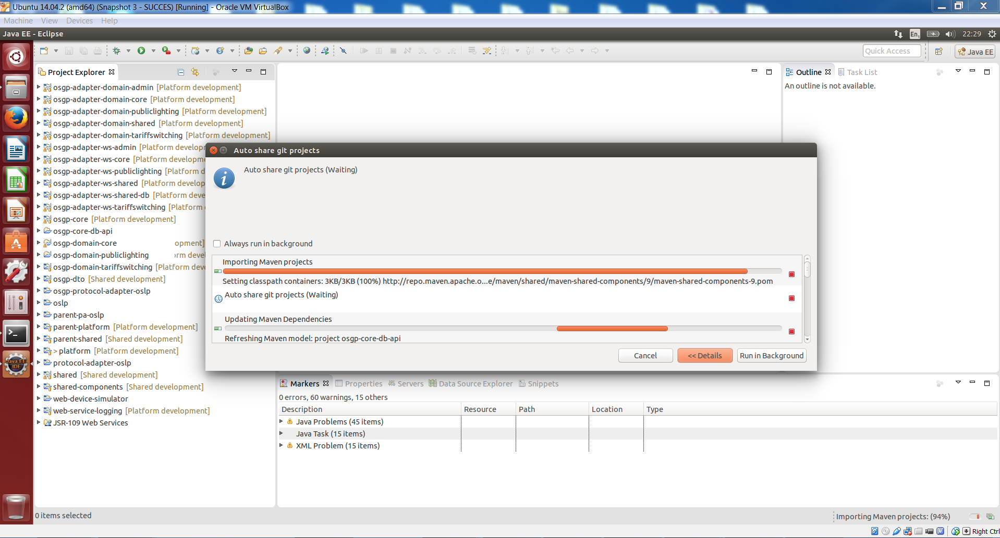

### Testing the platform using the Web Demo
This chapter will describe the steps needed to test the Open Smart Grid Platform using the Web Demo Application.

- Open a terminal and clone the demo app to the Sources/OSGP folder:
- ```bash
git clone https://github.com/OSGP/PublicLightingDemoApp.git /home/dev/Sources/OSGP/PublicLightingDemoApp
```
- Open Eclipse and import the following folder as as Maven project  ```/home/dev/Sources/OSGP/PublicLightingDemoApp/```
- Add the PublicLightingDemoApp components to the Tomcat Server.
- (Re)Start the Tomcat Server.


### Creating a device
To access the Demo App go to the following URL: ```https://localhost/web-demo-app/```

If you encounter a Untrusted Connection page, go to 'I Understand the Risks' -> Add Exception.. -> Confirm Security Exception


Click the Add a Device button in the Menu bar, and enter ```SSLD_000-00-01``` at the Device Identification field and press Submit.



The following screen will appear, it shows that the device has been succesfully added to the Platform.


### Opening Device Simulator to Add a Device
In order to be able to use the SSLD-000-00-01 Device, the device needs to be simulated in the Device Simulator. To do this we have to create it.
In the Firefox Browser, open the Device Simulator by going to the following URL:
```
https://localhost/web-device-simulator/devices
```

Click Add Device


Fill out the fields like this:
- Device Identification: SSLD_000-00-01
- IP Address: 127.0.0.1
- Device Type: SSLD
- Protocol: OSLP

Click Create Device


You should return to the Devices screen and see the message "Device with identification SSLD_000-00-01 was created."


### Registering a Device
Now click on the newly created device and click the 'Register Device' button. After a while the message "Device identification with identification SSLD_000-00-01 was registered at XXXXXXXX" appears.


Then click the 'Confirm Registration' button. The message should read: "Device with identification SSLD_000-00-01 was confirmed to be registered."


### Using 'SetLight' Switch the Light On
Now that the Device is known in the platform, and simulated in the Device-Simulator, the device can be used. Let's switch on the Light.
Go to the Demo App and press the List button in the Menu. A list should appear, showing the device that has just been added using the Add Device button.


Click on the Manage button to access the Device Details.


Switch on the Light by setting the Light Value to 100 and by checking the 'LightOn' checkbox (as shown in the screenshot below)


Hit submit to submit the request to the Platform. The following screen should appear:


In the home screen of the OSLP device simulator, the lightbulb should light up for SSLD_000-00-01. This means that the request succeeded.


This step also condcludes the installation manual.
