### Setting Up the Open Smart Grid Platform
This chapter describes all the steps needed to set-up the open samrt grid platform.

### Importing Maven Projects into Eclipse
Open Eclipse by clicking the shortcut on the Desktop and import the projects.

Go to File -> Import -> Existing Maven Projects, browse to folder `/home/dev/Sources/OSGP`

You will find 5 folders there, import each one (Except Config) in the following order:

- `/home/dev/Sources/OSGP/Shared`
- `/home/dev/Sources/OSGP/Platform`
- `/home/dev/Sources/OSGP/Protocol-Adapter-OSLP`
- `/home/dev/Sources/OSGP/Protocol-Adapter-DLMS`


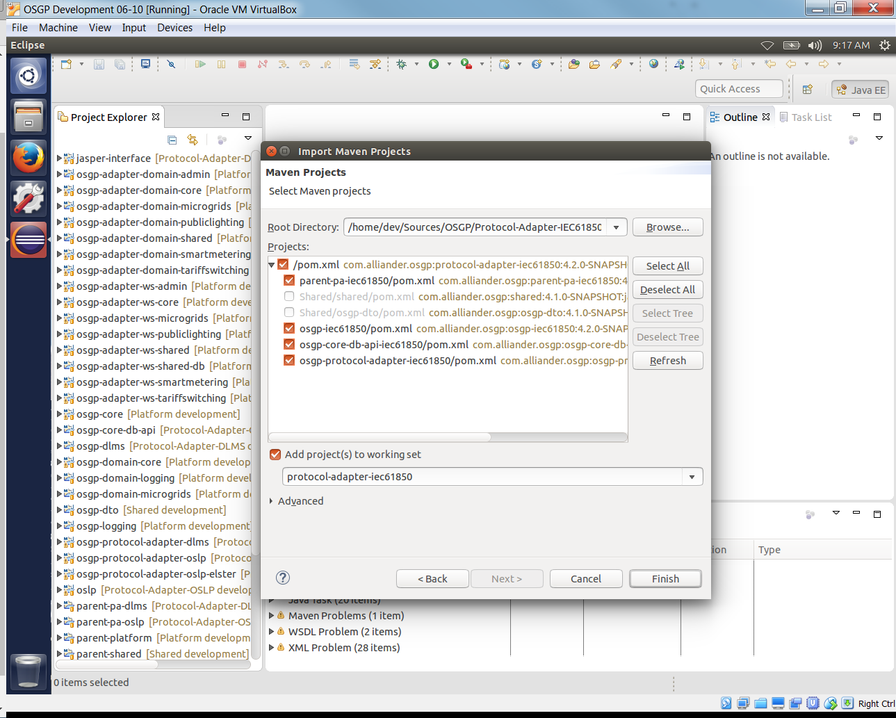

### Creating an Apache Tomcat7 Server

In Eclipse go to Window -> Open Perspective -> Debug
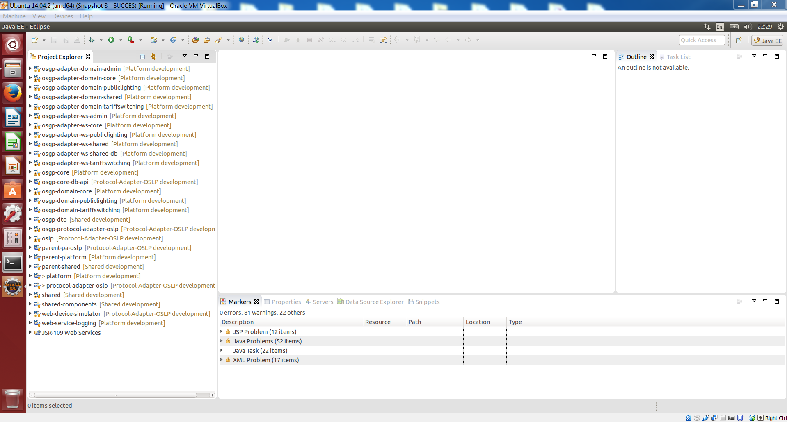

In the 'Debug' perspective, go to the 'Servers' view and add a new Apache Tomcat7 server, Tomcat7 is available in the folder `/home/dev/Tools/apache-tomcat-7.0.61`

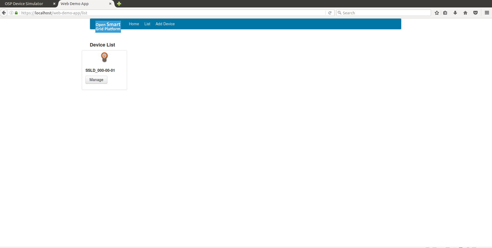

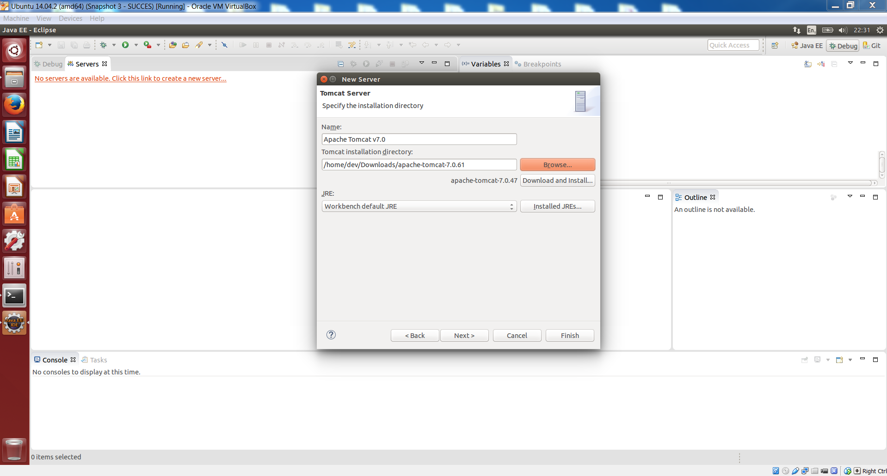

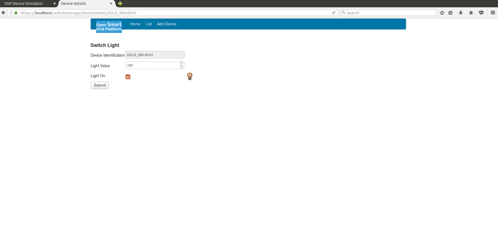
After adding the server, double click on the Tomcat server in the 'Servers' view and set the following configuration: under 'Timeouts' set 'Start' to 600 and 'Stop' to 300.
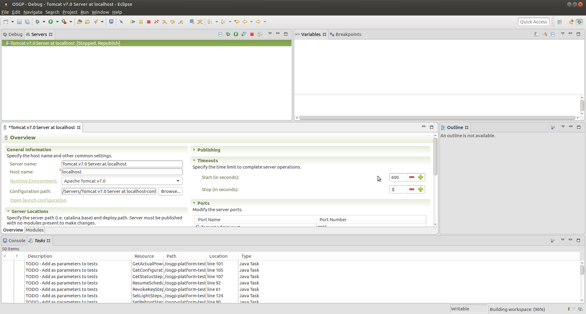

Click on 'Open launch configuration', click on the 'Arguments' tab and add the following at the end of the 'VM arguments':
`-Xms512m -Xmx2048m -Xss512k -XX:MaxPermSize=1024m -XX:+CMSClassUnloadingEnabled -XX:+UseConcMarkSweepGC -Dcom.sun.management.jmxremote=true`
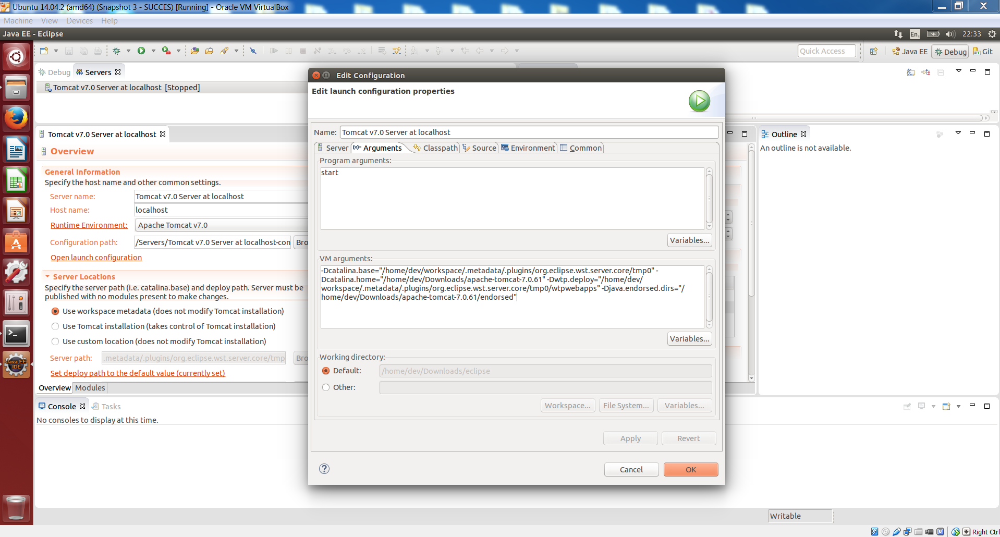

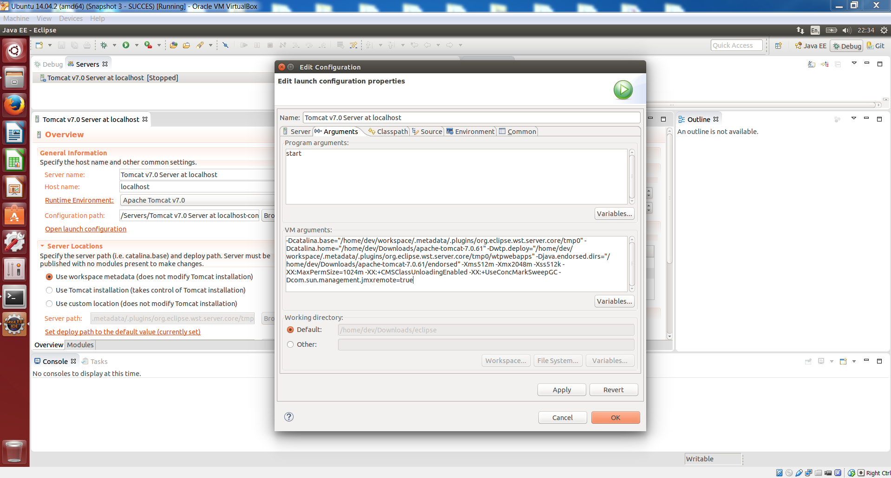

### Setting Up Apache Tomcat7 Server Context
Setup the Tomcat7 context.xml in the eclipse Servers folder, by copying the entries in `/home/dev/Sources/OSGP/Config/tomcat/context.xml` to map configuration file names to file paths.
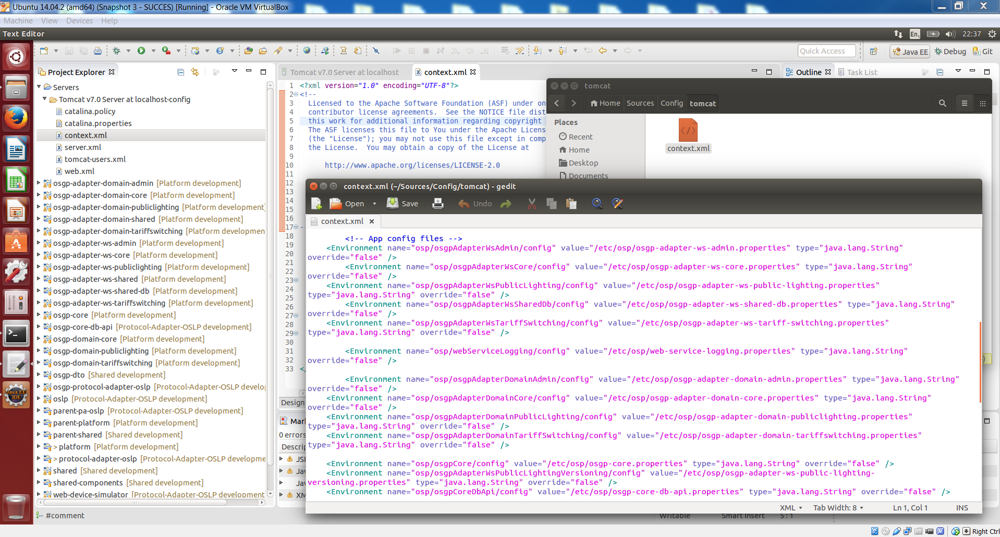

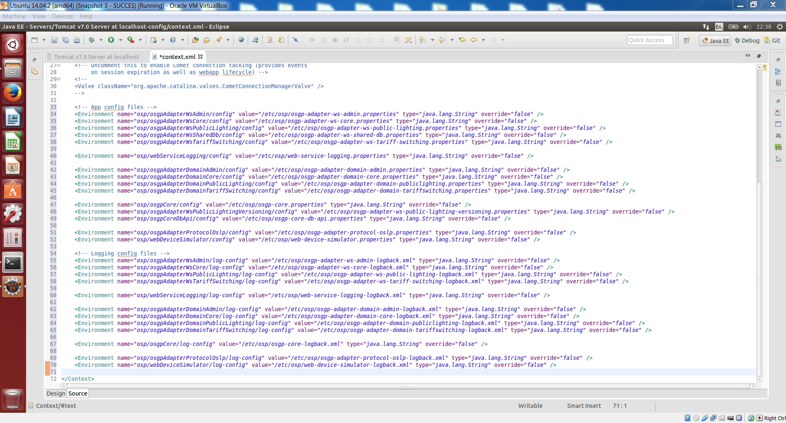

### Deploying all Open Smart Grid Platform components to Apache Tomcat7 Server
Continue by adding the Maven Projects to the Tomcat server by right clicking on the Tomcat server and choosing 'Add and Remove', followed by clicking on the 'Add =All' button.
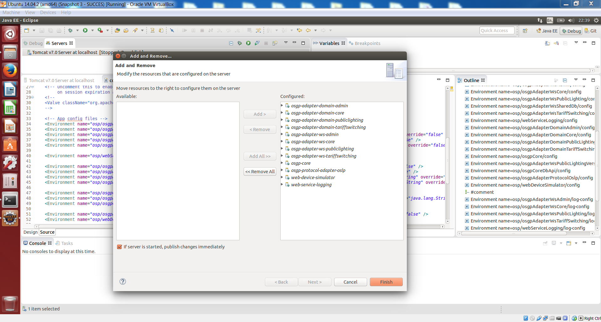
At this point, eclipse's auto-build should have built the projects, and the Tomcat server has been setup.

### Starting Apache ActiveMQ
Continue with starting Apache ActiveMQ. On the desktop double click the ActiveMQ shortcut.

Alternatively you can open a terminal and run the executable manually by using the following command:
(the executable can be found in the folder `/home/dev/Tools/apache-activemq-*/bin/linux-x86-64`)
```shell
sudo ./activemq console
```

This start ActiveMQ as a terminal process (this way, ActiveMQ doesn't detach from the terminal and starts running as a daemon).


### Starting Apache Tomcat7 Server
With ActiveMQ running, the Tomcat7 server can be started. Go to Eclipse, go to the Servers tab in the Debug view, and right click on the Tomcat server and select 'Start'.
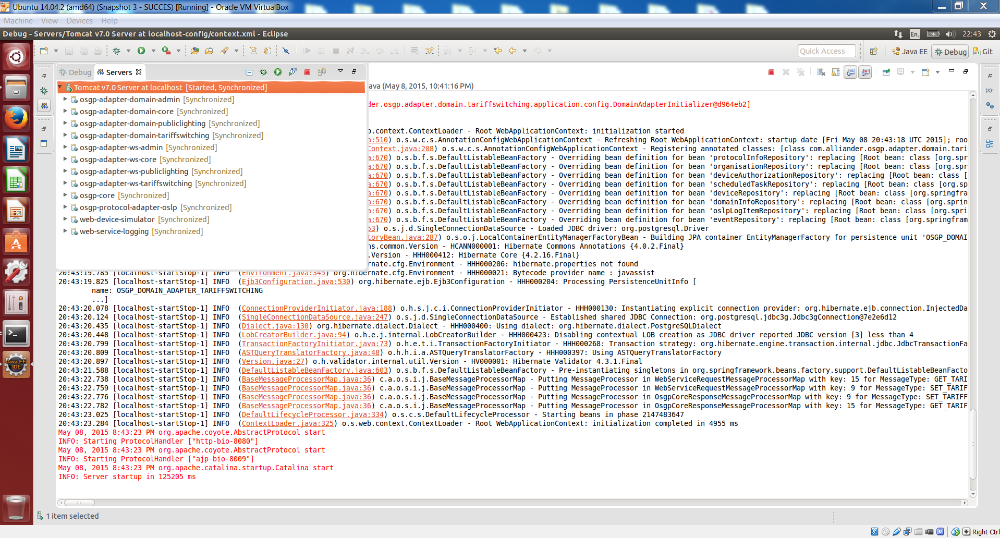

### Starting pgAdmin III and Connect to PostgreSQL
Open pgAdminIII and configure a connection: choose the 'Add a connection to a server.' and fill out the fields using
- Host: localhost
- Port: 5432
- Username: osp_admin
- Password: 1234

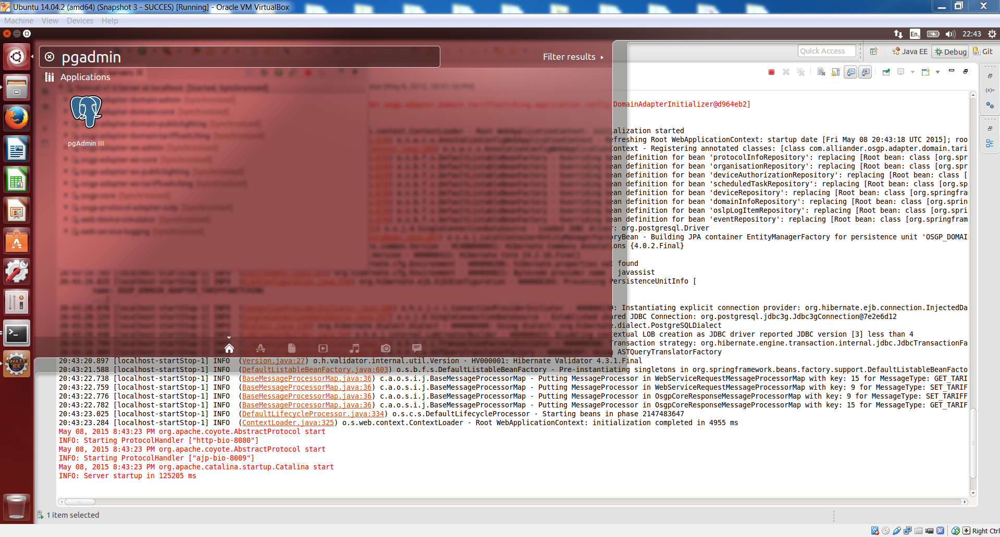

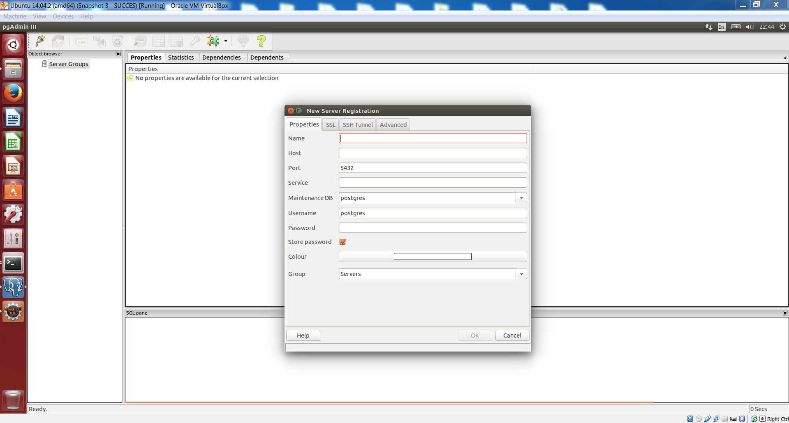

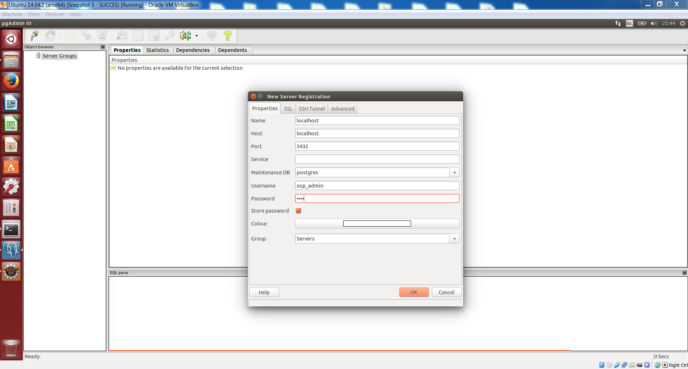

### Creating the 'test-org' Organization
Run the script in `/home/dev/Sources/OSGP/Config/sql/create-test-org.sql` to insert 'test-org' organization into the organisation table of the osgp_core database.

```shell
psql -U osp_admin -d osgp_core -f /home/dev/Sources/OSGP/Config/sql/create-test-org.sql
```

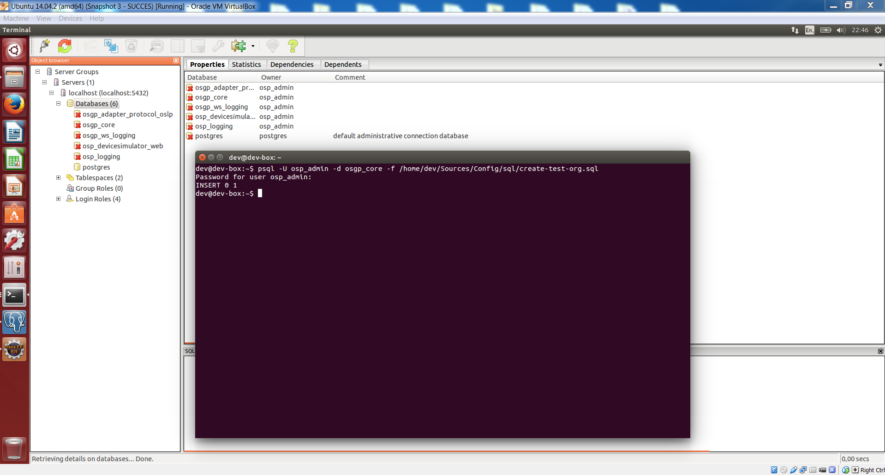

Go back to PgAdmin III, expand servers, select localhost -> databases -> osgp_core -> Schemas -> public -> Tables. Right click the organisation table and select 'show top 100 data rows'. Confirm that the test-org organisation has been added to the Database.

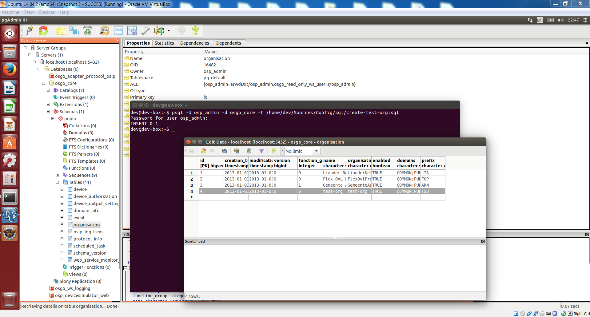

Now that everything has been set up, continue to the next chapter to start testing the Platform by sending it some requests.
