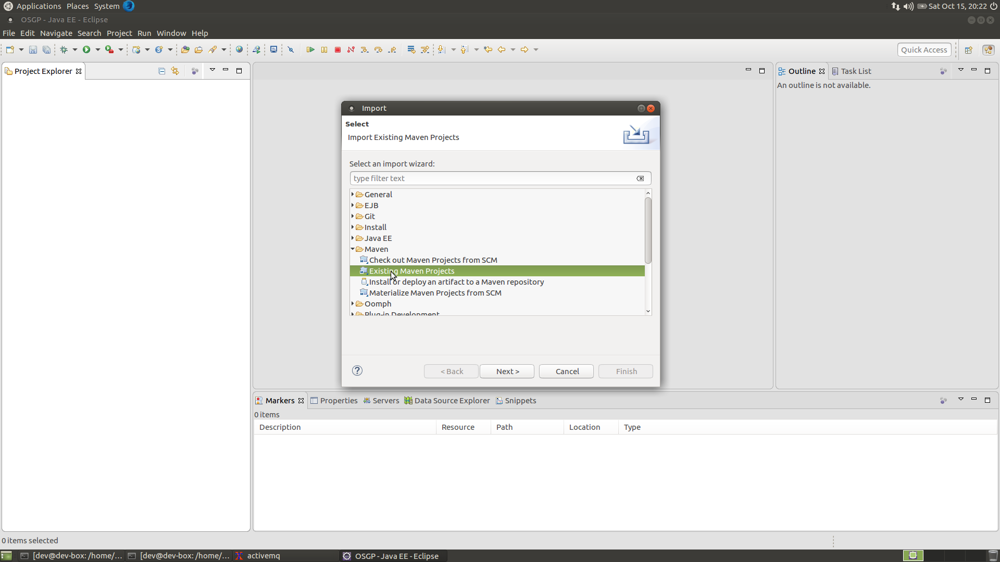
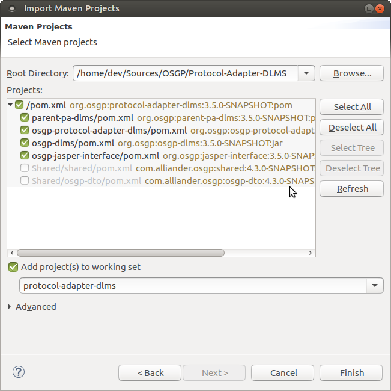
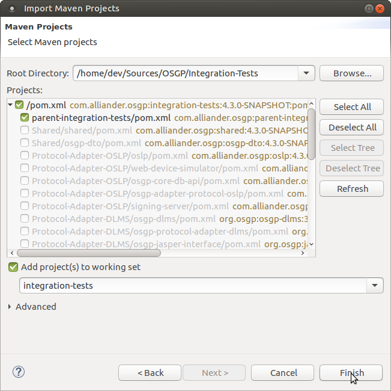

### Setting Up the Open Smart Grid Platform Development environment
This chapter describes all the steps needed to finalize the open smart grid platform development environment.

### Importing Maven Projects into Eclipse
Open Eclipse by clicking the shortcut on the Desktop and import the projects.

Go to File -> Import -> Existing Maven Projects, browse to folder `/home/dev/Sources/OSGP`

Import the following Projects (in the order as mentioned below)

- `/home/dev/Sources/OSGP/Shared`
- `/home/dev/Sources/OSGP/Platform`
- `/home/dev/Sources/OSGP/Protocol-Adapter-OSLP`
- `/home/dev/Sources/OSGP/Protocol-Adapter-DLMS`
- `/home/dev/Sources/OSGP/Protocol-Adapter-IEC61850`
- `/home/dev/Sources/OSGP/Integration-Tests`









### Creating an Apache Tomcat7 Server

In Eclipse go to Window -> Open Perspective -> Debug


In the 'Debug' perspective, go to the 'Servers' view and add a new Apache Tomcat7 server, Tomcat7 is available in the folder `/home/dev/Tools/tomcat`

Click on Next


Click on Finish


After adding the server, double click on the Tomcat server in the 'Servers' view and set the following configuration: under 'Timeouts' set 'Start' to 600 and 'Stop' to 3.


Click on 'Open launch configuration', click on the 'Arguments' tab and add the following at the end of the 'VM arguments':
`-Xms512m -Xmx2048m -Xss512k -XX:MaxPermSize=1024m -XX:+CMSClassUnloadingEnabled -XX:+UseConcMarkSweepGC -Dcom.sun.management.jmxremote=true`


### Setting Up Apache Tomcat7 Server Context
All modules contain their own context.xml. In the module specific context.xml are the environment variables defined where the global and module specific configuration files are located. Default they will point to a location in */etc/osp/*.

If you want to deviate from this, you might set up the context.xml in tomcat to be able to redirect in one file to different locations.  This is optional and not required.
In order to use a custom context.xml, copy the entries in `/home/dev/Sources/OSGP/Config/tomcat/context.xml.sample` to the Tomcat7 context.xml in the eclipse Servers folder, to map configuration file names to file paths.


### Deploying all Open Smart Grid Platform components to Apache Tomcat7 Server
Continue by adding the Maven Projects to the Tomcat server by right clicking on the Tomcat server and choosing 'Add and Remove', followed by clicking on the 'Add =All' button.

At this point, eclipse's auto-build should have built the projects, and the Tomcat server has been setup.

### Starting Apache ActiveMQ
Continue with starting Apache ActiveMQ. On the desktop double click the ActiveMQ shortcut.

Alternatively you can open a terminal and run the executable manually by using the following command:
(the executable can be found in the folder `/home/dev/Tools/activemq/bin/linux-x86-64`)
```shell
sudo ./activemq console
```

This starts ActiveMQ as a terminal process (this way, ActiveMQ doesn't detach from the terminal and starts running as a daemon).


### Starting Apache Tomcat7 Server
With ActiveMQ running, the Tomcat7 server can be started. Go to Eclipse, go to the Servers tab in the Debug view, and right click on the Tomcat server and select 'Start'.


### Starting pgAdmin III and Connect to PostgreSQL
Open pgAdminIII and configure a connection: choose the 'Add a connection to a server.' and fill out the fields using
- Host: localhost
- Port: 5432
- Username: osp_admin
- Password: 1234


### Creating the 'test-org' Organization
Run the script in `/home/dev/Sources/OSGP/Config/sql/create-test-org.sql` to insert 'test-org' organization into the organisation table of the osgp_core database.

```shell
psql -U osp_admin -d osgp_core -f /home/dev/Sources/OSGP/Config/sql/create-test-org.sql
```

If asked for a password, enter ```1234```


Go back to PgAdmin III, expand servers, select localhost -> databases -> osgp_core -> Schemas -> public -> Tables. Right click the organisation table and select 'show top 100 data rows'. Confirm that the test-org organisation has been added to the Database.


Now that everything has been set up, continue to the next chapter to start testing the Platform by sending it some requests.
