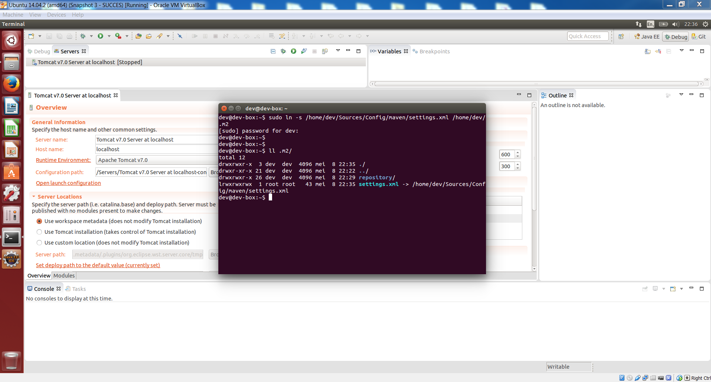

### 3.3.8 Downloading the Puppet Scripts From Our [Config GitHub Repository](https://github.com/OSGP/Config)

Make sure to check the development branch for the latest version!

### 3.3.9 Start with Installing Puppet

### 3.3.10 Using Puppet to Setup the Development Environment

### 3.3.11 Importing Maven Projects into Eclipse
Open eclipse (the executable can be found in the folder /home/dev/Downloads/eclipse*/eclipse) and import the projects: File -> Import -> Existing Maven Projects, browse to folder /home/dev/Sources and start with the Shared project, then the Platform project, then the Protocol-Adapter-OSLP project and then the Protocol-Adapter-DLMS project.

Show the 'Debug' and 'Git' perspectives.

### 3.3.12 Creating an Apache Tomcat7 Server
In the 'Debug' perspective, go to the 'Servers' view and add a new Apache Tomcat7 server, Tomcat7 is available in the folder /home/dev/Downloads/apache-tomcat-7.0.61.

After adding the server, double click on the Tomcat server in the 'Servers' view and set the following configuration: under 'Timeouts' set 'Start' to 600 and 'Stop' to 300.

Click on 'Open launch configuration', click on the 'Arguments' tab and add the following at the end of the 'VM arguments' '''string: -Xms512m -Xmx2048m -Xss512k -XX:MaxPermSize=1024m -XX:+CMSClassUnloadingEnabled -XX:+UseConcMarkSweepGC -Dcom.sun.management.jmxremote=true'''

### 3.3.13 Creating Sym Link to Maven Settings
Create a symlink to the Maven setting file using this command: 
'''sudo ln -s /home/dev/Sources/Config/maven/settings.xml /home/dev/.m2 '''

### 3.3.14 Setting Up Apache Tomcat7 Server Context
Setup the Tomcat7 context.xml in the eclipse Servers folder, by copying the entries in /home/dev/Sources/Config/tomcat/context.xml to map configuration file names to file paths.

### 3.3.15 Deploying All OSGP Components to Apache Tomcat7 Server
Continue by adding the Maven Projects to the Tomcat server by right clicking on the Tomcat server and choosing 'Add and Remove', followed by clicking on the 'Add =All' button.

At this point, eclipse's auto-build should have built the projects, and the Tomcat server has been setup.

### 3.3.16 Starting Apache ActiveMQ
Continue with starting Apache ActiveMQ (the executable can be found in the folder /home/dev/Downloads/apache-activemq-*/bin/linux-x86-64): by opening a terminal and use the command: '''sudo ./activemq console''' to start ActiveMQ as a terminal process (this way, ActiveMQ doesn't detach from the terminal and starts running as a daemon).

### 3.3.17 Starting Apache Tomcat7 Server
With ActiveMQ running, the Tomcat7 server can be started.

### 3.3.18 Starting pgAdmin III and Connect to PostgreSQL
Open pgAdminIII and configure a connection: choose the 'Add a connection to a server.' and fill out the fields using Host localhost, Port 5432, Username osp_admin and Password 1234.

### 3.3.19 Creating the 'test-org' Organization
Run the script (/home/dev/Sources/Config/sql/create-test-org.sql) to insert 'test-org' organization into the organisation table of the osgp_core database.

'''
psql -U osp_admin -d osgp_core -f /home/dev/Sources/Config/sql/create-test-org.sql
'''

