### Testing the platform
This chapter will describe the steps needed to test the Open Smart Grid Platform.

### Setting Up SoapUI
Start SoapUI by double clicking the shortcut on the Desktop or run it manually by typing the following command in a terminal:
```shell
/home/dev/Tools/SoapUI/bin/soapui.sh
```

Go to File -> Preferences -> SSL Settings, and browse for the KeyStore to `/home/dev/Sources/OSGP/Config/certificates/osgp-ca/certs/test-org.pfx` and fill out the password (the password is 1234)
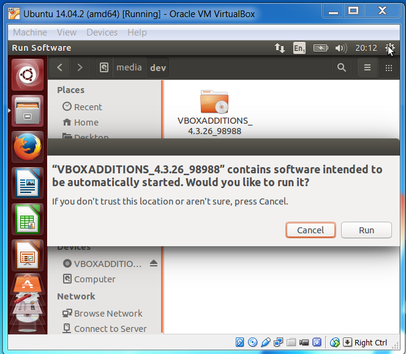

Go to WSDL Settings and check 'Generate Example Values in New Requests' and 'Generate Comments with Type Information in New Requests'
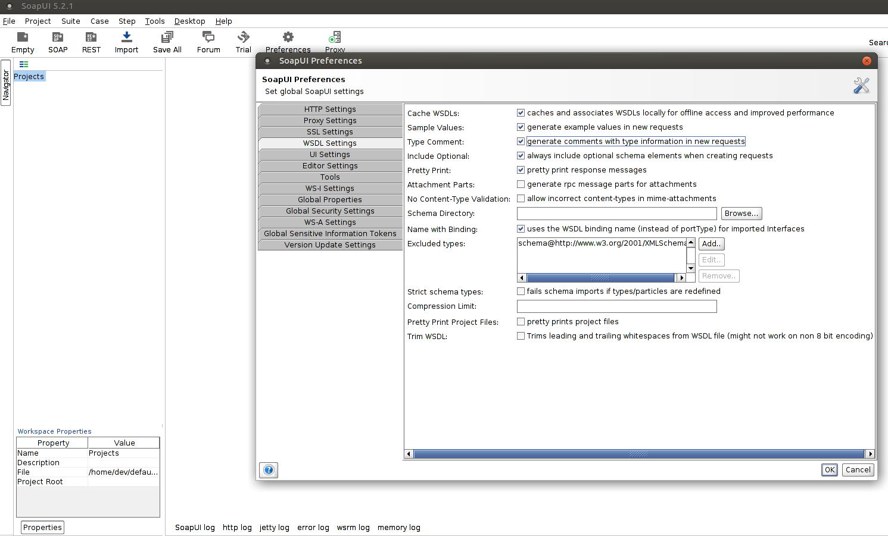

### Adding the 'Admin' Soap project
Import the 'admin' project by clicking File -> Import project. Browse to `/home/dev/Sources/OSGP/Config/soapui/`, select 'admin-soapui-project.xml' and click open.

Alternatively you can create the 'admin' project yourself by following the steps below:

- Create a new SOAP Project and call it 'admin'
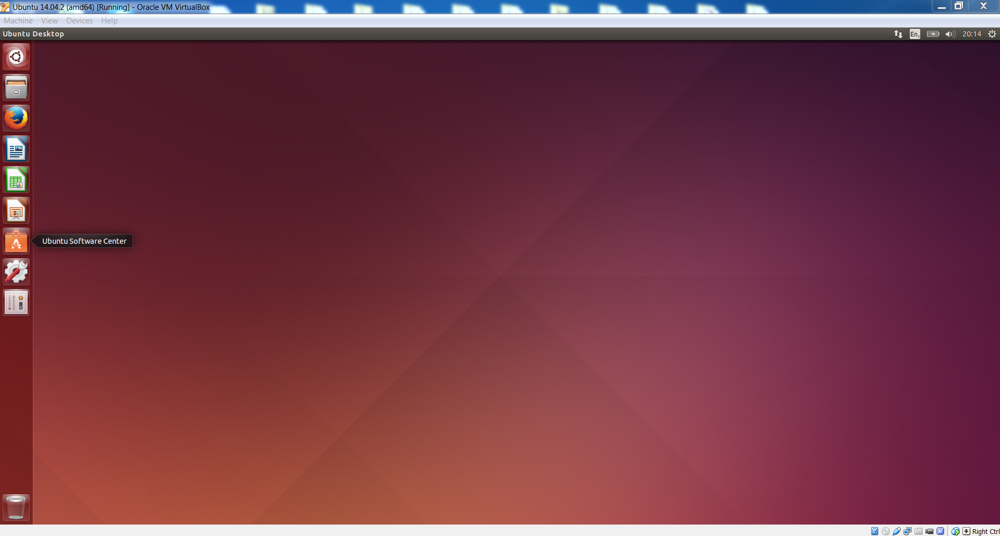

- Open the Project View by double-clicking on the 'admin' project. Go to 'WS-Security Configurations' and select the 'Keystores' Tab. Click on the '+' to add the `test-org.pfx` in `/home/dev/Sources/OSGP/Config/certificates/osgp-ca/certs/`
- Fill out the password (1234) and click Ok and close the Project View window.
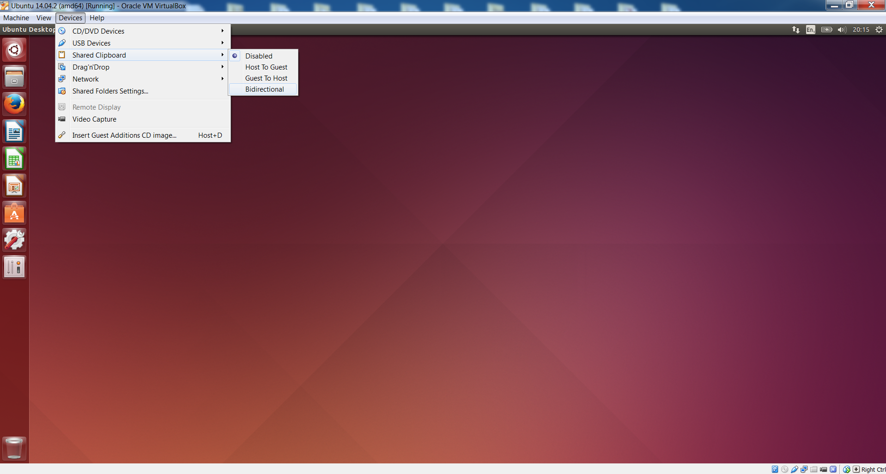

- Right click the 'admin' project and choose 'Add WSDL'. Enter the following URL in the WSDL Location field:
```
/home/dev/Sources/OSGP/Shared/osgp-ws-admin/src/main/resources/DeviceManagement.wsdl
```

- Make sure the box 'Create sample requests for all operators' is checked, and click OK.
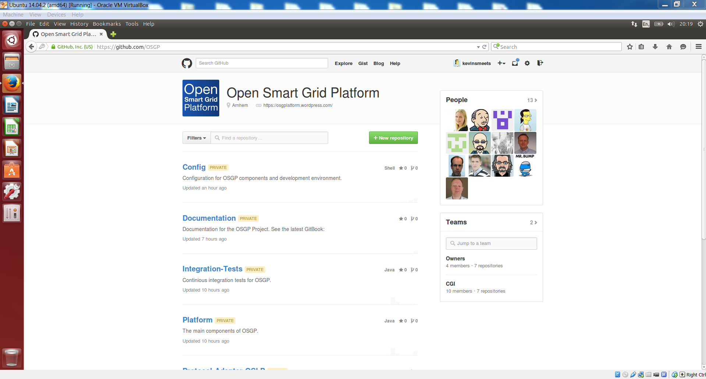

### Adding the 'Public Lighting' Soap project.
Import the 'public-lighting' project by clicking File -> Import project. Browse to `/home/dev/Sourcees/OSGP/Config/soapui/`, select 'public-lighting-soapui-project.xml' and click open.

Alternatively you can create the 'public-lighting' project yourself by following the steps below:

- Create another new SOAP Project and call it 'public-lighting'
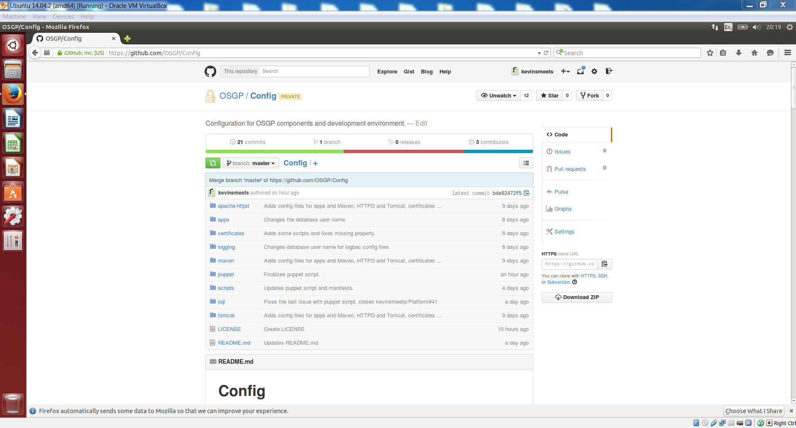

- Open the Project View by double-clicking on the 'public-lighting' project. Go to 'WS-Security Configurations' and select the 'Keystores' Tab. Click on the '+' to add the `test-org.pfx` in `/home/dev/Sources/OSGP/Config/certificates/osgp-ca/certs/`
- Fill out the password (1234) and click Ok and close the Project View window.
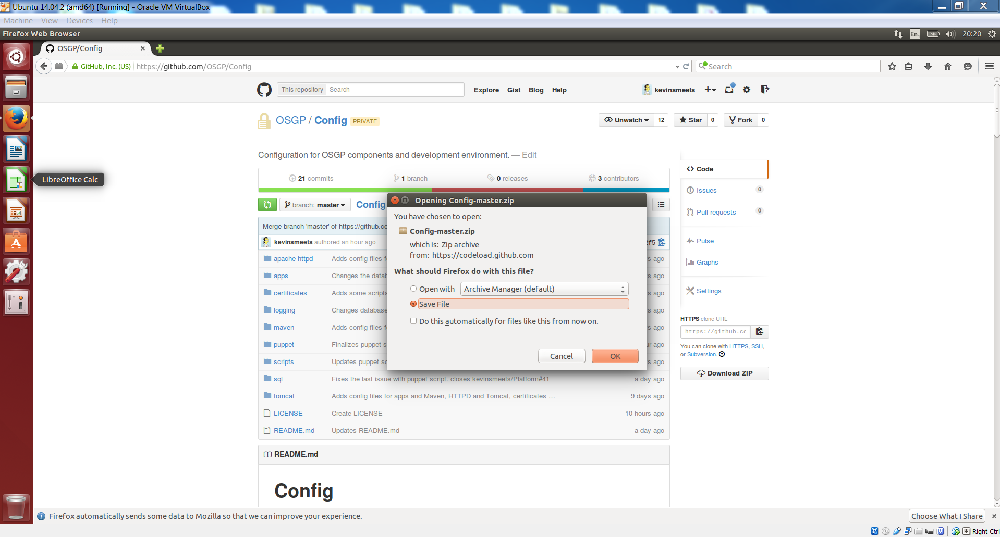

- Right click the 'public-lighting' project and choose 'Add WSDL'. Enter the following URL in the WSDL Location field:
```
/home/dev/Sources/OSGP/Shared/osgp-ws-publiclighting/src/main/resources/PublicLightingAdHocManagement.wsdl
```

- Make sure the box 'Create sample requests for all operators' is checked, and click OK.
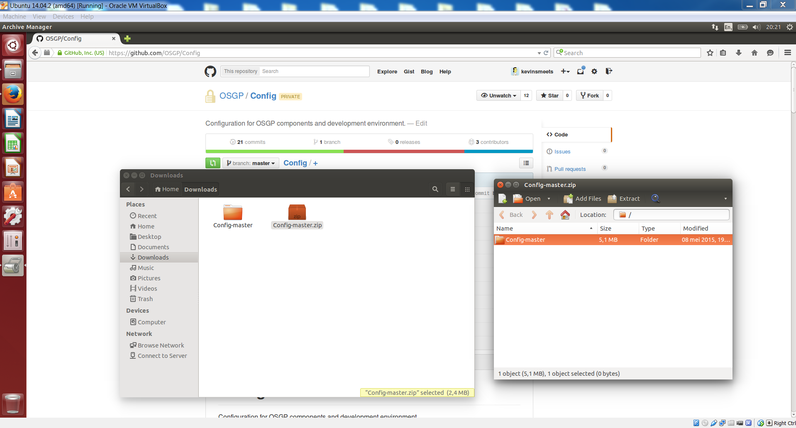

### First SOAP requests to add a device to the open smart grid platform
Before sending the request, the test-org.pfx should be added as SSL Keystore: Go to the properties interface for the request (bottom left of the screen, after selecting 'Request 1' under UpdateKey in the 'admin' project'), and choose `test-org.pfx` from the drop-down box.
### Note
- This has to be done for each request!

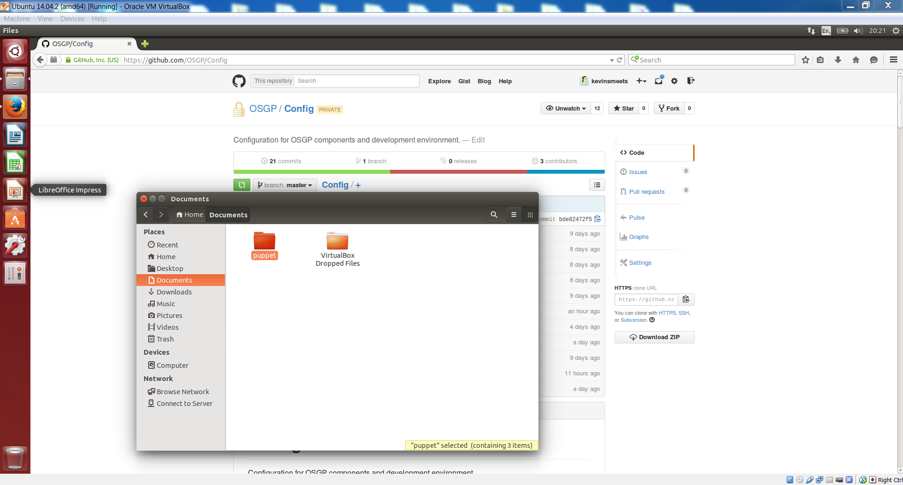

A SSLD needs to be added to the platform, together with a public key. The UpdateKey function of the admin webservice offers that functionality. Double click 'Request 1' under UpdateKey in the 'admin' project. Add the following request:
```xml
<soapenv:Envelope xmlns:soapenv="http://schemas.xmlsoap.org/soap/envelope/" xmlns:ns="http://www.alliander.com/schemas/osgp/common/2014/10" xmlns:ns1="http://www.alliander.com/schemas/osgp/admin/devicemanagement/2014/10">
   <soapenv:Header>
      <ns:ApplicationName>APPLICATION_NAME</ns:ApplicationName>
      <ns:UserName>USER_NAME</ns:UserName>
      <ns:OrganisationIdentification>test-org</ns:OrganisationIdentification>
   </soapenv:Header>
   <soapenv:Body>
      <ns1:UpdateKeyRequest>
         <!--type: Identification-->
         <ns1:DeviceIdentification>SSLD_000-00-01</ns1:DeviceIdentification>
         <!--type: string-->
         <ns1:PublicKey>MFkwEwYHKoZIzj0CAQYIKoZIzj0DAQcDQgAEFhUImXFJdqmputquVAc2CPdnn9Ju00M3m/Ice7wABNN+oAYKQbw/OceqvZmFF1+r4nO/vCm/f1JO5nEorE2jNQ==</ns1:PublicKey>
         <!--type: long-->
         <ns1:ProtocolInfoId>1</ns1:ProtocolInfoId>
      </ns1:UpdateKeyRequest>
   </soapenv:Body>
</soapenv:Envelope>
```
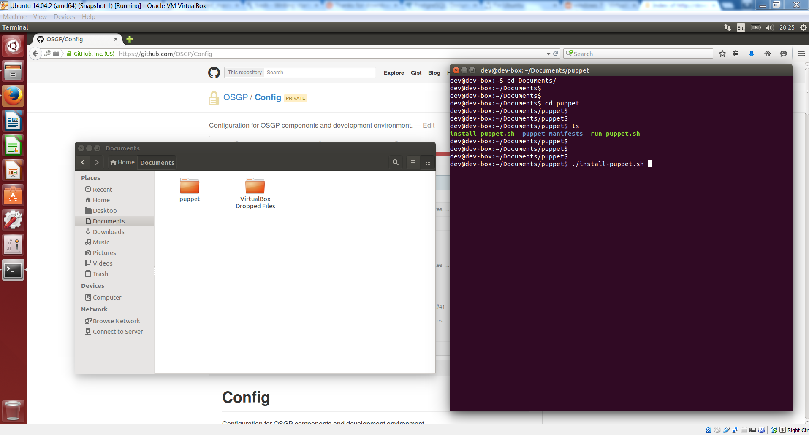

Click the 'play' button to submit the request to the endpoint. You should receive similar response as shown in the screenshot below:
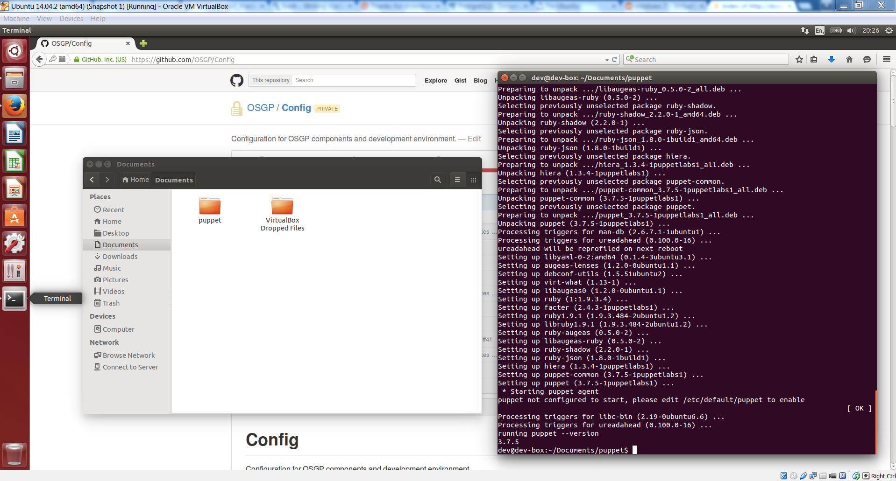

After the SSLD has been added, let's see if the function FindAllDevices shows the SSLD. Continue with the FindAllDevices request from the public-lighting project. Since this is not the same project, we have to change the endpoint; in this case in https://localhost:443/osgp-adapter-ws-publiclighting/publiclighting/adHocManagementService/.
Do not forget to set the SSL keystore in the Request Properties. Use the following parameters in the request:
```xml
<soapenv:Envelope xmlns:soapenv="http://schemas.xmlsoap.org/soap/envelope/" xmlns:ns="http://www.alliander.com/schemas/osgp/common/2014/10" xmlns:ns1="http://www.alliander.com/schemas/osgp/publiclighting/adhocmanagement/2014/10">
   <soapenv:Header>
      <ns:ApplicationName>APPLICATION_NAME</ns:ApplicationName>
      <ns:UserName>USER_NAME</ns:UserName>
      <ns:OrganisationIdentification>test-org</ns:OrganisationIdentification>
   </soapenv:Header>
   <soapenv:Body>
      <ns1:FindAllDevicesRequest>
         <!--type: int-->
         <ns1:Page>0</ns1:Page>
      </ns1:FindAllDevicesRequest>
   </soapenv:Body>
</soapenv:Envelope>
```
After the request has been submitted, the response should include the SSLD device with ID SSLD_000_00_01
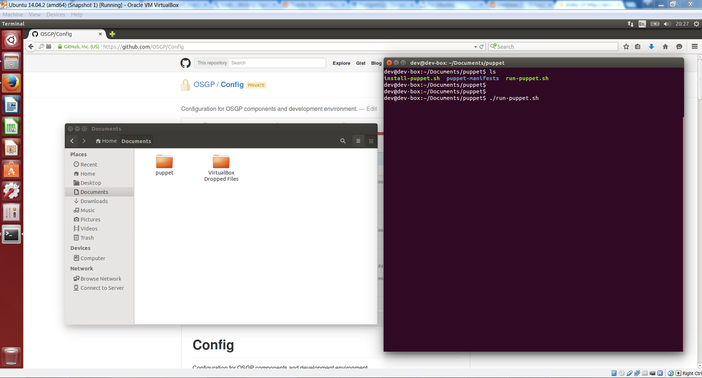

### Opening Device Simulator to Add a Device
In order to be able to use the SSLD-000-00-01 Device, the device needs to be simulated in the Device Simulator. To do this we have to create it.
In the Firefox Browser, open the Device Simulator by going to the following URL:
```
https://localhost/web-device-simulator/devices
```
If you encounter a Untrusted Connection page, go to 'I Understand the Risks' -> Add Exception.. -> Confirm Security Exception
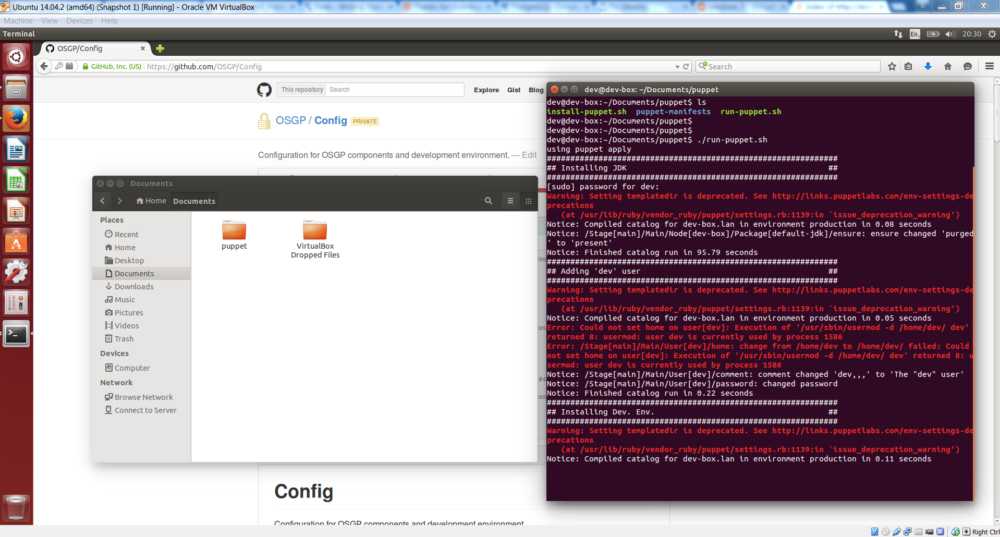

Click Add Device
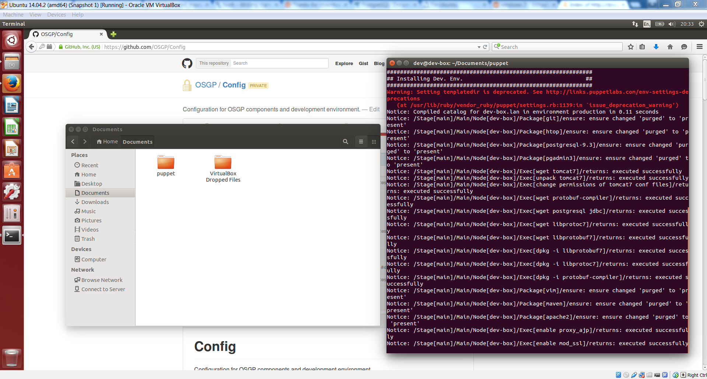

Fill out the fields like this:
- Device Identification: SSLD_000-00-01
- IP Address: 127.0.0.1
- Device Type: SSLD
- Protocol: OSLP

Click Create Device
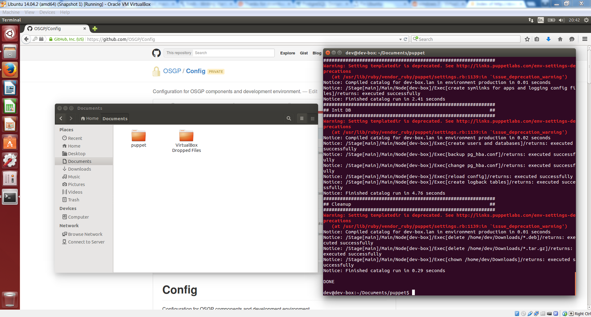

You should return to the Devices screen and see the message "Device with identification SSLD_000-00-01 was created."
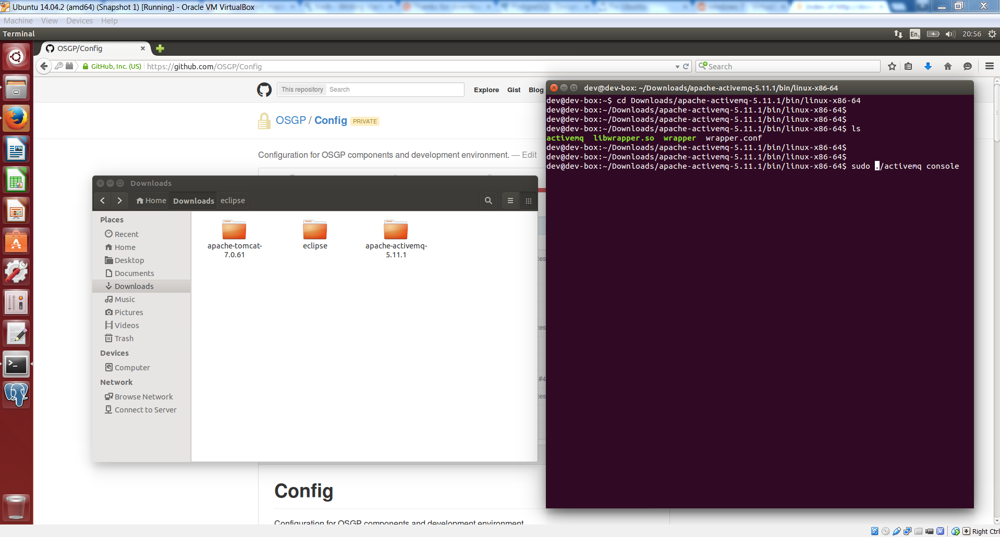

### Registering a Device
Now click on the newly created device and click the 'Register Device' button. After a while the message "Device identification with identification SSLD_000-00-01 was registered at XXXXXXXX" appears.
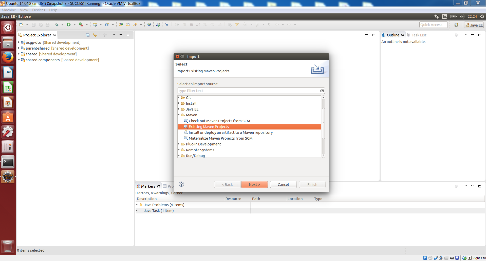

Then click the 'Confirm Registration' button. The message should read: "Device with identification SSLD_000-00-01 was confirmed to be registered."
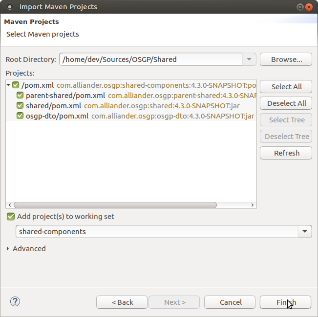

### Using 'SetLight' SOAP Request to Switch the Light On
Now that the Device is known in the platform, and simulated in the Device-Simulator, the device can be used. Let's switch on the Light.
Using SoapUI, click on Request 1 under SetLight at the public-lighting project. Set the following parameters in the request (And do not forget to set the Keystore in the request properties):

```xml
<soapenv:Envelope xmlns:soapenv="http://schemas.xmlsoap.org/soap/envelope/" xmlns:ns="http://www.alliander.com/schemas/osgp/common/2014/10" xmlns:ns1="http://www.alliander.com/schemas/osgp/publiclighting/adhocmanagement/2014/10">
   <soapenv:Header>
      <ns:ApplicationName>APPLICATION_NAME</ns:ApplicationName>
      <ns:UserName>USER_NAME</ns:UserName>
      <ns:OrganisationIdentification>test-org</ns:OrganisationIdentification>
   </soapenv:Header>
   <soapenv:Body>
      <ns1:SetLightRequest>
         <!--type: Identification-->
         <ns1:DeviceIdentification>SSLD_000-00-01</ns1:DeviceIdentification>
         <!--1 to 6 repetitions:-->
         <ns1:LightValue>
            <!--Optional:-->
            <!--anonymous type-->
            <ns1:Index>0</ns1:Index>
            <!--type: boolean-->
            <ns1:On>true</ns1:On>
            <!--Optional:-->
            <!--anonymous type-->
            <ns1:DimValue>100</ns1:DimValue>
         </ns1:LightValue>
      </ns1:SetLightRequest>
   </soapenv:Body>
</soapenv:Envelope>
```

Submit the request. Take note of the CorrelationUid in the response. You can use this Id in another request to ask the server for the status of this request.
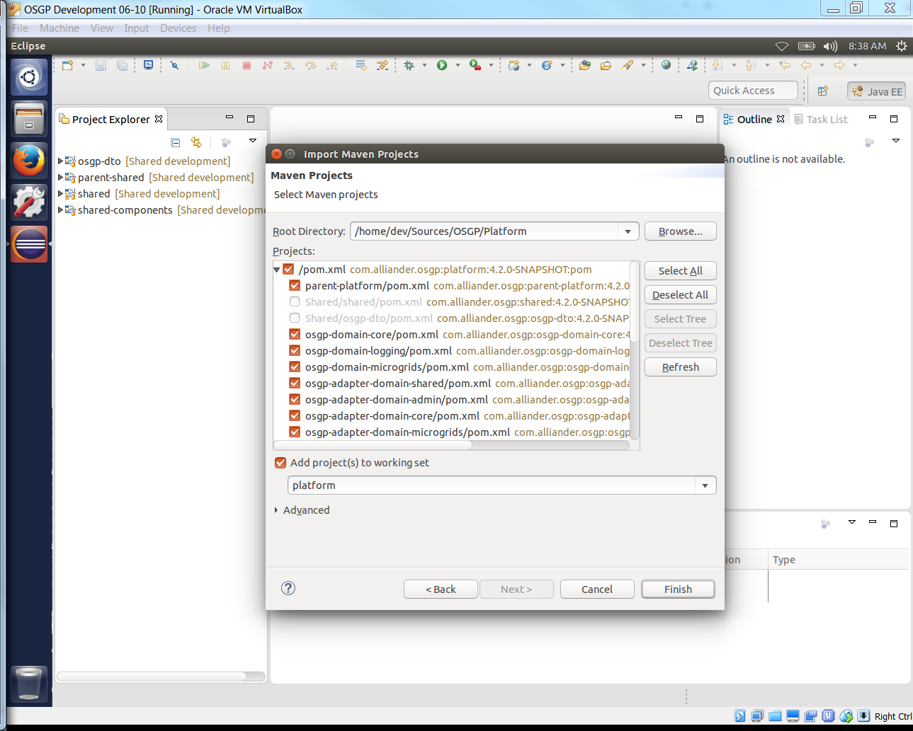

In the home screen of the OSLP device simulator, the lightbulb should light up for SSLD_000-00-01. This means that the request succeeded.
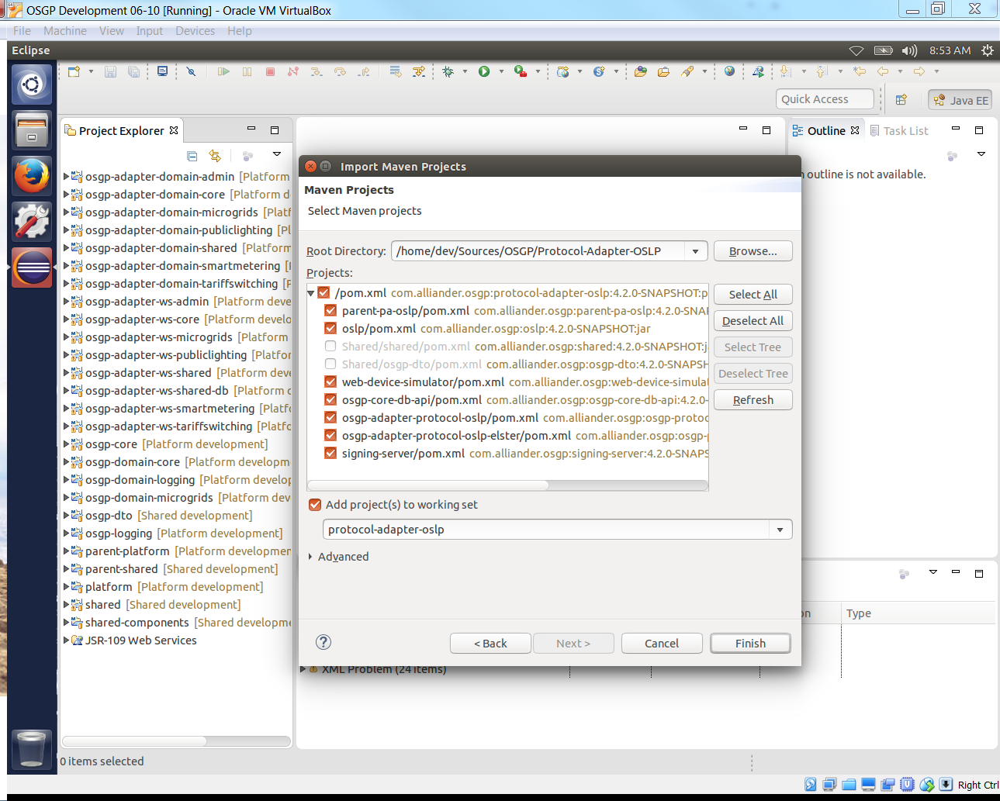

The last request concerns the response form the previous SetLight request.
In SoapUi open Request 1 under 'GetSetLightResponse' in the 'public-lighting' project. Set the following parameters in the request (And the keystore in the request properties). Make sure to replace the CorrelationUid with the value from the respons from the SetLight request.
```xml
<soapenv:Envelope xmlns:soapenv="http://schemas.xmlsoap.org/soap/envelope/" xmlns:ns="http://www.alliander.com/schemas/osgp/common/2014/10" xmlns:ns1="http://www.alliander.com/schemas/osgp/publiclighting/adhocmanagement/2014/10">
   <soapenv:Header>
      <ns:ApplicationName>APPLICATION_NAME</ns:ApplicationName>
      <ns:UserName>USER_NAME</ns:UserName>
      <ns:OrganisationIdentification>test-org</ns:OrganisationIdentification>
   </soapenv:Header>
   <soapenv:Body>
      <ns1:SetLightAsyncRequest>
         <ns1:AsyncRequest>
            <!--type: CorrelationUid-->
            <ns:CorrelationUid>test-org|||SSLD_000-00-01|||20160721083641940</ns:CorrelationUid>
            <!--type: Identification-->
            <ns:DeviceId>SSLD_000-00-01</ns:DeviceId>
         </ns1:AsyncRequest>
      </ns1:SetLightAsyncRequest>
   </soapenv:Body>
</soapenv:Envelope>
```

#### Note
- Do not forget to set the CorrelationUid to value in the response you received from the setLight request.

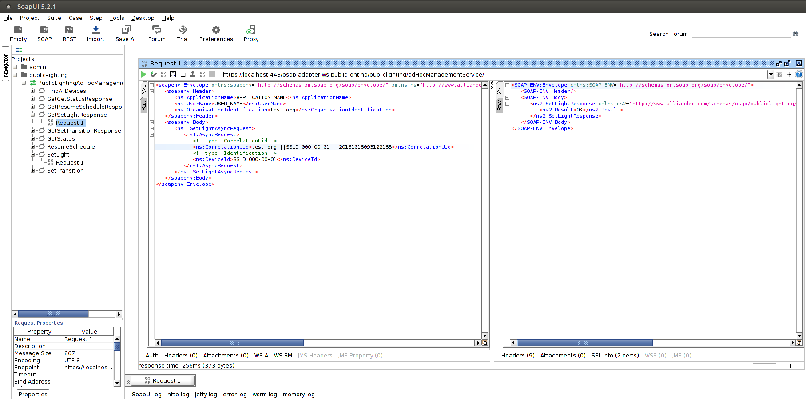

The server replied Ok, indicicating that the SetLight request has been processed succesfully.

This step also condcludes the installation manual.
