### Installing SoapUI
In order to test the webservice, SoapUI can be used. Download SoapUI Open Source from https://www.soapui.org/downloads/soapui.html
Once downloaded, make the SoapUI-x64-*.sh script executable.
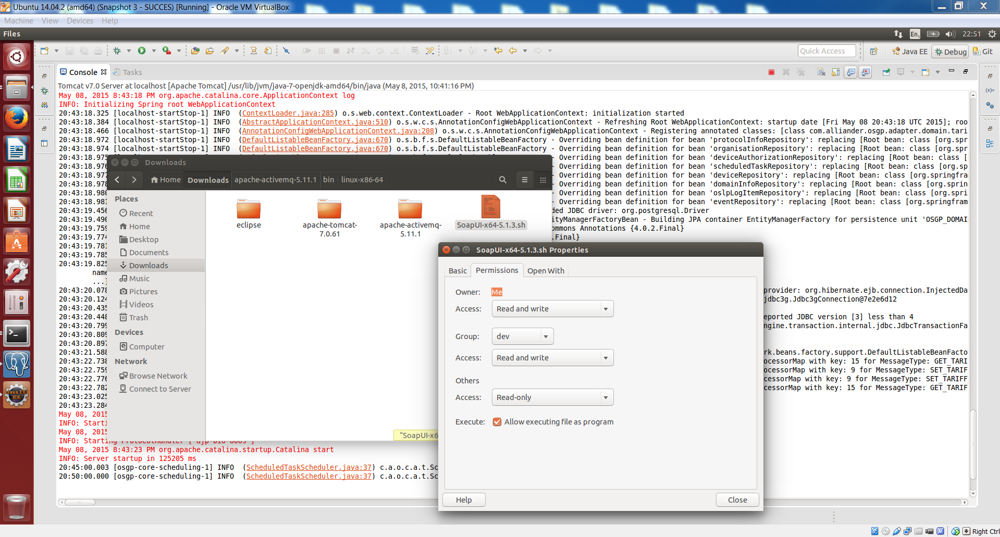

Start the SoapUI-x64-*.sh script.
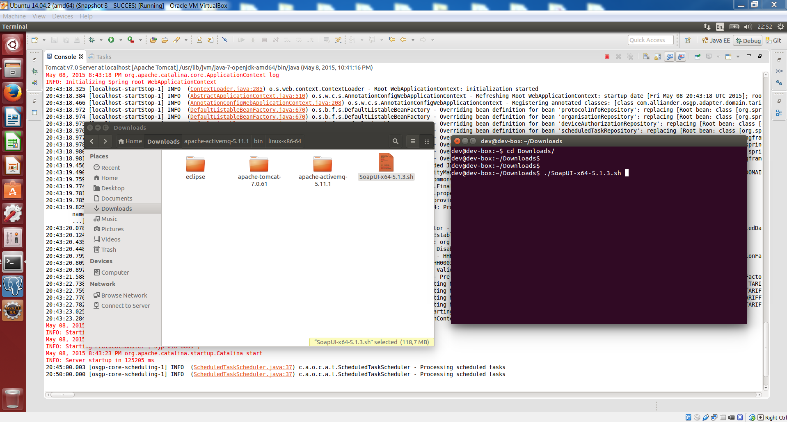

Follow the steps of the Installer.
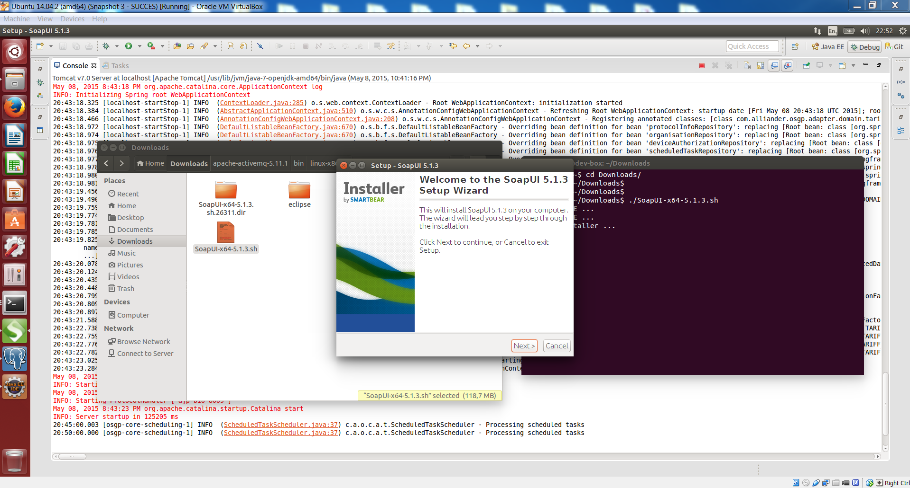

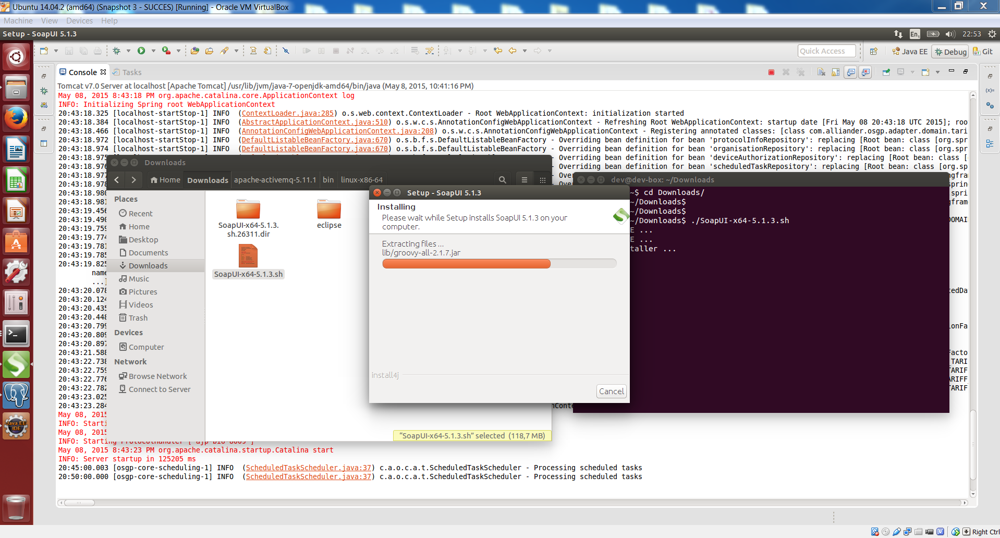

Start SoapUI.

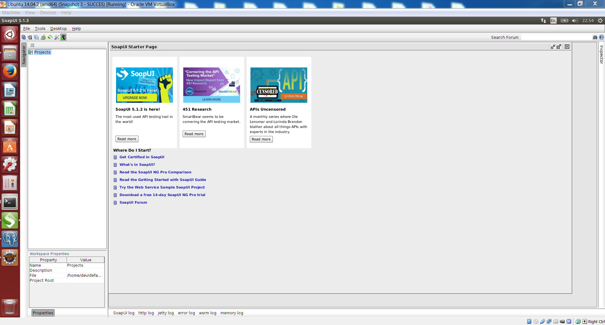

### Setting Up SoapUI 
Go to File -> Preferences -> SSL Settings, and browse for the KeyStore to /home/dev/Sources/Config/certificates/osgp-ca/certs/test-org.pfx and fill out the password (the password is 1234)
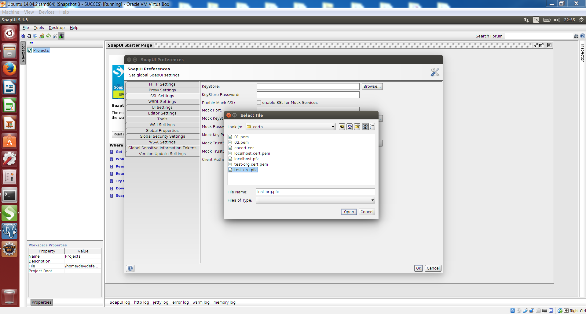

Go to WSDL Settings and check 'Generate Example Values in New Requests' and 'Generate Comments with Type Information in New Requests'
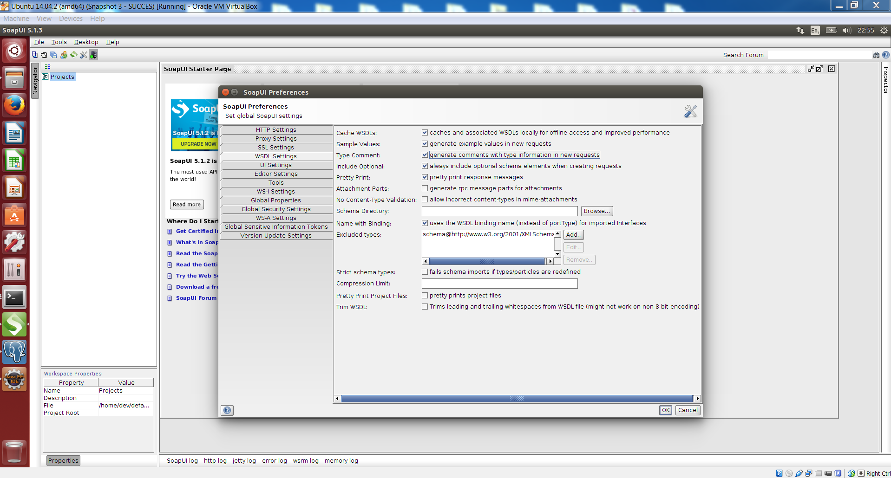

Create a new SOAP Project and call it 'admin'
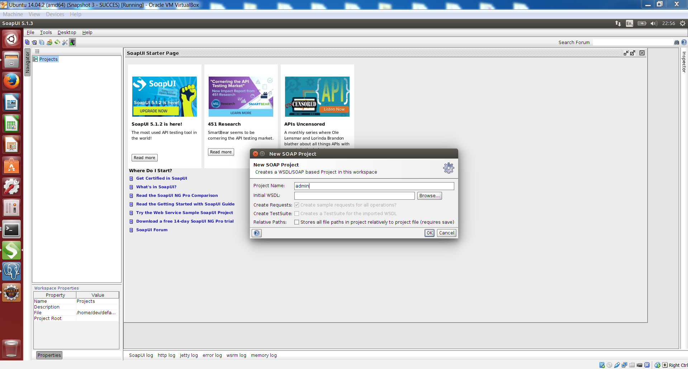

Open the Project View by double-clicking on the 'admin' project. Go to 'WS-Security Configurations' and select the 'Keystores' Tab. Click on the '+' tp add the test-org.pfx in /home/dev/Sources/Config/certificates/osgp-ca/certs/
Fill out the password (1234) and click Ok and close the Project View window.
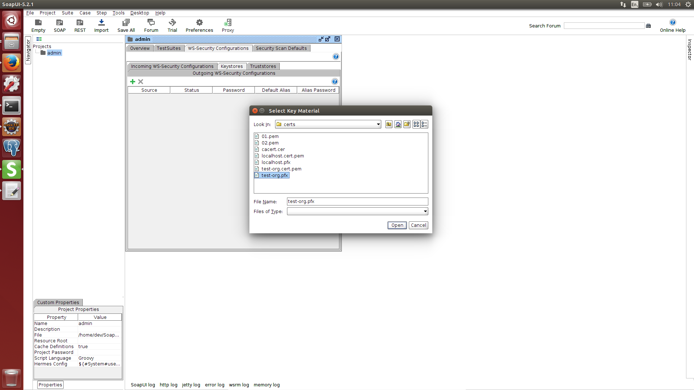

Right click the 'admin' project and choose 'Add WSDL'. Enter the following URL in the WSDL Location field: https://localhost/osgp-adapter-ws-admin/wsdl/Admin/DeviceManagement.wsdl
Make sure the box 'Create sample requests for all operators' is checked, and click OK.

Create another new SOAP Project and call it 'public-lighting'
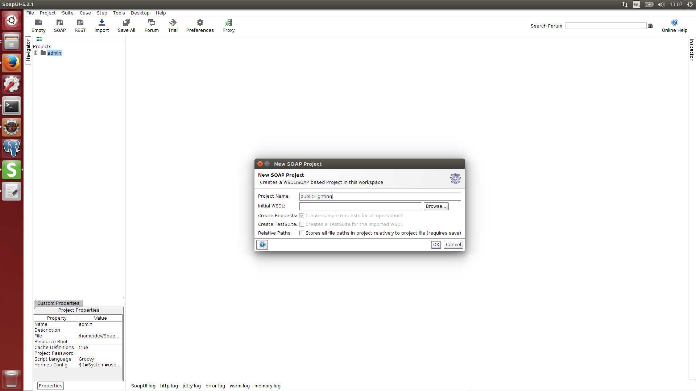

Open the Project View by double-clicking on the 'public-lighting' project. Go to 'WS-Security Configurations' and select the 'Keystores' Tab. Click on the '+' tp add the test-org.pfx in /home/dev/Sources/Config/certificates/osgp-ca/certs/
Fill out the password (1234) and click Ok and close the Project View window.
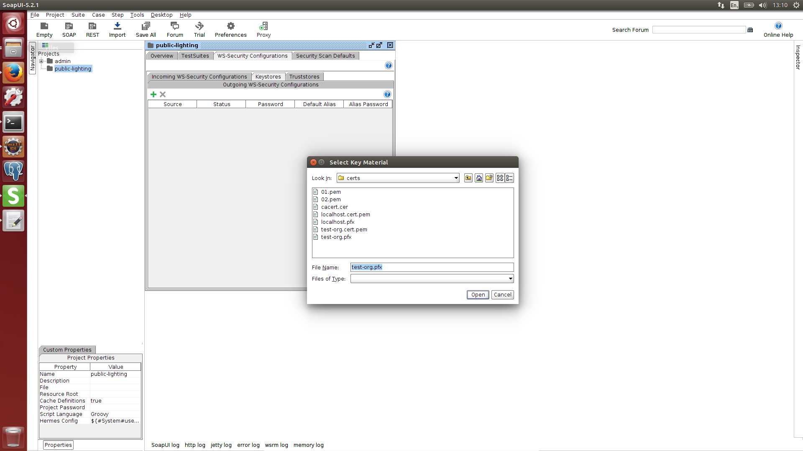

Right click the 'public-lighting' project and choose 'Add WSDL'. Enter the following URL in the WSDL Location field: https://localhost/osgp-adapter-ws-publiclighting/wsdl/PublicLighting/PublicLightingAdHocManagement.wsdl
Make sure the box 'Create sample requests for all operators' is checked, and click OK.
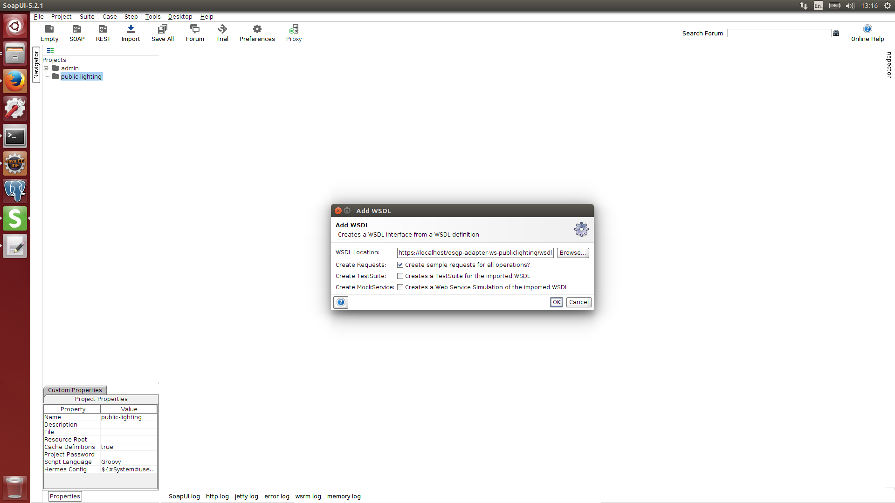

### First SOAP Requests to Add a Device to OSGP
Before we can send our first request, we have to add the test-org.pfx as SSL Keystore: Go to the properties interface for the request (bottom left of the screen, after selecting 'Request 1' under UpdateKey in the 'admin' project'), and choose test-org.pfx from the drop-down box.
Note: This has to be done for each request!
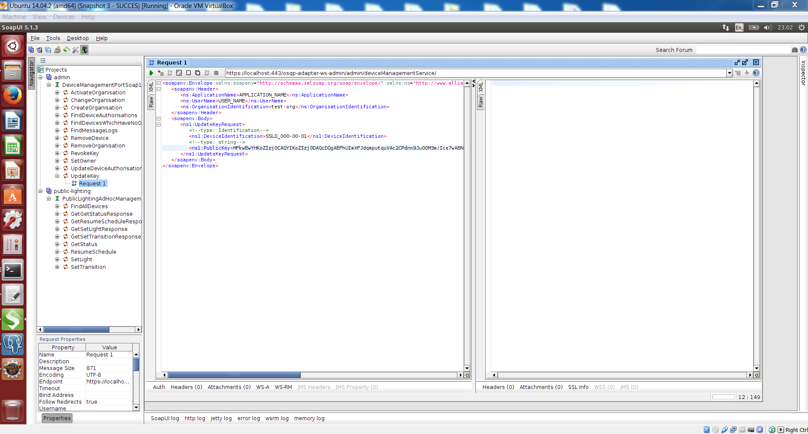

A SSLD needs to be added to the platform, together with a public key. The UpdateKey function of the admin webservice offers that functionality. Double click 'Request 1' under UpdateKey in the 'admin' project. Change the parameters in the request as follows:
ApplicationName: APPLICATION_NAME
UserName: USER_NAME
OrganisationIdentification: test-org

DeviceIdentification: SSLD_000-00-01
PublicKey: MFkwEwYHKoZIzj0CAQYIKoZIzj0DAQcDQgAEFhUImXFJdqmputquVAc2CPdnn9Ju00M3m/Ice7wABNN+oAYKQbw/OceqvZmFF1+r4nO/vCm/f1JO5nEorE2jNQ==
ProtocolInfoId: 1
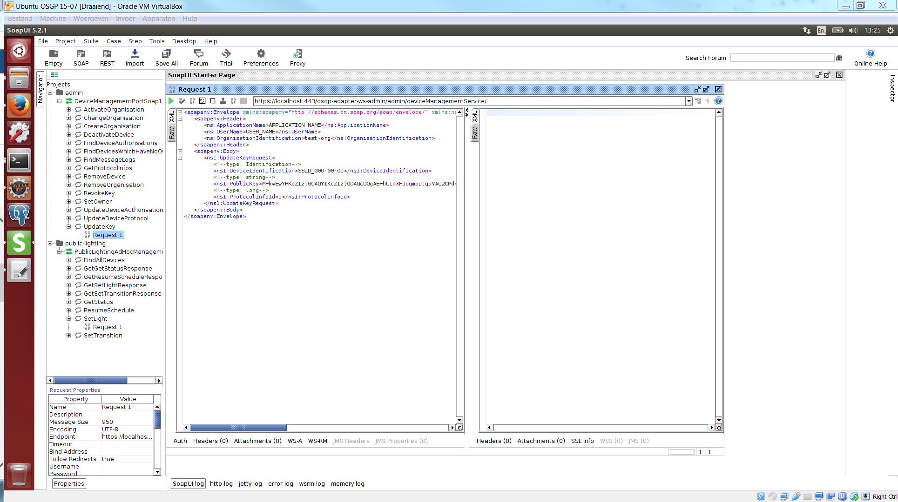

Click the 'play' button to submit the request to the endpoint. You should receive similar response as shown in the screenshot below:
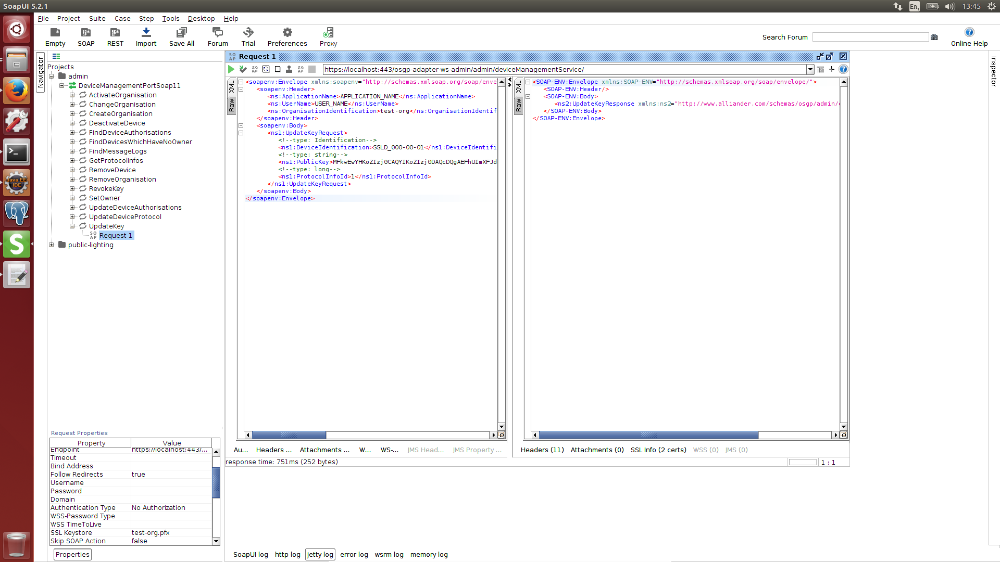

After the SSLD has been added, let's see if the function FindAllDevices shows the SSLD. Continue with the FindAllDevices request from the public-lighting project.
Do not forget to set the SSL keystore in the Request Properties. Use the following parameters in the request:
ApplicationName: APPLICATION_NAME
UserName: USER_NAME
OrganisationIdentification: test-org

Page: 0

After the request has been submitted, the response should include the SSLD device with ID SSLD_000_00_01
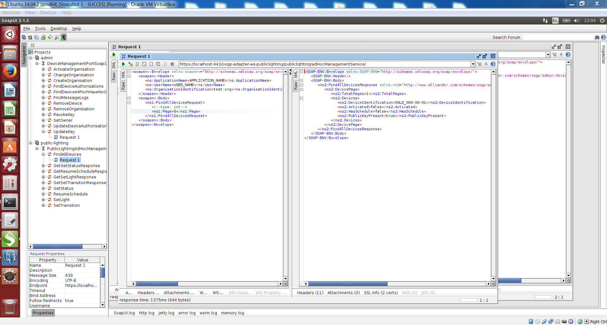

### Opening Device Simulator to Add a Device
In order to be able to use the SSLD-000-00-01 Device, the device needs to be simulated in the Device Simulator. To do this we have to create it.
In the Firefox Browser, open the Device Simulator by going to the following URL: https://localhost/web-device-simulator/devices
If you encounter a Untrusted Connection page, go to 'I Understand the Risks' -> Add Exception.. -> Confirm Security Exception
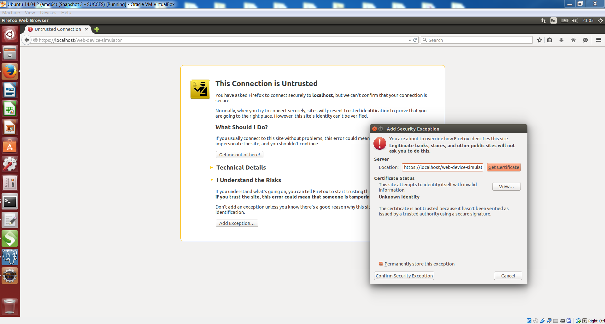

Click Add Device
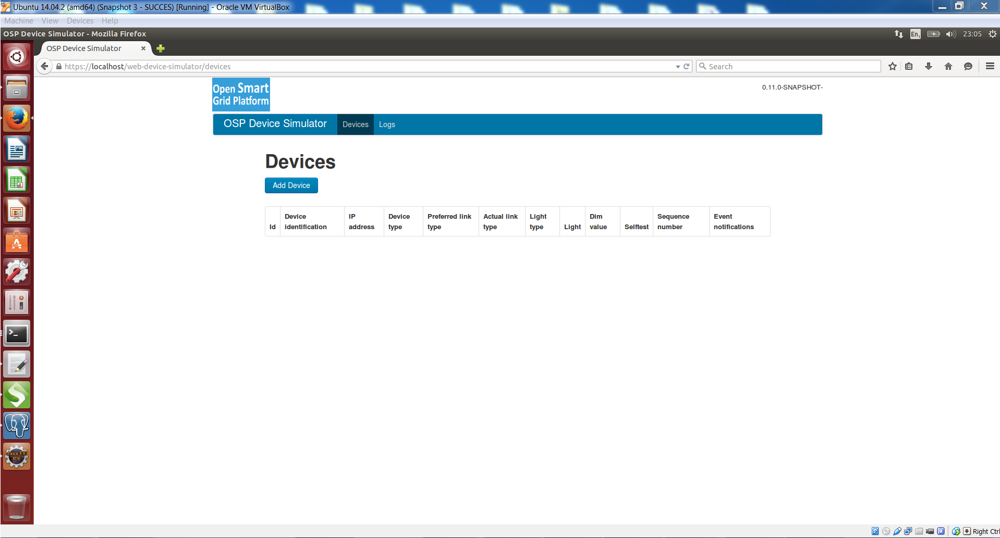

Fill out the fields like this:
Device Identification: SSLD_000-00-01
IP Address: 127.0.0.1
Device Type: SSLD
Protocol: OSLP

Click Create Device
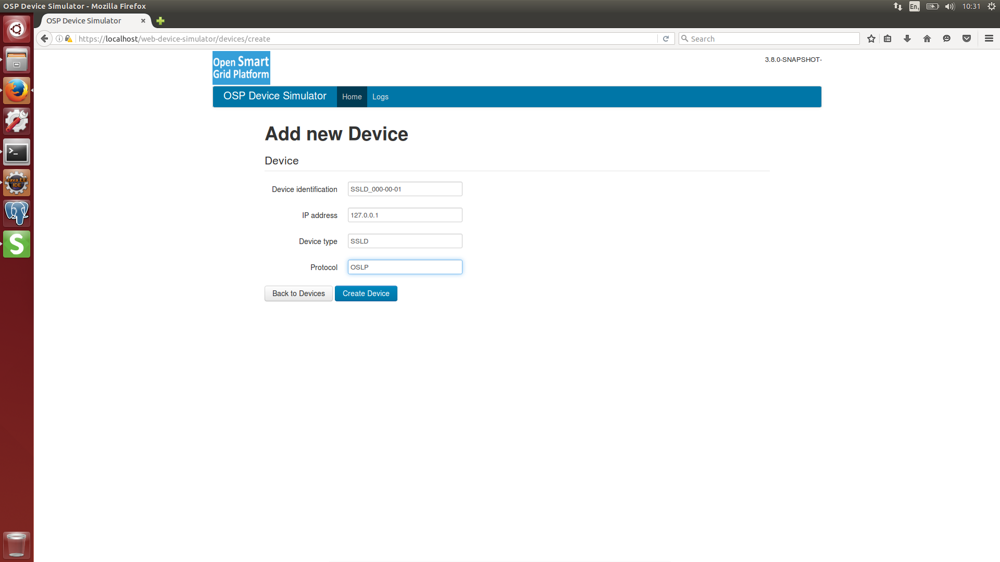

You should return to the Devices screen and see the message "Device with identification SSLD_000-00-01 was created."
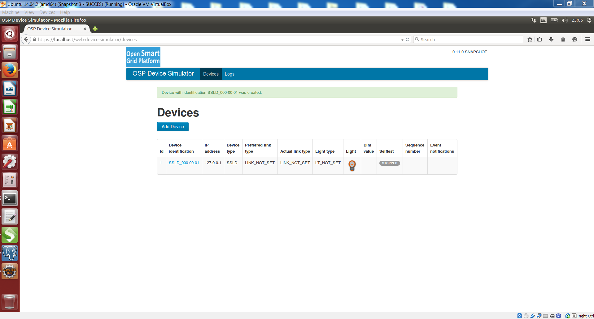

### Registering a Device
Now click on the newly created device and click the 'Register Device' button. After a while the message "Device identification with identification SSLD_000-00-01 was registered at XXXXXXXX" appears.
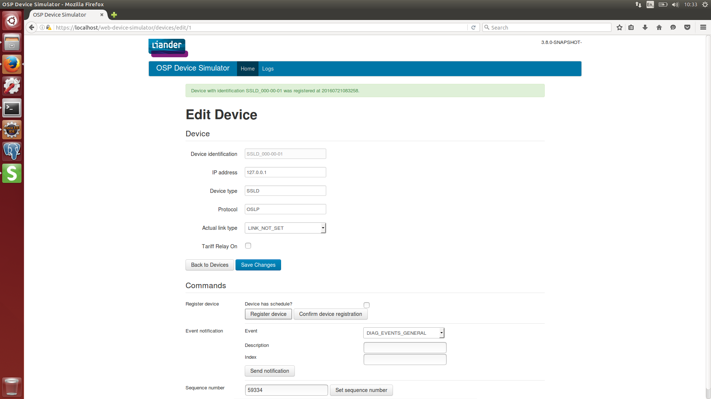

Then click the 'Confirm Registration' button. The message should read: "Device with identification SSLD_000-00-01 was confirmed to be registered."
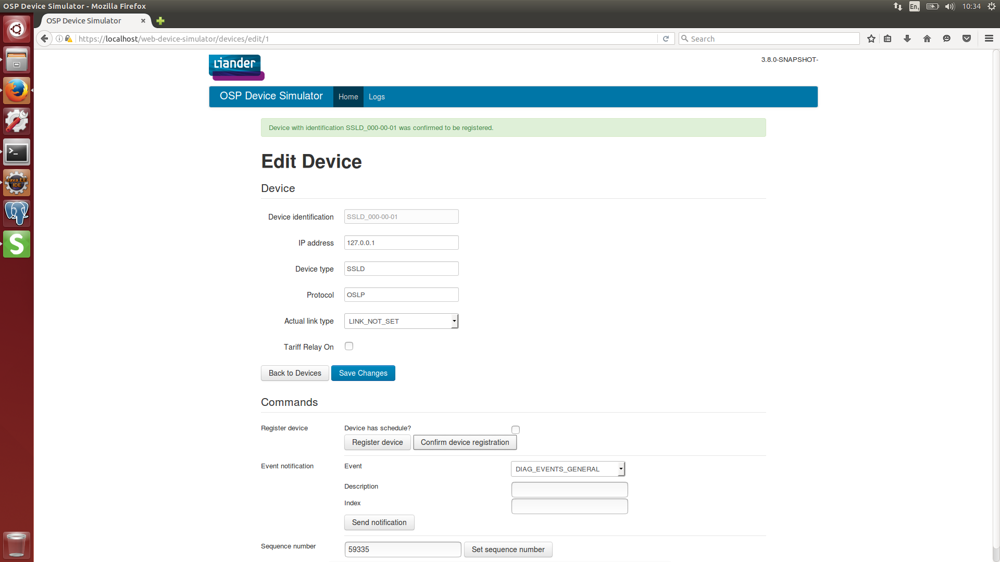

### Using 'SetLight' SOAP Request to Switch the Light On
Now that the Device is known in the platform, and simulated in the Device-Simulator, the device can be used. Let's switch on the Light. 
Using SoapUI, click on Request 1 under SetLight at the public-lighting project. Set the following parameters in the request (And do not forget to set the Keystore in the request properties):

ApplicationName: APPLICATION_NAME
UserName: USER_NAME
OrganisationIdentification: test-org

DeviceIdentification: SSLD_000-00-01

Index: 0
On: True
DimValue: 100

Submit the request. Take note of the CorrelationUid in the response. We can send out a request later using that Id to ask the Platform if the request succeeded. 
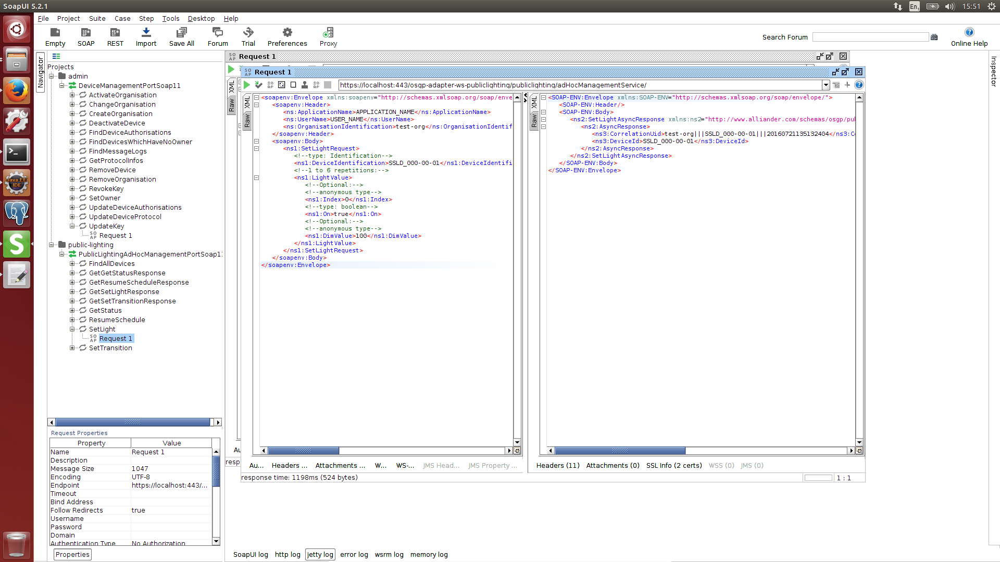

In the home screen of the OSLP device simulator, the lightbulb should light up for SSLD_000-00-01. Now we know the request succeeded. 
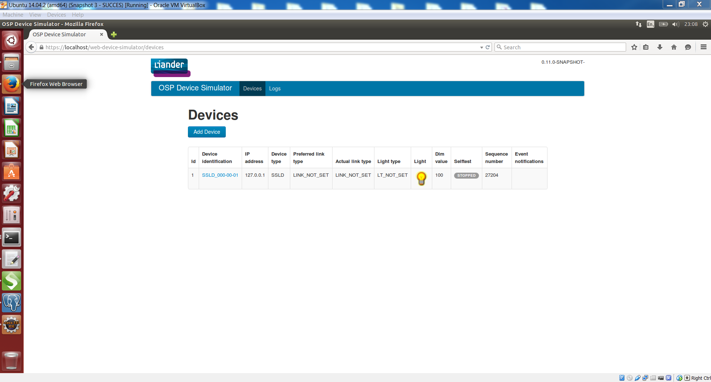

Normally we don't have a device simulator to know if the SetLight request succeeded. But we can ask the platform by sending another request: GetSetLightResponse
In SoapUi open Request 1 under 'GetSetLightResponse' in the 'public-lighting' project. Set the following parameters in the request (And the keystore in the request properties):

ApplicationName: APPLICATION_NAME
UserName: USER_NAME
OrganisationIdentification: test-org

CorrelationUid: -Copy from the response in the SetLight request-
DeviceId: SSLD_000-00-01
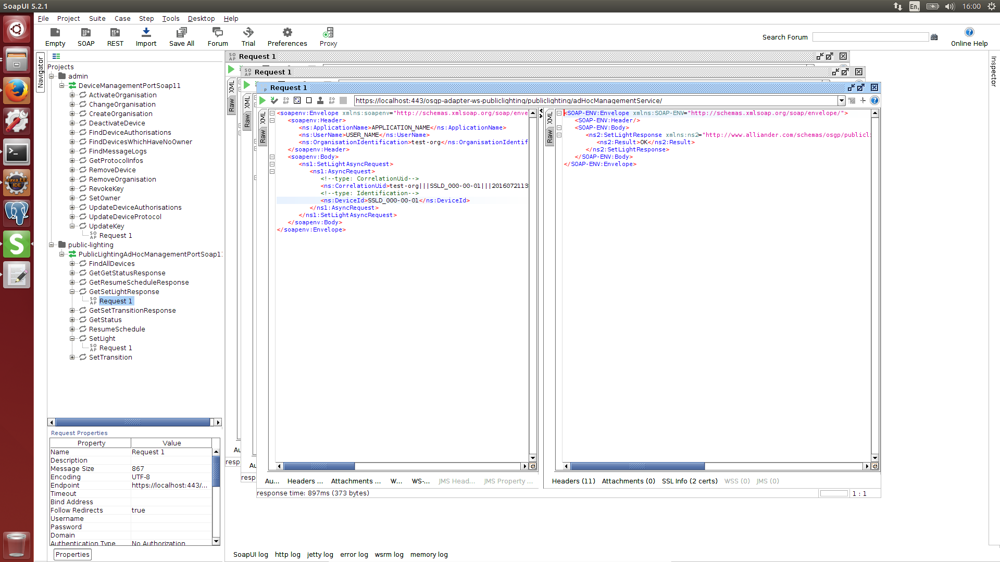
