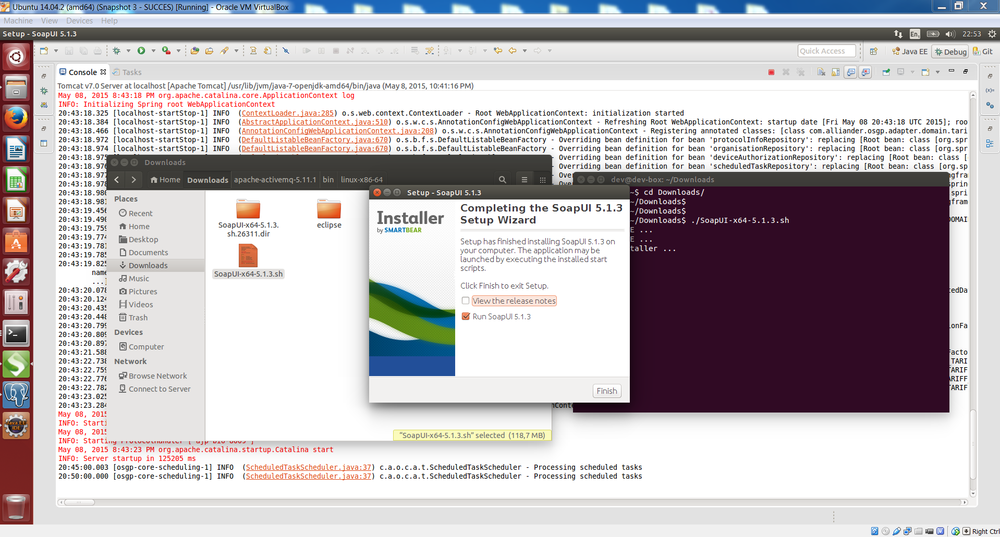

### 2.2.20 Installing SoapUI

### 3.3.21 Setting Up SoapUI 

### 3.3.22 First SOAP Requests to Add a Device to OSGP

### 3.3.23 Opening Device Simulator to Add a Device

### 3.3.24 Registering a Device

### 3.3.25 Using 'SetLight' SOAP Request to Switch the Light On

