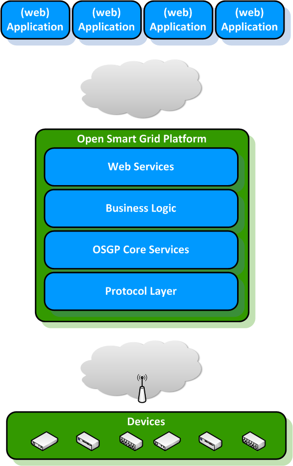

<!--
SPDX-FileCopyrightText: Contributors to the Documentation project

SPDX-License-Identifier: Apache-2.0
-->

# Architecture introduction

## Basic Architecture

**The basic architecture**

Basic Overview

## Layered architecture

The Open Smart Grid Platform environment consists of five layers:

1. Web services layer
2. Domain logic layer
3. Open Smart Grid Platform Core layer
4. Protocol layer
5. Device layer

### Web services layer

In this layer the web services are exposed to the outside world. Applications can connect to the web services to implement the required functionality of the open smart grid platform. The web services are divided into functional domains, i.e. Public Lighting, Smart Metering, Power Quality, etc. Additional functional domains can be created.

### Domain logic layer

Every functional domain has a separate set of web services and a corresponding domain logic block. In the domain logic block the business logic of that functional domain can be found. This is where a functional command will be translated into a generic intermediate format. For example, in the case of public lighting the command "Turn light on" will be translated into a command like "set switch\(1\) in closed position". In this layer it could also be decided that one functional command results in multiple commands to a device. The domain logic is closely related to the web services layers and can be added as well.

### Open Smart Grid Platform core layer

In the core of the Open Smart Grid Platform the following generic functions are found:

* Device management
* Time synchronization
* Firmware management
* Workflow engine
* Device installation services
* Scheduler
* Device status monitoring
* Routing of device commands to appropriate device protocol

### Protocol layer

The different protocol adapters are found in this layer. Here the generic intermediate format of a command for a specific device will be translated into the protocol message the device understands. This message will be sent to the device. A retry mechanism has been implemented to prevent communication failure in the case that the receiving end is temporarily unavailable. The listeners for messages initiated by a device are implemented here. Examples are the DLMS/COSEM protocol adapter for smart meters.

### Devices

Any device in the public space with an Internet connection may be connected to the platform. The platform is independent of the device used, therefore this part of the set-up is not part of the platform.

