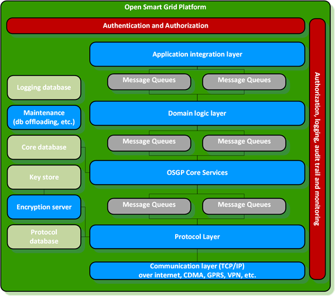

# Architecture Principles

This chapter gives an overview of the principles used defining and implementing the architecture. The following principles were applied:

* Layering
* Domain driven design
* Dependency inversion principle
* Behavior driven development

## Layering

The use of layers improves the separation of responsibilities. Each application contains the following layers:

* Presentation layer: responsible for providing information to users \(persons and/or systems\) and the handling of user requests
* Application layer: responsible for executing system tasks including authorisation control
* Domain layer: responsible for the representation of the problem domain.
* Infrastructure layer: responsible for technical matters supporting other layers. For instance persistence, messaging, etc

_Image, Layers:_ 

1. Audit logger
2. Web Services
3. Functions
4. Queue
5. Workflow engine
6. Protocol framework
7. Protocol implementations
8. Workflow engine
9. Queue
10. Communication

## Domain driven design \(DDD\)

Domain-driven design focuses on the problem domain. DDD's starting point is creating an optimal model for a specific problem domain by having a common language and constructive collaboration between technical and domain experts.

DDD uses the following building blocks:

* Entity: An object not identified by its attributes but by its own identity.
* Value Object: an object with attributes but has no own identity.
* A collection of objects surrounding a specific root entity \(or aggregate root\). To ensure consistency objects in the aggregate can only be addressed through the aggregate root.
* Service: Contains instructions not related to a specific object. 
* Repository: Serves as a  collection for fetching and saving objects. Creates an abstraction for actual persistent implementations.
* Factory: Contains methods to create domain objects.

## Dependency inversion principle

The dependency inversion principle promotes an independent connection by inverting dependency relations. This ensures that the domain model can be very 'clean' without knowledge of the underlying infrastructure \(POJO classes\). The Spring framework is used to implement the Dependency Inversion principle.

## Behavior driven development \(BDD\)

Behavior driven development is a way of programming that first describes behavior in user stories and then implements this in code. The user stories contain scenarios with acceptation criteria that can be automated. This creates a complete test suite for the whole system.

For the application of BDD the following frameworks are used:

* Cucumber and Gherkin, automated acceptance testing, based on scenarios from stories.

