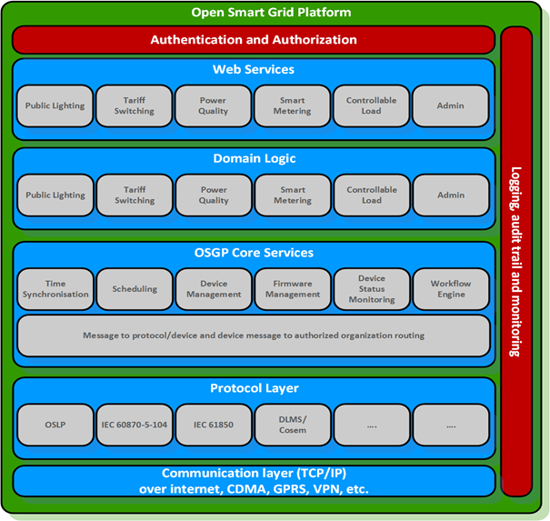
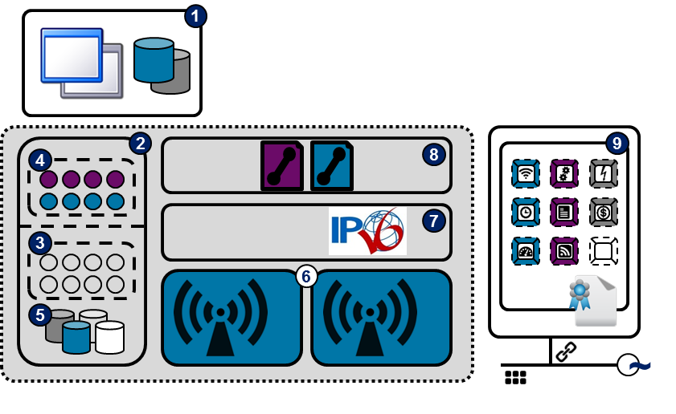
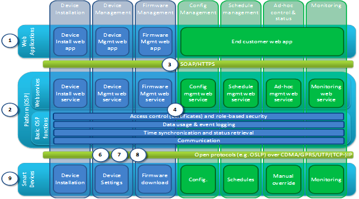

<!--
SPDX-FileCopyrightText: Contributors to the Documentation project

SPDX-License-Identifier: Apache-2.0
-->

# Architecture functional layers

## Functional view

_Image, functional layers overview_ 

### Starting architecture

The Functional view shows an overview of the most important functions of the system. The two images below show the starting architecture and functional reference architecture respectively.

_Image, functional starting architecture_ 

1. Web applications
2. Open Smart Grid Platform
3. Web services
4. Basic functions
5. Database
6. Communication infrastructure \(CDMA/GPRS/Ethernet\)
7. IP infrastructure
8. Open Street Light Protocol \(OSLP\)
9. Public Street Lighting Device \(PSLD\) or Sub Station Lighting Device \(SSLD\)

## Functional Reference

This model partitions the system in seven functional clusters \(vertically\) which are shown on the system layers \(horizontally\). The circled numbers refer to image 1.

_Image, functional reference architecture_ 

Vertical clusters:

* Device installation
* Device management
* Firmware management
* Configuration management
* Schedule management
* Ad-hoc control and status
* Monitoring

Horizontal System layers:

* Web applications
* HTTPS/SOAP communication
* Platform
* Open protocols
* Smart devices

