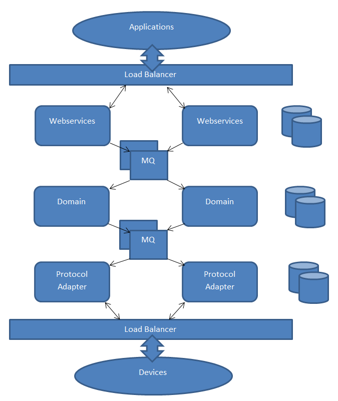

<!--
SPDX-FileCopyrightText: Contributors to the Documentation project

SPDX-License-Identifier: Apache-2.0
-->

# Redundancy

This chapter describes the possibilities of a redundant set up of the Open Smart Grid Platform. The Platform is designed to run in a High Available \(or HA\) environment, and to prevent data loss due to unexpected failures. Each component of the Platform is designed to be stateless. Components communicate with each other using message queues, which are processed in an asynchronous way.

## Active-active

In an active-active setup, multiple instances of each component \(eg. Web Services, Core, Protocol Adapter\) process the data at the same time. Traffic is equally distributed across the instances. In case of a defect in one instance the traffic is automatically processed by the remaining instance\(s\). The Open Smart Grid Platform is designed to run in such a set up, and thus preventing down time in case of a failing server. Each component of the Platform can run in an independent, redundant and scalable way.

## Database

The Open Smart Grid Platform uses a PostgreSQL database. PostgreSQL supports multiple database servers. For example, a slave and master node, where the slave node continuously replicates the master node. In case the master node fails, the slave mode is triggered and will stop replicating from the master node, execute a recovery and will become the master node.

## ActiveMQ

The components of the Platform communicate with each other through a Message Queue. The Open Smart Grid Platform uses Apache Active Message Queue, which makes asynchronous communication possible between components. The components can register to the queues as consumers. In case a consumer \(e.g. a server running a component of the platform\) is down, the message will still be consumed by the remaining consumer\(s\). The Message Brokers can be used as a MasterSlave. In case the Master message broker is down, you get immediate fail-over to the slave without loss of messages.

