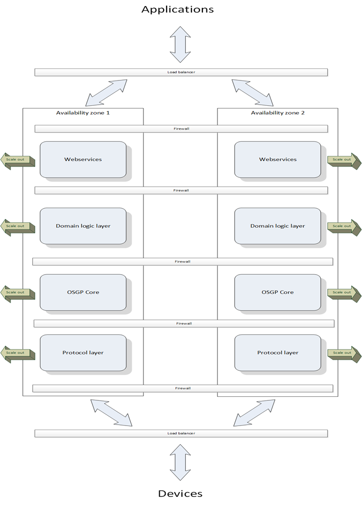

<!--
SPDX-FileCopyrightText: Contributors to the Documentation project

SPDX-License-Identifier: Apache-2.0
-->

# Scalability

The Open Smart Grid Platform is designed and built for scalability and reliability

* Messages will never get lost, In the worst case scenario, a message will be sent to the dead letter queue.
* Any layer of the platform can be independently scaled up- and down
* Adding servers can be done runtime
* It can run in an active-active setup over multiple servers and data centers. In our cloud hosted setup even over sets of data centers in different countries.

