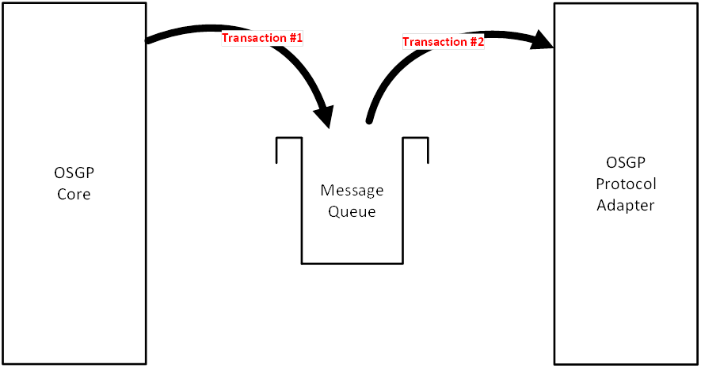

# Platform components description

## Application Layering

The use of layers improves the separation of responsibilities. Each application contains the following layers:

* Presentation layer: responsible for providing information to users \(persons and/or systems\) and the handling of user requests
* Application layer: responsible for executing system tasks including authorization control
* Domain layer: responsible for the representation of the problem domain.
* Infrastructure layer: responsible for technical matters supporting other layers. For instance persistence, messaging, etc

**Layers:**

## Authentication and authorization

The web server is configured with a SSL certificate to encrypt the incoming and outgoing communication. The SOAP Web service \(Spring Framework web service\) uses a Java Keystore and a certificate for each organization. Only organizations that are known within the platform are authorized to use the web service.

## Application integration layer

For the several functional domains separate SOAP Web services are offered. This separation offers authorization per functional domain. Each of the web service components send a queue message to the corresponding domain component.

WSDL A separate WSDL is implemented for each functional cluster. All SOAP operations have a request object parameter and return a response object. For Synchronized Web Services the result is immediately included in the response. For asynchronous web services the response contains a correlation ID. This Correlation ID is to be used by the requester to receive the actual result from the platform. The following diagram is an example of such an asynchronous request.

Furthermore each SOAP message has a header which contains the user's organisation ID. This table displays an overview of the WSDL's including operations and fields in the request and response objects.

SOAP vs. REST

SOAP is chosen in the open smart grid platform web services over REST for the following reasons:

* REST is resources/data oriented \(put, get, delete\) while the open smart grid platform is function/method oriented
* SOAP has the advantage of having a contract \(WSDL\)
* SOAP has extensive security features that are being used in the open smart grid platform to meet the high security demands/requirements requested by e.g. the energy utilities
* Energy companies are generally not progressive in terms of technology. SOAP is acceptable for energy companies and REST is sometimes seen as new and insecure.

The benefits of REST \(e.g. speed / less overhead\) does not outweigh the benefits of SOAP. More general information on this topic can be found [online](http://spf13.com/post/soap-vs-rest).

## Domain logic layer

For each functional domain business logic is implemented using a separate domain component. Common functionality like authorization should be abstracted to a shared component. Domain components receive queue messages from web service components and send queue messages to the open smart grid platform core component.

More information on the specific domains can be found in the [domain chapter](../domains/)

## Open Smart Grid Platform Core Services

The open smart grid platform core component receives queue messages from domain components. These messages from domain components are forwarded to a protocol adapter project. The open smart grid platform core component also offers logic for a protocol adapter project to send the response of a smart device back to a domain project. The Core component routes messages from domain adapter components to protocol adapter components and vice versa. The core layer also contains a workflow engine.

The internal database model in the core layer: 

_ERD's made with Valetina Studio_

**Overview of platform data model:**

Data model explanation:

| **Table** | **Description** |
| :--- | :--- |
| devices | Devices table |
| device\_authorisation | Authorisation table, function group column concerns the device functions \(AD\_HOC, INSTALLATION, etc\) |
| organization | Organization table, function group column concerns the platform functions \(ADMIN of USER\) |
| event | Events table |
| oslp\_log\_item | Table for logging of OSLP messages. |
| webservice monitor log item | Audit record for tracking webservice activity. |

The platform will store as little data as possible. Generic \(and domain specific\) devices attributes are stored in core DB.

## Protocol Layer

The open smart grid platform supports multiple protocols.

* OSLP \(Open Street Light Protocol\)
* DLMS/COSEM
* IEC61850

The protocols can use one of the security layers:

* TLS \(Transport Layer Security encryption\)
* SSL \(Secure Sockets Layer encryption\)

Other protocols can be easily added to the platform. If possible, we prefer protocols based on open standards. A comprehensive list of protocols that are currently supported can be found in the [protocols chapter](../protocols/).

Protocol specific device attributes are stored in the protocol adapter DB

## Queues

Open smart grid platform components connect to each other through message queues.

* Transactions on messages to and from the queues
* Messages are persisted on the queues
* Queues are clustered for reliability and speed
* By using queues, the open smart grid platform can be stateless

## Smart devices

The open smart grid platform can connect to any device that supports one of the supported protocols. Smart devices can receive messages from or send messages to protocol adapter components. In case of SSLD's this is done using TCP/IP over mobile internet connections \(e.g. GPRS, CDMA, etc.\). The communication is encrypted using public key cryptography.

