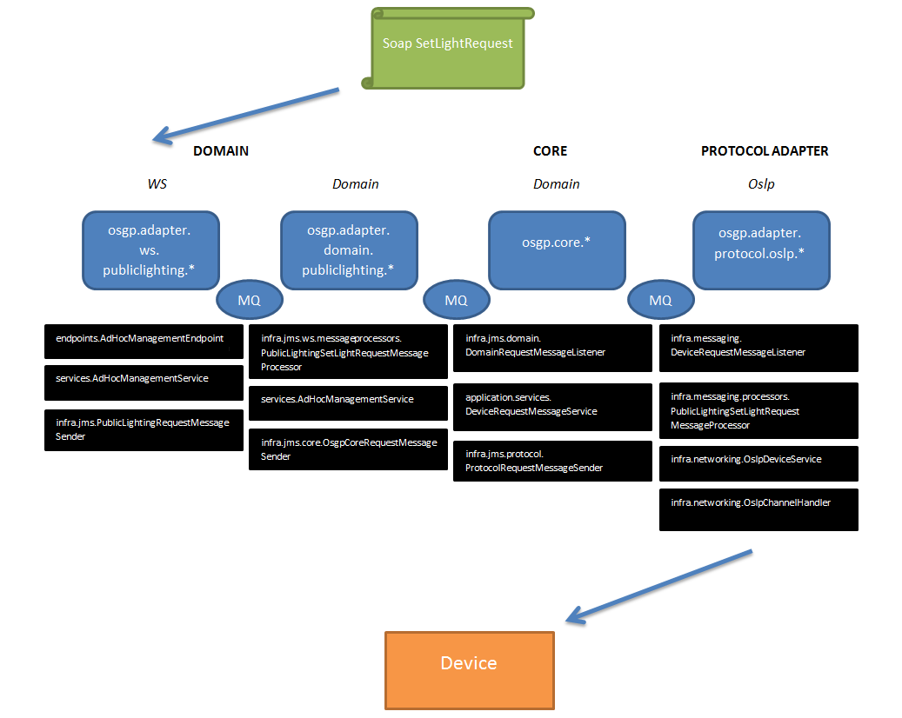

# Technical Overview

This chapter gives a more technical overview. It describes each layer of the platform by giving an overview of its packages and the code it contains. Furthermore it describes how a message proceeds through the platform. If you are planning on adding your own Domain Adapter or Protocol Adapter, it will be useful to read this chapter to get a feeling of how the Platform has been built.

## A Request through the Platform

The picture below depicts an example of a request \(OSLP SetLight request\) proceeding through the platform to a device. 

* A web request enters the platform at its EndPoint, which in turns calls the RequestService. The RequestService checks if the organisation in the request is authorized, creates the request message and sends it to the MessageSender which in turn puts it on the queue of the Domain Adapter.
* In the Domain Adapter, the incoming message is processed in the MessageProcessor, which in turn calls the Request Service. Here the message is converted to a DTO object. The CoreRequestMessageSender puts the message on the Core Queue.
* The MessageListener in Core receives the message. The DeviceRequestMessageService contains generic functionality such as Authorization, Validation, etc. Once these procedures are completed, the message is routed to the appropriate protocol adapter.
* In the Protocol Adapter the message is received by the MessageListener. It is processed through the MessageProcessor and OslpDeviceService. The request eventually ends up in the OslpChannelHandler, where the actual Protocol Request to the device is made.

For a detailed description of each layer, please take a look at a more detailed description of each layer in this chapter.

## Configuration files

The Platform uses property files for certain settings \(such as JMS settings, Persistence settings, etc.\). These files are stored in property files which can be found in the Config repository on Github. These files are sym linked to /etc/osp/, where the Platform \(through reference in context.xml\) looks for the property files.

