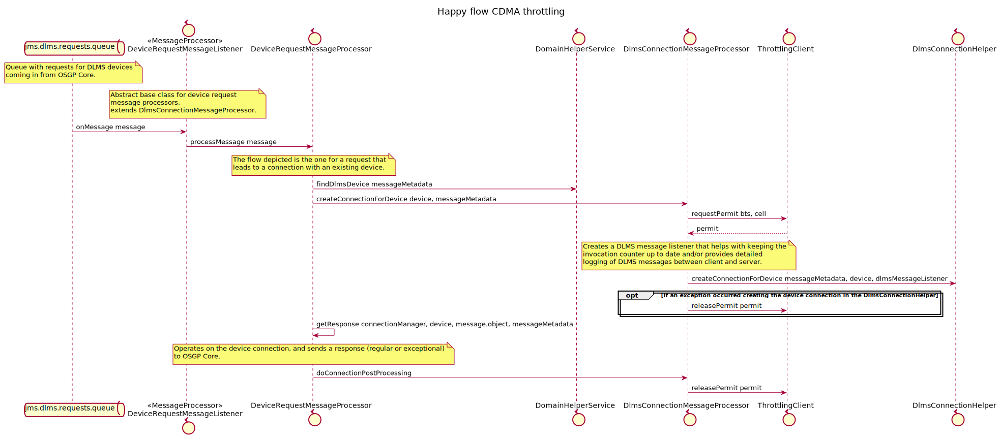

# Throttling

Throttling is used to limit the flow into communication channels that need it. The GXF platform has throttling support for [CDMA](https://en.wikipedia.org/wiki/Code-division_multiple_access) and [SMS](https://en.wikipedia.org/wiki/SMS)/texting.

## CDMA throttling
The CDMA network uses [base transceiver stations](https://en.wikipedia.org/wiki/Base_transceiver_station) (BTS) with cells for each BTS.

Throttling occurrs on the number of concurrent connections per BTS/cell. GXF offers a throttling service that hands out permits per BTS/cell while maintaining the configurable limit.

An application will typically use this service like this:

## SMS/texting throttling
SMS can be used to wake up certain types of devices. Throttling in this context means limiting the number of messages per second to a configurable rate.