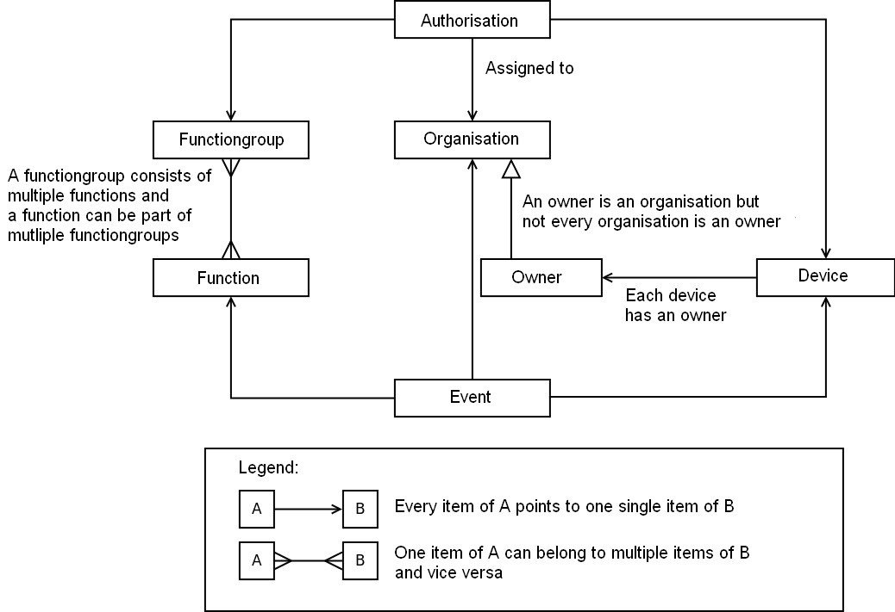
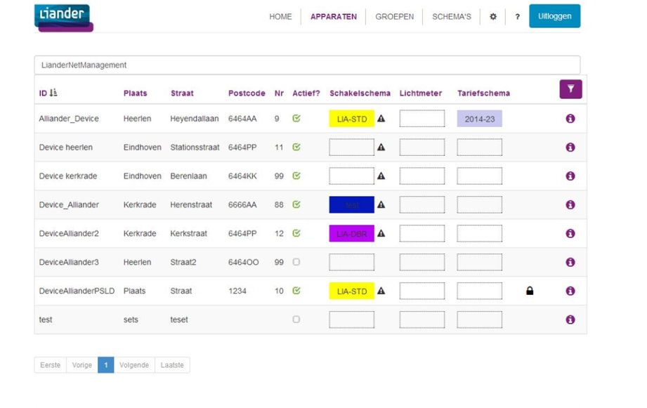

# Open Smart Grid Platform, technical overview

## Architecture

### Functional layers overview
 

### Functional view

#### 1.1 Starting architecture

The Functional view shows an overview of the most important functions of the system. The 2 images below respectively show the Starting architecture and Functional Reference architecture.

_Image 1, functional starting architecture_
 

1. Web applications
2. Platform (OSGP)
3. Web services
4. Basic functions
5. Database
6. Communication infrastructure (CDMA/GPRS/Ethernet)
7. IP infrastructure
8. Open Street Light Protocol (OSLP)
9. Public Street Lighting Device (PSLD) or Sub Station Lighting Device (SSLD)

### Functional Reference

This model partitions the system in 7 functional clusters (vertically) which are shown on the system layers (horizontally). The circled numbers refer to image 1.

_Image 2, functional reference architecture_

Vertical clusters:

- Device installation
- Device management
- Firmware management
- Configuration management
- Schedule management
- Ad-hoc control and status
- Monitoring

Horizontal System layers:

- Web applications
- HTTPS/SOAP communication
- Platform
- Open protocols
- Smart devices

### Description of each of the platform components

#### Web applications

If one of the web apps is open source, we might write something on this and it's APIs as well.

**Application Layering**

The use of layers improves the separation of responsibilities. Each application contains the following layers:

- Presentation layer: responsible for providing information to users (persons and/or systems) and the handling of user requests
- Application layer: responsible for executing system tasks including authorisation control
- Domain layer: responsible for the representation of the problem domain.
- Infrastructure: responsible for technical matters supporting other layers. For instance persistence, messaging, etc

**Layers:**
 

1. Audit logger
2. Webservices
3. Functions
4. Queue
5. Worklow engine
6. Protocol framework
7. Protocol implementations
8. Workflow engine
9. Queue
10. Communication

#### HTTPS/SOAP communication

//TODO

#### Web services

//TODO

#### Business logic

//TODO

#### Core

//TODO

#### Open protocols

- TLS (Transport Layer Security encryption)
- SSL (Secure Sockets Layer encryption)
- OSLP (Open Street Light Protocol).

At the moment only the OSLP protocol is supported but other protocols can easily be added to the platform.

The Open Street Light Protocol is based on Google Protocol Buffers and is used for communicating with SSLD devices (and device simulators).

#### Smart devices

//TODO ? This one may be left out ?

## Cloud solution

Hosting OSGP in the cloud is possible, as well as on premises.

## Logical Data Model

This model displays the most important entities of the OSGP system and their mutual relationships.

 

The logic of the model above:

At the top of the image is the entity "authorisation". This represents the permissions of an organization on a certain device. In general an organisation will have a lot of permissions, at least one for each device it needs to manage.

The functions an organisation can execute on a device are determined by the function group the authorisation refers to. Function groups are collections of functions and are predefined in the software. The following function groups have been predefined.

- Owner-group (this contains all functions)
- Ad hoc-group (Functions for ad hoc switching of lighting)
- Management-group (Platform functions)
- Installation-group (Functions to install devices)
- Firmware-group (Functions for updating firmware)
- Schedule-group (Functions to create lighting schedules)
- Tariff scheme-group (Functions to create tariff groups)
- Configuration-group (Functions to configure devices)
- Monitoring-group (Functions to monitor devices)

This structure provides maximum flexibility when assigning rights to devices. Devices always belong to an Owner. An organisation can be an owner. The entity "Event", at the bottom of the image, is the execution of a function by an organisation on a device.

Details like device-type, device-status etcetera have been omitted in this model.

One security requirement is that each event must be traced back to a 'natural'  person, also known as an audit trail. Although OSGP does not register individual users we can meet this requirement by registering a data-item with each event. This enables the user organisation to investigate which events belongs to which 'natural' person. This data-item can for example be an user-ID provided by the user-organisation which doesn't have to be unique in the OSGP platform.

Table describing the entities in the logical data-model

| **Entity** | **Description** |
| --- | --- |
| authorisation | Authorisation – Permissions of an organisation to execute a certain function  (member of a role) on a certain device |
| device | Electronics present in a "container" (for example a lamp post), connecting to the OSGP platform and (in case of a lamp post) controls the lights. One device has one owner. |
| audit trail | The actions of an organisation on a device. A combination of [time, organisation, function and device]. |
| function | An end-to-end operation. For example "set schedule". A function belongs to multiple function groups. |
| function group | Usually this will be larger groups than the "function clusters" in this document. All functions available to end users could be in a single group for example. |
| organisation | Een partij die een rol speelt in het beheer en de aansturing van de devices. Bijvoorbeeld: Liander, gemeenten. A party playing a role in the management and control of the devices. |
| owner | An organisation role. Each device has an owner. |
| event | An event reported by the device (which is not the action of a natural person) for example an error or security problem. |

## Non-functional view

De non-functional view is an overview of the most significant non-functional demands.

The identified non-functional demands are:

- Time Behavior
- Extensibility
- Internationalisation and localisation
- Security

### 2.1 Time Behavior

Time behavior is mainly significant in the Flexovl project when a lot of devices have to be addressed in a short period of time over a wireless network. Both latency and limited bandwidth have to be taken in consideration while demanding the coordinated on and off switching of the lighting (no Christmas tree effect).

- Time synchronization: devices periodically register with the platform and receive a time.
- Protocol: because of the limited bandwidth an efficient protocol "protobuf" was selected.

**Points of interest:**

- Light metering messages
- When the SSLD's are disabled the PSLDs cannot be addressed

Because of these points of interest we use message queueing combined with a retry mechanism of delayed delivery.

### 2.2 Extensibility

At the moment the platform is mainly used for switching of public lighting but it is possible to easily extend this to other applications like electric transport, smart grids, etc.

### 2.3 Internationalization and localization

The platform and devices use UTC time. The OSLP protocol between platform and devices uses UTC time as well.

### 2.4 Security

The following security measures are in place for the cloud hosted platform:

- Hardened operating systems (according to Center of Internet Security)
- Firewalls between all servers and layers
- DDOS protection
- Communication over TLS
- Certificates from a certificate authority
- Audit trail on all actions throughout the platform
- Role based authorizations on specific functions of devices
- Access control
- IPSEC VPN connections
- IP whitelisting
- Unique device identification

For every major release there will be a mandated security test.
The cloud hosting platform will be tested regularly by the provider.

**Security**

In cooperation with the European Network of Cyber Security (ENCS) state of the art security measures were implemented.

- Security per device
- Security per application 
- Security Certificates per Organisation and per device
- All communication is encrypted

 

**Security measures:**
1. Firewall in defined zone
2. Operating System Hardening
3. DDOS protection
4. Replay attack prevention
5. Private encryption key per device
6. Certificates from a Certificate Authority
7. Encryption via Elliptic Curve DSA
8. IPSEC VPN for CDMA and GPRS
9. Unique device identification
10. Unique CDMA modem number
11. Role based authorizations on functions and devices

 

## 2.4.1 Encryption

An analysis of safety aspects has led to the decision that the safety of the whole system will be realized by proven technology based on asymmetrical coding (Also known as public-key encryption).

## 2.4.2 Algorithms

Only public encryption Algorithms will be used. Due to performance limitations (of the devices) and recommendations from The European Network for Cyber Security (ENCS) Elliptic Curve DSA with 256-bit-keys was selected. This improves the security and efficiency over the 1024 bit RSA algorithm. Messages can be smaller and less processor capacity is needed. The key length of Elliptic Curve DSA is similar to the 3072 bit key length of RSA.

Note: Even though OSGP uses ECDSA to secure the OSLP, other encryptions may be used as well. The RSA Algorithm is still supported if preferred. This is a flexible configuration option.

## 2.4.3 Private APN

A private APN is used for linking to mobile data communication infrastructures.

 

### 2.4.4 Authentication of OSGP

The Open Smart Grid Platform contains an extensive authorization model, which enables a device owner  to give certain rights on certain devices to other organizations. Every organization will only see devices they have rights to.

 

An organization can get rights from the device owner to specific functions of a device, for instance reading value _x_ on device _y_. Every other function of the device has to offer will not be available to this organization.

To ensure that devices can only receive instructions from a 'genuine' OSGP it must be possible to authenticate the OSGP platform. This is implemented through a standard technology based on asymmetric encryption. The OSGP platform will receive an unique key to enable the devices to tell if the messages come from a 'genuine' OSGP. To prevent replay-attacks each message will get an index number (this is standard practice as well).

## 2.4.5 Authentication of devices

To make sure OSGP can distinguish between 'genuine' devices and 'illegal' devices all devices are supplied with a manufacturer key. Each device has an unique key. Because of the asymmetrical encryption the platform contains the public part of each key. In this way devices can be identified by their unique key and their unique hardware ID. The device-ID will be encrypted in each message sent from the device to the platform.

All communication between OSGP and the devices will be signed with these keys to ensure (1) the source is legitimate and (2) the integrity of the message. It is not necessary to encrypt the whole message because confidentiality is not important. This results in a less computationally intensive process.

When a key is stolen (by hacking a device) this will not affect the integrity of the other devices. Each device has an unique key after all and only the hacked device has to be excluded from communicating in the platform.

The security is independent from the carrier (GPRS, CDMA, Ethernet, etc.).

The firmware will be used to distribute keys to devices. In this way we can use the existing secure firmware update mechanism for updating keys and certificates.

## 2.4.6 Authentication of web-applications

Two way SSL will be used between web-applications and OSGP to ensure the identities for both parties. User organisations are responsible for the administration of the identity of and access to their web applications. The owner and management applications feature a login page. After successful login the user is linked to an organisation. Passwords will be stored encrypted. The organisation ID will be sent in each message to OSGP and will be verified by the SSL certificate.

## 2.4.7 Authorisation of organisations

Authorisation for use of the platform functionalities is handled by roles. Roles are defined for both platform functionality and device functionality. Each role has one or more functions. Access to device functions can be set per device. The matrixes below respectively show an overview of all device roles and functions and platform roles and functions.

|   | **Roles** |
| --- | --- |
| **Functions** | OWNER | INSTALLATION | AD\_HOC | MANAGEMENT | FIRMWARE | SCHEDULING | TARIFF\_SCHEDULING | CONFIGURATION | MONITORING |
| GET\_DEVICE\_AUTHORISATION | X | X | X | X | X | X | X | X | X |
| SET\_DEVICE\_AUTHORISATION | X |   |   |   |   |   |   |   |   |
| START\_SELF\_TEST | X | X |   |   |   |   |   |   |   |
| STOP\_SELF\_TEST | X | X |   |   |   |   |   |   |   |
| SET\_LIGHT | X |   | X |   |   |   |   |   |   |
| GET\_STATUS | X |   | X |   |   |   |   |   |   |
| RESUME\_SCHEDULE | X |   | X |   |   |   |   |   |   |
| SET\_REBOOT | X |   | X |   |   |   |   |   |   |
| SET\_TRANSITION | X |   | X |   |   |   |   |   |   |
| SET\_EVENT\_NOTIFICATIONS | X |   |   | X |   |   |   |   |   |
| GET\_EVENT\_NOTIFICATIONS | X |   |   | X |   |   |   |   |   |
| REMOVE\_DEVICE | X |   |   | X |   |   |   |   |   |
| UPDATE\_FIRMWARE | X |   |   |   | X |   |   |   |   |
| GET\_FIRMWARE\_VERSION | X |   |   |   | X |   |   |   |   |
| SET\_SCHEDULE | X |   |   |   |   | X |   |   |   |
| SET\_TARIFF\_SCHEDULE | X |   |   |   |   |   | X |   |   |
| SET\_CONFIGURATION | X |   |   |   |   |   |   | x |   |
| GET\_CONFIGURATION | X |   |   |   |   |   |   | X |   |
| GET\_ACTUAL\_POWER\_USAGE | X |   |   |   |   |   |   |   | X |
| GET\_POWER\_USAGE\_HISTORY | X |   |   |   |   |   |   |   | X |

|   | **Roles** |
| --- | --- |
| **Functions** | ADMIN | USER |
| CREATE\_ORGANISATION | X |   |
| GET\_ORGANISATIONS | X | X |
| GET\_DEVICE\_NO\_OWNER | X |   |
| GET\_MESSAGES | X |   |
| FIND\_DEVICES | X |   |
| SET\_OWNER | X |   |

## Principles

This chapter gives an overview of the principles used defining and implementing the architecture. The following principles were applied:

- Layering
- Domain driven design
- Dependency inversion principle
- Behavior driven development

### Layering

The use of layers improves the separation of responsibilities. Each application contains the following layers:

- Presentation layer: responsible for providing information to users (persons and/or systems) and the handling of user requests
- Application layer: responsible for executing system tasks including authorisation control
- Domain layer: responsible for the representation of the problem domain.
- Infrastructure: responsible for technical matters supporting other layers. For instance persistence, messaging, etc

**Layers:**
 

1. Audit logger
2. Webservices
3. Functions
4. Queue
5. Worklow engine
6. Protocol framework
7. Protocol implementations
8. Workflow engine
9. Queue
10. Communication

### Domain driven design (DDD)

Domain-driven design focusses on the problem domain. DDD's starting point is creating an optimal model for a specific problem domain by having a common language and constructive collaboration between technical and domain experts.

DDD uses the following building blocks:

- Entity: An object not identified by its attributes but by its own identity.
- Value Object: an object with attributes but has no own identity.
- A collection of objects surrounding a specific root entity (or aggregate root). To ensure consistency objects in the aggregate can only be addressed through the aggregate root.
- Service: Contains instructions not related to a specific object. 
- Repository: Serves as a  collection for fetching and saving objects. Creates an abstraction for actual persistent implementations.
- Factory: Contains methods to create domain objects.

### Dependency inversion principle

The dependency inversion principle promotes an independent connection by inverting dependency relations. This ensures that the domain model can be very 'clean' without knowledge of the underlying infrastructure (POJO classes). To apply this principle the Spring Framework is used.

### Behavior driven development (BDD)

Behavior driven development is a way of programming that first describes behavior in user stories and then implements this in the code. The user stories contain scenarios with acceptation criteria, which can be automated. This creates a complete test suite for the whole system.

For the application of BDD the following frameworks are used:

- GivWenZen, extension for FitNesse to use Given When Then scenario's
- FitNesse, acceptance testing framework, makes use of wiki.

## Models and Views

### Design view

The image below shows a high-level view of the system's components.

### Data model platform

Overview of platform data model.

Data model explanation:

| **Table** | **Description** |
| --- | --- |
| device | Devices table |
| device\_authorisation | Authorisation table, function group column concerns the device functions (AD\_HOC, INSTALLATION, etc) |
| organisation | Organisation table, function group column concerns the platform functions (ADMIN of USER) |
| event | Events table |
| oslp\_log\_item | Table for logging of OSLP messages. |
| webservice monitor log item | Audit record for tracking webservice activity. |

### Data model web application

Image showing the datamodel for the owners and management application.

Data model explanation:

| **Table** | **Description** |
| --- | --- |
| devices | Devices tabel |
| organisations | Organisation table with userinfo. |
| lightmeasurementdevices | Light measurement table for linking to devices and conversion to transitions (via sms\_type and sms\_index) of incoming light measurement texts. |
| groups | Device groups. Device can exist only in 0 or 1 group. |
| Lighting schedule | Available lighting schedules linked to device (after upload of schedule). |
| Tariff schedule | Available tariff schedules linked to device (after upload of schedule). |
| Keyvalue settings | Key/value pairing to store dynamic configuration. Organisations have their own configuration. |
| Burninghour reports | Monthly Burninghour reports |
| Burninghour report devices | Device informatie burninghour report |
| Burninghour report data | Data related to a device in burninghour report. |

### Logical view

The logical view is a high-level overview of the system . The image below displays the main components and interfaces between these components.

 

This Table presents an overview of the components and the most important technological choices per component.

| **Component** | **Technologieën** |
| --- | --- |
| OSGP Platform | Java, Spring Framework, Hibernate, Netty |
| Demo applicatie | Java, Spring Framework, Spring MVC |
| OSGP Management applicatie | Java, Spring Framework, Spring MVC |
| Net-Management applicatie | Java, Spring Framework, JAX-RS, AngularJS |
| Liander Installatie applicatie | Java, Spring Framework, JAX-RS, AngularJS |
| Web services | SOAP, WSDL |
| OSLP Protocol | Google Protocol Buffers |

### Interface view

The platform contains  2 kinds of external interfaces:

1. Web services (WSDL), to provide platform functionality to 3rd party applications.
2. Open Street Light Protocol (OSLP), to communicate with devices.

### Web Services (WSDL)

A separate WSDL is implemented for each functional cluster. All SOAP operations have a request object parameter and return a response object. For Synchronized Webservices  the result is immediately included in the response.

For asynchronous web services the response contains a correlation ID. This Correlation ID  is to be used by the requester to receive the actual result from the platform. The following diagram is an example of such an asynchronous request.

Furthermore each SOAP message has a header which contains the user's organisation ID. This table displays an overview of the WSDL's including operations and fields in the request and response objects.

| **Operation** | **Request** | **Response** |
| --- | --- | --- |
| **Common** |
| **DeviceInstallation.wsdl** |
| AddDevice | DeviceIdentification | - |
| FindDevicesWhichHaveNoOwner | - | Devices |
| FindRecentDevices | - | Devices |
| StartDeviceTest | DeviceIdentification | - |
| StopDeviceTest | DeviceIdentification | - |
| UpdateDevice | DeviceIdentification | - |
| GetStatus | DeviceIdentification | Status |
| **DeviceManagement.wsdl** |
| ChangeOrganisation | Organisation | - |
| CreateOrganisation | Organisation | - |
| FindAllOrganisations | - | Organisations |
| FindDeviceAuthorisations | DeviceIdentification | DeviceAuthorisations |
| FindDevices | PageSize, Page | Devices, Page |
| FindEvents | DeviceIdentification, From, Until, PageSize, Page | Events, Page |
| FindMessageLogs | DeviceIdentification, Page | MessageLogPage |
| RemoveDevice | DeviceIdentification | - |
| RemoveOrganisation | Organisation |   |
| SetEventNotifications | DeviceIdentification, EventNotifications | - |
| SetOwner | DeviceIdentification, OrganisationIdentification | - |
| UpdateDeviceAuthorisations | DeviceAuthorisations | - |
| ActivateOrganisation | Organisation | - |
| **FirmwareManagement.wsdl** |
| GetFirmwareVersion | DeviceIdentification | FirmwareVersion |
| UpdateFirmware | DeviceIdentification, FirmwareIdentification | - |
| **ConfigurationManagement.wsdl** |
| GetConfiguration | DeviceIdentification | Configuration |
| SetConfiguration | DeviceIdentification, Configuration | - |
| **ScheduleManagement.wsdl** |
| SetSchedule | DeviceIdentification, Schedules, Page | - |
| SetTariffSchedule | DeviceIdentification, Schedules, Page | - |
| ** AdHocManagement.wsdl       ** |
| SetReboot | DeviceIdentification | - |
| **PublicLighting** |
| **DeviceMonitoring.wsdl** |
| GetActualPowerUsage | DeviceIdentification | PowerUsageData |
| GetPowerUsageHistory | DeviceIdentification, TimePeriod, HistoryTermType, Page | PowerUsageData, PageInfo |
| **PublicLightingAdHocManagement** |
| SetTransition | DeviceIdentification, TransitionType, Time | - |
| FindAllDevices | Page | DevicePage |
| GetStatus | DeviceIdentification | LightValues, PreferredLinkType, ActualLinkType, LightType, EventNotifications |
| ResumeSchedule | DeviceIdentification, Index, IsImmediate | - |
| SetLight | DeviceIdentification, LightValue | - |
| **PublicLightingScheduleManagement** |
| SetSchedule | DeviceIdentification, Schedules, Page | - |
| **TariffSwitching** |
| **TariffSwitchingAdHocManagement** |
| GetDevices |   |   |
| GetStatus | DeviceIdentification | Status |
| **TariffSwitchingScheduleManagement** |
| SetSchedule | DeviceIdentification, Schedules, Page | - |

### Technology selection

Open street light protocol does not use ASN.1 but Google Protocol Buffers. The main reason for this is the lack of a good quality free compiler for Java or C.

Open LDAP is not applied. A database solution was chosen instead of Directory services for authorisation.

## Applications

//TODO

## Use cases

### Reference implementation in The Netherlands:  Flexible system for operating public lighting (FlexOVL)

FlexOVL, a new and flexible switching system of public lighting delivers more control for municipalities and is the first solution which is powered by the Open Smart Grid Platform.

**Technical drivers for Alliander**

- Replacing Ripple Control
- Decrease future investments
- Decrease outages

**Customer drivers (Municipalities)**

- Get more in control, through controlling switching times themselves
- Resolve power failures faster, through up-to-date information
- Save on costs, through energy saving and more efficient maintenance and management
- Not dependent on one supplier

**Implementation/roll-out**

- Small scale roll-out started jan-2015
- 200 Sub Stations will be fitted with an SSLD to control public lighting and tariff switching
- 15 municipalities in the Liander grid operator area will be participating
- Goal is to allow municipalities to use the application, give feedback and to see if the services offered to municipalities are adaquate

- Large scale roll-out will start around end of 2015
- The entire Liander grid operator area will use SSLD's to controll all public lighting and tariff switching
- About 25.000 Sub Stations (middenspanningsruimtes)
- About 800.000 street lights will be switched by the SSLD's mounted in the 25.000 Sub Stations

**FlexOVL web application**

Municipalities have a freedom of choice in their own application (using the webservices of the Open Smart Grid Platform), or using the default web application developed by Liander.

**Functionality of the default Liander web application**

- Create switching schedules and assign those schedules to one or more SSLD's
- Create groups of SSLD's in order to be able to assign schedules to many SSLD's at once
- On demand switching of public lighting
- Review current status of an SSLD in order to review public lighting and tariff switching states
- Abilities to monitor power consumption of public lighting (available if the SSLD is fitted with an Electricity Meter)
- Monthly report offering insight into swtich moments and power consumption

### White papers

//TODO