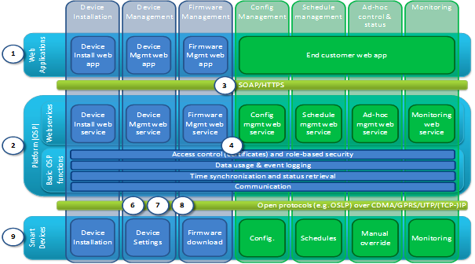

## 1.1 Architecture

_Image, functional layers overview_
 

### 2.1.1 Functional view

#### Starting architecture

The Functional view shows an overview of the most important functions of the system. The two images below respectively show the starting architecture and functional reference architecture.

_Image, functional starting architecture_
 

1. Web applications
2. Platform (OSGP)
3. Web services
4. Basic functions
5. Database
6. Communication infrastructure (CDMA/GPRS/Ethernet)
7. IP infrastructure
8. Open Street Light Protocol (OSLP)
9. Public Street Lighting Device (PSLD) or Sub Station Lighting Device (SSLD)

### 2.1.2 Functional Reference

This model partitions the system in 7 functional clusters (vertically) which are shown on the system layers (horizontally). The circled numbers refer to image 1.

_Image, functional reference architecture_

Vertical clusters:

- Device installation
- Device management
- Firmware management
- Configuration management
- Schedule management
- Ad-hoc control and status
- Monitoring

Horizontal System layers:

- Web applications
- HTTPS/SOAP communication
- Platform
- Open protocols
- Smart devices
