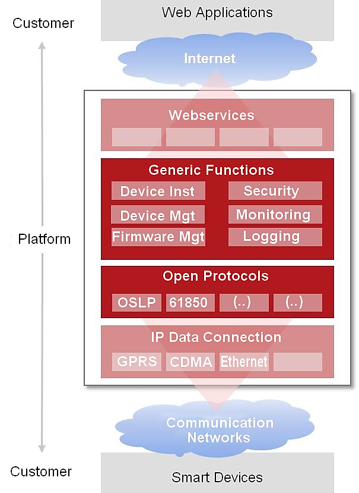
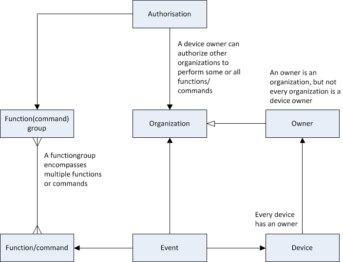

## 1.5 Non-functional view

De non-functional view is an overview of the most significant non-functional demands.

The identified non-functional demands are:

- Time Behavior
- Extensibility
- Internationalisation and localisation
- Security

### 1.5.1 Time Behavior

Time behavior is mainly significant in the Flexovl project when a lot of devices have to be addressed in a short period of time over a wireless network. Both latency and limited bandwidth have to be taken in consideration while demanding the coordinated on and off switching of the lighting (We do not want the Christmas tree effect after all).

- Time synchronization: devices periodically register with the platform and receive a time.
- Protocol: because of the limited bandwidth an efficient protocol "protobuf" was selected.

**Points of interest:**

- Light metering messages
- When the SSLD's are disabled the PSLDs cannot be addressed

Because of these points of interest we use message queueing combined with a retry mechanism of delayed delivery.

### 1.5.2 Extensibility

At the moment the platform is mainly used for switching of public lighting but this can easily be extended to other applications like electric transport, smart grids, etc.

### 1.5.3 Internationalization and localization

The platform and devices use UTC time. The OSLP protocol between platform and devices uses UTC time as well.

### 1.5.4 Security

The following security measures are in place for the cloud hosted platform:
### Cloud security
- DDOS protection
- IPSEC VPN connections
- IP whitelisting

### Operating System 
- Hardened operating systems (according to Center of Internet Security)

### Platform security
- Communication over TLS
- Firewalls between all servers and layers
- Certificates from a certificate authority
- Audit trail on all actions throughout the platform
- Role based authorizations on specific functions of devices
- Access control
- Unique device identification

For every major release there will be a mandated security test.
The cloud hosting platform will be tested regularly by the provider.

In cooperation with the European Network of Cyber Security (ENCS) state of the art security measures were implemented.

- Security per device
- Security per application 
- Security Certificates per Organisation and per device
- All communication is encrypted

 

**Security measures:**
1. Firewall in defined zone
2. Operating System Hardening
3. DDOS protection
4. Replay attack prevention
5. Private encryption key per device
6. Certificates from a Certificate Authority
7. Encryption via Elliptic Curve DSA
8. IPSEC VPN for CDMA and GPRS
9. Unique device identification
10. Unique CDMA modem number
11. Role based authorizations on functions and devices

 

#### 1.5.4.1 Encryption

An analysis of safety aspects has led to the decision that the safety of the whole system will be realized by proven technology based on asymmetrical coding (Also known as public-key encryption).

#### 1.5.4.2 Algorithms

Only public encryption Algorithms will be used. Due to performance limitations (of the devices) and recommendations from The European Network for Cyber Security (ENCS) Elliptic Curve DSA with 256-bit-keys was selected. This improves the security and efficiency over the 1024 bit RSA algorithm. Messages can be smaller and less processor capacity is needed. The key length of Elliptic Curve DSA is similar to the 3072 bit key length of RSA.

Note: Even though OSGP uses ECDSA to secure the OSLP, other encryptions may be used as well. The RSA Algorithm is still supported if preferred. This is a flexible configuration option.

#### 1.5.4.3 Private APN

A private APN is used for linking to mobile data communication infrastructures.

 

#### 1.5.4.4 Authentication of OSGP

The Open Smart Grid Platform contains an extensive authorization model, which enables a device owner  to give certain rights on certain devices to other organizations. Every organization will only see devices they have rights to.

 

An organization can get rights from the device owner to specific functions of a device, for instance reading value _x_ on device _y_. Every other function of the device has to offer will not be available to this organization.

To ensure that devices can only receive instructions from a 'genuine' OSGP it must be possible to authenticate the OSGP platform. This is implemented through a standard technology based on asymmetric encryption. The OSGP platform will receive an unique key to enable the devices to tell if the messages come from a 'genuine' OSGP. To prevent replay-attacks each message will get an index number (this is standard practice as well).

#### 1.5.4.5 Authentication of devices

To make sure OSGP can distinguish between 'genuine' devices and 'illegal' devices all devices are supplied with a manufacturer key. Each device has an unique key. Because of the asymmetrical encryption the platform contains the public part of each key. In this way devices can be identified by their unique key and their unique hardware ID. The device-ID will be encrypted in each message sent from the device to the platform.

All communication between OSGP and the devices will be signed with these keys to ensure (1) the source is legitimate and (2) to ensure the integrity of the message. It is not necessary to encrypt the whole message because confidentiality is not important. This results in a less computationally intensive process.

When a key is stolen (by hacking a device) this will not affect the integrity of the other devices. Each device has an unique key after all and only the hacked device has to be excluded from communicating in the platform.

The security is independent from the carrier (GPRS, CDMA, Ethernet, etc.).

The firmware will be used to distribute keys to devices. In this way we can use the existing secure firmware update mechanism for updating keys and certificates.

#### 1.5.4.6 Authentication of web-applications

Two way SSL will be used between web-applications and OSGP to verify the identities for both parties. User organisations are responsible for the administration of the identity of and access to their web applications. The web applications feature a login page. After successful login the user is linked to an organisation. Passwords will be stored encrypted. The organisation ID will be sent in each message to OSGP and will be verified by the SSL certificate.

#### 1.5.4.7 Authorisation of organisations

Authorisation for use of the platform functionalities is handled by roles. Roles are defined for both platform functionality and device functionality. Each role has one or more functions. Access to device functions can be set per device. The matrixes below respectively show an overview of all device-roles and device-functions and platform-roles and platform-functions.

|   | **Roles** |
| --- | --- |
| **Functions** | OWNER | INSTALLATION | AD\_HOC | MANAGEMENT | FIRMWARE | SCHEDULING | TARIFF\_SCHEDULING | CONFIGURATION | MONITORING |
| GET\_DEVICE\_AUTHORISATION | X | X | X | X | X | X | X | X | X |
| SET\_DEVICE\_AUTHORISATION | X |   |   |   |   |   |   |   |   |
| START\_SELF\_TEST | X | X |   |   |   |   |   |   |   |
| STOP\_SELF\_TEST | X | X |   |   |   |   |   |   |   |
| SET\_LIGHT | X |   | X |   |   |   |   |   |   |
| GET\_STATUS | X |   | X |   |   |   |   |   |   |
| RESUME\_SCHEDULE | X |   | X |   |   |   |   |   |   |
| SET\_REBOOT | X |   | X |   |   |   |   |   |   |
| SET\_TRANSITION | X |   | X |   |   |   |   |   |   |
| SET\_EVENT\_NOTIFICATIONS | X |   |   | X |   |   |   |   |   |
| GET\_EVENT\_NOTIFICATIONS | X |   |   | X |   |   |   |   |   |
| REMOVE\_DEVICE | X |   |   | X |   |   |   |   |   |
| UPDATE\_FIRMWARE | X |   |   |   | X |   |   |   |   |
| GET\_FIRMWARE\_VERSION | X |   |   |   | X |   |   |   |   |
| SET\_SCHEDULE | X |   |   |   |   | X |   |   |   |
| SET\_TARIFF\_SCHEDULE | X |   |   |   |   |   | X |   |   |
| SET\_CONFIGURATION | X |   |   |   |   |   |   | x |   |
| GET\_CONFIGURATION | X |   |   |   |   |   |   | X |   |
| GET\_ACTUAL\_POWER\_USAGE | X |   |   |   |   |   |   |   | X |
| GET\_POWER\_USAGE\_HISTORY | X |   |   |   |   |   |   |   | X |

|   | **Roles** |
| --- | --- |
| **Functions** | ADMIN | USER |
| CREATE\_ORGANISATION | X |   |
| GET\_ORGANISATIONS | X | X |
| GET\_DEVICE\_NO\_OWNER | X |   |
| GET\_MESSAGES | X |   |
| FIND\_DEVICES | X |   |
| SET\_OWNER | X |   |
