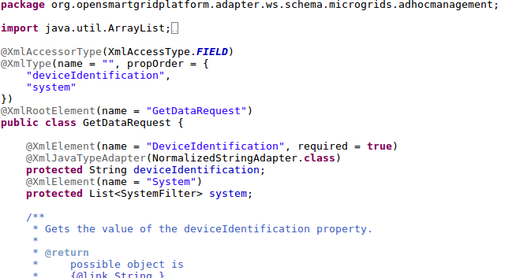

# Guidelines to add a new domain to GXF

In order to add a new domain to OSGP, you can benefit from the guidelines given in this document. The general idea for adding a new domain is to copy an existing domain, for instance the microgrids domain, and perform a global search and replace, to replace the old domain name with the new domain name. You can use refactor methods from IntelliJ or Eclipse to help renaming the old domain names.

To add a new domain, changes must be made to 2 GitHub repositories: 1. [Config repository](https://github.com/OSGP/Config). 2. [Open smart grid platform repository](https://github.com/OSGP/open-smart-grid-platform).

## Changes to OSGP/Config

Search for “Microgrids” and “microgrids” in all files and you will find all files to change for a new domain. These files include:

* Apache configuration
* Create domain database script
* Backup, restore, symlinks scripts
* Tomcat context script

## Changes to OSGP/open-smart-grid-platform

### Directory OSGP/open-smart-grid-platform/osgp/shared/

A new Maven module must be added for the new domain \(osgp-ws-newdomain\). This module will contain the wsdl files for the new domain services. Copy for instance osgp-ws-microgrids, search and replace microgrids with your domain and replace the wsdl files with your wsdl files. JAXB will generate java classes for your webservices. Change NewDomainWebServiceConfig.java accordingly. Make sure your base Request and Response classes are generated with an @XmlRootElement annotation. Otherwise your endpoints which are based on these types will fail \(See @PayloadRoot in AdHocManagementEndpoint in ospg-adapter-ws-microgrids\). The structure of your wsdl file determines whether the @XmlRootElement annotation is generated or not.

_Image showing the generated @XmlRootElement annotation_ 

Do not forget to add two constants for your new domain in the enum ComponentType.java \([https://github.com/OSGP/open-smart-grid-platform/blob/development/osgp/shared/shared/src/main/java/org/opensmartgridplatform/shared/exceptionhandling/ComponentType.java](https://github.com/OSGP/open-smart-grid-platform/blob/development/osgp/shared/shared/src/main/java/org/opensmartgridplatform/shared/exceptionhandling/ComponentType.java)\). These constants are used in handling exceptions. Add one constant to denote your new Domain layer \(DOMAIN\) and one for your new Web Services layer \(WS\). See for instance MicrogridsService.java \([https://github.com/OSGP/open-smart-grid-platform/blob/development/osgp/platform/osgp-adapter-ws-microgrids/src/main/java/org/opensmartgridplatform/adapter/ws/microgrids/application/services/MicrogridsService.java](https://github.com/OSGP/open-smart-grid-platform/blob/development/osgp/platform/osgp-adapter-ws-microgrids/src/main/java/org/opensmartgridplatform/adapter/ws/microgrids/application/services/MicrogridsService.java)\).

Add DTO’s to osgp-dto for your services. The DTO’s are used in the protocol-adapter. Mapping from/to DTO’s is performed in adapter-domain.

### Directory OSGP/open-smart-grid-platform/osgp/platform/

Reference the new osgp-ws-newdomain in pom.xml. Also create three new Maven modules and add them to the pom:

* osgp-domain-newdomain
* osgp-adapter-ws-newdomain
* osgp-adapter-domain-newdomain

### Constants for the new domain webservices

OSGP uses a couple of Java enums to identify all available services the platform offers.

* The DeviceFunction enum contains all services for all domains.
* The NotificationType enum and the NewDomainRequestMessageType enum are identical and contain the services for 1 domain. The NotificationType enum is generated from the wsdl service definition for the notification service. The NewDomainType enum is defined in the Web Service Layer for the new domain and is used to pass the message type to the other layers of OSGP.
* DeviceRequestMessageType will contain the services for 1 protocol Strictly speaking this enum is not necessary to add a new domain because the enum is located in the protocol layer of OSGP.

Each new service that is offered by the domain, for instance GET\_DATA or SET\_DATA, must be added to 3 java enums: 1. NotificationType \([https://github.com/OSGP/open-smart-grid-platform/blob/development/osgp/shared/osgp-ws-microgrids/src/main/resources/schemas/notification.xsd](https://github.com/OSGP/open-smart-grid-platform/blob/development/osgp/shared/osgp-ws-microgrids/src/main/resources/schemas/notification.xsd), generated from wsdl with JAXB\) 2. DeviceFunction \([https://github.com/OSGP/open-smart-grid-platform/blob/development/osgp/platform/osgp-domain-core/src/main/java/org/opensmartgridplatform/domain/core/valueobjects/DeviceFunction.java](https://github.com/OSGP/open-smart-grid-platform/blob/development/osgp/platform/osgp-domain-core/src/main/java/org/opensmartgridplatform/domain/core/valueobjects/DeviceFunction.java)\) 3. MessageType \([https://github.com/OSGP/open-smart-grid-platform/blob/development/osgp/shared/shared/src/main/java/org/opensmartgridplatform/shared/infra/jms/MessageType.java](https://github.com/OSGP/open-smart-grid-platform/blob/development/osgp/shared/shared/src/main/java/org/opensmartgridplatform/shared/infra/jms/MessageType.java)\)

### SQL for the new domain

A Flyway script should be added for system data. For a new domain a new record must be inserted in the table domain\_info in the core database. Check for instance the Flyway script for Distribution Automation [https://github.com/OSGP/open-smart-grid-platform/blob/development/osgp/platform/osgp-core/src/main/resources/db/migration/V20170508125704045\_\_Added\_Distribution\_Automation\_domain\_info.sql](https://github.com/OSGP/open-smart-grid-platform/blob/development/osgp/platform/osgp-core/src/main/resources/db/migration/V20170508125704045__Added_Distribution_Automation_domain_info.sql). Test data for a new domain will include:

* Table device\_function\_mapping in the core database. Add a row for each new service to authorize ‘OWNER’ for this service.
* Table device in the core database. Add a new row for a test device, use the proper protocol\_info\_id. \(Protocol\_info\_id is a foreign\_key to the protocol\_info table in core\).
* Table device\_authorization. Add a new row to authorize owner for this device. \(Function\_group is a reference to the java enum DeviceFunctionGroup in platform/osgp-domain-core\).

### Changes to osgp-domain-newdomain

* Review entities. Be careful, the entities in this project are generated in the core database. The name of this project suggests that the entities would be generated in a domain specific database.
* Create valueobjects for your domain. The valueobjects in this project are used only in the adapter-ws and adapter-domain layer.

### Changes to osgp-adapter-ws-newdomain

* Add Endpoints for each service request in presentation.ws.
* Add MessageProcessors in infra.jms.messageprocessors for each service response.
* Modify mapping/NewDomainMapper to map the JAXB generated classes to the classes in platform/osgp-domain-new-domain

### Changes to osgp-adapter-domain-newdomain

* Add MessageProcessors in infra.jms.ws.messageprocessors for each service request.
* Add MessageProcessors in infra.jms.core.messageprocessors for each service response.
* Modify mapping/DomainNewDomainMapper to map the classes in platform/osgp-domain-new-domain to the classes in shared/osgp-dto. The osgp-dto classes are used in the core layer and the protocol layer.

### Testing the new domain services

In order to test the new domain services take a look at the [Installation Guide](../userguide/installationguide). While following this guide keep the following items in mind:

* A test device for the new domain must be available. This can either be a physical device or a simulated device.
* The test device must be connected or a device simulator must be running.
* The OSGP protocol adapter for the new device must be extended.
* ProgreSQL must be installed with all OSGP databases and system data as listed in the installation guide. The new domain might have a new database in which case the create script for the database and database owner must be run.
* Test data must be inserted into the following tables: organisation, device, device\_authorization, device\_function\_mapping. Depending on the type of protocol adapter used for the new domain other tables might have to be populated as well. For instance a table like rtu\_device for the IEC61850 Protocol Adapter.
* Apache Http Server must be installed and the new domain must be added to the configuration
* Apache ActiveMQ must be installed
* Tomcat application server must be installed and at least 4 web applications must be deployed:
  * An OSGP protocol adapter
  * OSGP Core
  * The OSGP Adapter Domain for your new domain
  * The OSGP Adapter WS for your new domain
* SoapUI can be used to test the new webservices for your domain

