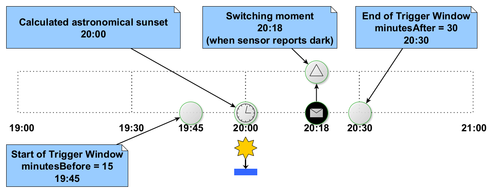
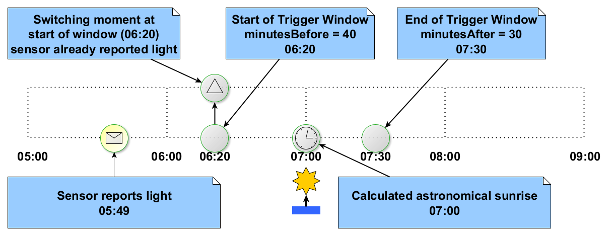
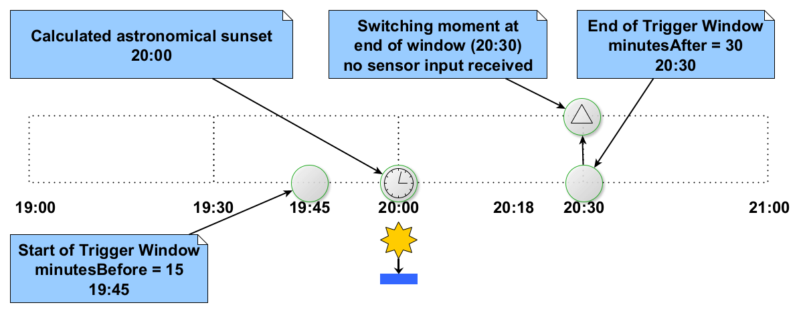
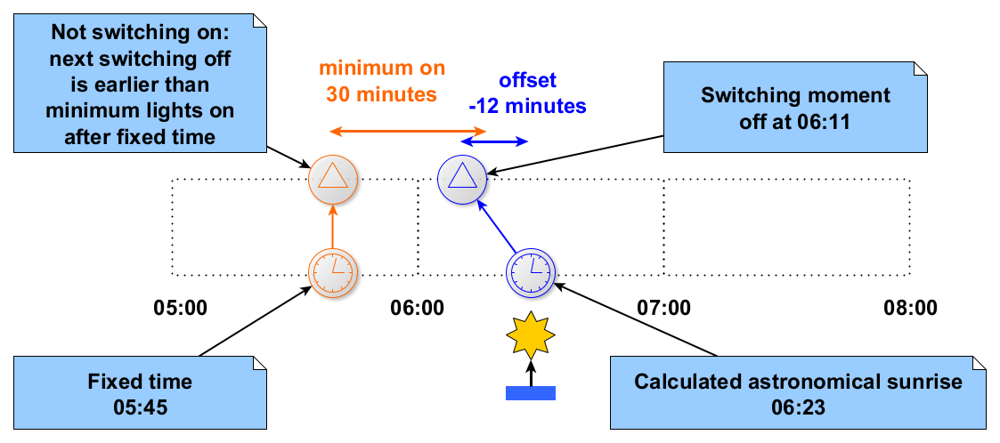
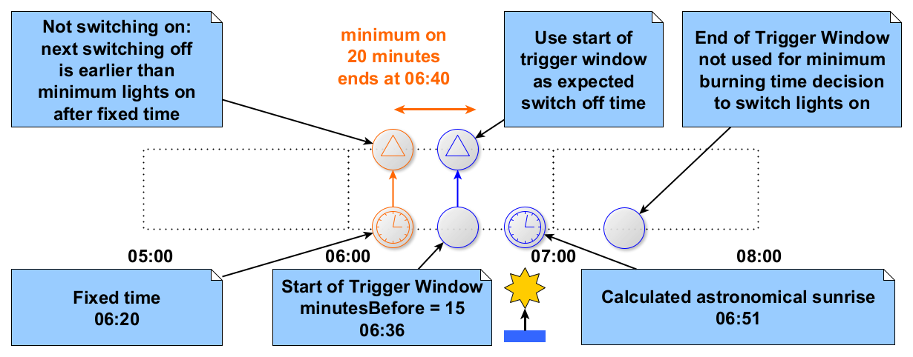
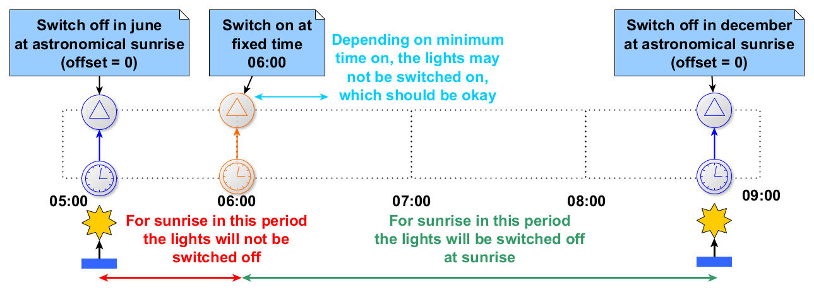
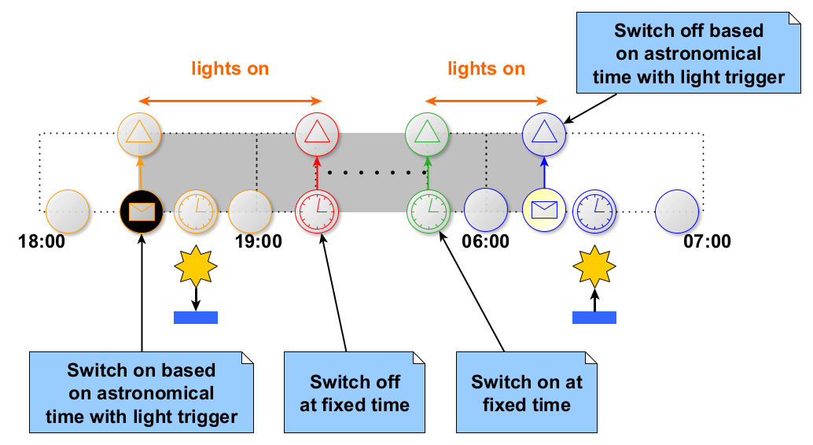

# Light Schedules

Schedules for light switching can be set using [Set Schedule requests](https://github.com/OSGP/open-smart-grid-platform/blob/development/osgp/shared/osgp-ws-publiclighting/src/main/resources/schemas/pl-schedulemanagement.xsd) from the [Public Lighting Schedule Management web service](https://github.com/OSGP/open-smart-grid-platform/blob/development/osgp/shared/osgp-ws-publiclighting/src/main/resources/PublicLightingScheduleManagement.wsdl).  
 For brevity the XML element and type names in the descriptions below will not include the namespace \(which will typically be `"http://www.opensmartgridplatform.org/schemas/publiclighting/schedulemanagement/2014/10"`\).

A switching schedule is defined by a number of declarations of switching moments \(also known as schedule entries\).  
 The `SetScheduleRequest` defines the schedule, where `Schedules` of type `Schedule` define the entries.  
 A complete schedule for a device as set with the Set Schedule request can have 1 up to 50 entries.  
 Each schedule entry defines a moment on a day when certain relays on a device are switched on or off.  
 Whether or not a switch action defined in a schedule entry is executed may not only depend on the entry itself. Other switch moments from the schedule that are [close in time](lightschedules.md#minimal-burning-time) compared to an entry may cause switching to be skipped.

A more detailed description of the components defining a schedule entry is in the sections below:

* [week day](lightschedules.md#week-day)
* [time](lightschedules.md#time)
  * explicitly configured [fixed time](lightschedules.md#fixed-time)
  * time of [sunrise or sunset](lightschedules.md#astronomical-time)
  * time of [sunrise or sunset combined with sensor input](lightschedules.md#astronomical-time-with-sensor)
* [light value](lightschedules.md#light-value)

## Week Day

The value of `WeekDay` is used to indicate on which days the schedule entry may trigger switch actions.

| **`WeekDay`** | **May trigger a switch action on** |
| ---: | :--- |
| `MONDAY` | Mondays |
| `TUESDAY` | Tuesdays |
| `WEDNESDAY` | Wednesdays |
| `THURSDAY` | Thursdays |
| `FRIDAY` | Fridays |
| `SATURDAY` | Saturdays |
| `SUNDAY` | Sundays |
| `WEEKDAY` | weekdays \(Monday to Friday\) |
| `WEEKEND` | weekend days \(Saturday or Sunday\) |
| `ABSOLUTEDAY` | the day specified in `startDay` |
| `ALL` | any day |

## Time

Each schedule entry can cause switching at a single time during the day. There are a number of ways in which this time can be specified, starting with `ActionTime`.

| **`ActionTime`** | **Description** |
| ---: | :--- |
| `ABSOLUTETIME` | a [fixed time](lightschedules.md#fixed-time) is set for the switching moment in `Time` |
| `SUNRISE` | switching at sunrise at the location of the device |
| `SUNSET` | switching at sunset at the location of the device |

For `ActionTime` values `SUNRISE` or `SUNSET` the value of `TriggerType` specifies what the actual switching time should be.

| **`TriggerType`** | **Description** |
| ---: | :--- |
| `LIGHT_TRIGGER` | [astronomical time with sensor input](lightschedules.md#astronomical-time-with-sensor) determines the actual switching time |
| `ASTRONOMICAL` | the [calculated astronomical time](lightschedules.md#astronomical-time) for sunrise or sunset is the switching time |

### Fixed Time

For `ActionTime` `ABSOLUTETIME` a fixed time can be set for the switching moment as `Time`.  
 The `Time` value needs to be formatted in a way the [protocol implementations](lightschedules.md#protocol-implementations-for-light-schedules) can handle. For the currently listed implementations, you should be fine when you use a format from:

* `hh:mm`;
* `hh:mm:ss`;
* `hh:mm:ss.SSS`

With `hh` from `00` to `23`, `mm` from `00` to `59`, `ss` from `00` to `59` and `SSS` from `000` to `999`.  
 Some protocols may accept more precise time formats than they support. The IEC61850 implementation for instance, will silently apply only the hours and minutes from any of the formats listed above.

### Astronomical Time

For `ActionTime` `SUNRISE` or `SUNSET` with `TriggerType` `ASTRONOMICAL` the astronomical sunrise or sunset time \(as calculated by the switching device, based on its longitude and latitude\) will be used to determine the switching moment.

#### Astronomical Offsets

If an astronomical offset is configured, it has to be added to the calculated astronomical time to determine the time to be used as the switching moment.  
 For positive offset values, the astronomical time for the switching moment will be the configured amount of minutes after the calculated astronomical sunrise or sunset time, while for negative values the astronomical time used will be the number of minutes before the calculated astronomical sunrise or sunset time.

**Astronomical Sunrise Offset**

The astronomical sunrise offset is applied with entries with `ActionTime` `SUNRISE` and `TriggerType` `ASTRONOMICAL`.  
 The following picture is an example of switching off at 07:30; the calculated astronomical sunrise \(say at 07:15 for the day shown\) plus 15 minutes \(configured as `AstronomicalSunriseOffset` `15`\).

**Astronomical Sunset Offset**

The astronomical sunset offset is similar to the [astronomical sunrise offset](lightschedules.md#astronomical-sunrise-offset), except that it is applied with entries with `ActionTime` `SUNSET` and `TriggerType` `ASTRONOMICAL`.

### Astronomical Time With Sensor

For `ActionTime` `SUNRISE` or `SUNSET` with `TriggerType` `LIGHT_TRIGGER` the calculated astronomical sunrise or sunset time will be used as a reference time with a trigger window to determine the switching moment.  
 The astronomical time itself is calculated in the same way as with [astronomical time](lightschedules.md#astronomical-time) \(without light sensor input\).  
 Switching happens within a configured [trigger window](lightschedules.md#trigger-window) around the astronomical time, at a moment that is influenced by a signal from a light sensor.

#### Trigger Window

The `TriggerWindow` with its `minutesBefore` and `minutesAfter` defines a window of time around an astronomical sunrise or sunset time with sensor.  
 Switching will occur at the start of the window when light sensor input is received before the window.  
 Switching will occur at the end of the window when light sensor input is not received before the end of the window.  
 Switching will occur at the time light sensor input is received, when this input is received within the window.

Light sensor input in the conditions above means the sensor trigger for `light` when the schedule entry is switching off, and the sensor trigger for `dark` when switching on.

#### Astronomical Time With Sensor Signal Within The Trigger Window

The following picture is an example where the light sensor reports `dark` within the trigger window for a schedule entry for astronomical time with sensor signal. Switching on occurs at the time the sensor input is received. Note that for this example this could have been at any time between 19:45 and 20:30 \(15 minutes before to 30 minutes after the astronomical sunset, calculated to occur at 20:00 on the day shown\).

#### Astronomical Time With Sensor Signal Before The Trigger Window Opens

The following picture is an example where the device has received a light sensor report before the trigger window opens for a schedule entry for astronomical time with sensor signal. Switching off occurs at the start of the trigger window.

#### Astronomical Time Without Sensor Signal Before The Trigger Window Closes

The following picture is an example where the device has not received a light sensor report before the trigger window closes for a schedule entry for astronomical time with sensor signal. Switching on occurs at the end of the trigger window.

## Minimal Burning Time

For certain types of lighting it may be undesirable to switch the lights on only for a short period of time, after which they are switched off again. In such a case the action of switching the lights on will be suppressed if `minimumLightsOn` is set with a positive number of seconds, and the action switching the lights off again is expected within this time period.

The minimal burning time is always regarded with respect to an **actual time** for a switching moment that switches a relay on in comparison with the **expected time** of the next switching moment where the same relay will be switched off again.  
 Switching on will be skipped if switching off is expected to occur within a number of minutes set as `minimumLightsOn` with the schedule entry that switches the relay on.

### Minimal Burning Time With Astronomical Offset

This example shows the minimal burning time preventing the [morning lights](lightschedules.md#morning-lights) to be switched on at a fixed time because switching off at the calculated time of astronomical sunrise \(with offset\) would happen before passing of the minimum number of minutes the lights should be kept on.

### Minimal Burning Time With Light Sensor Trigger Window

This example shows the minimal burning time preventing the [morning lights](lightschedules.md#morning-lights) to be switched on at a fixed time because switching off at the start of the trigger window around the calculated time of astronomical sunrise would happen before passing of the minimum number of minutes the lights should be kept on.

## Light Value

Each schedule entry may include 1 to 6 `LightValue` elements. These light values determine the relay to switch, whether the relay should be switched on or off, and whether the lights with a relay should be dimmed \(and by how much\).

* `Index`: `0` for all light switching relays in the device, or `1` to `6` for numbered relays \(the

  index should indicate an existing relay that is used for light switching\).

* `On`: `true` if this entry is for switching on the relay\(s\) identified by `Index`; `false` for

  switching off.

* `DimValue`: optional percentage set as number `1` to `100` indicating a dim value; will be ignored

  when the protocol or switching device does not support dimming.

## Common Light Scheduling Patterns

Here are some examples of patterns that are common with light schedules. The patterns are formed by combinations of schedule entries that switch on or off lights controlled by a certain relay on the switching device.

### All Night Lights

All night lights is a name for lights that are turned on around sunset and keep burning all night until they are switched off again around sunrise.  
 The all night lights are switched by a pair of schedule entries:

* one entry switching on at [astronomical sunset time](lightschedules.md#astronomical-time) with

  [optional offset](lightschedules.md#astronomical-offsets) or [light sensor trigger](lightschedules.md#astronomical-time-with-sensor).

* another entry switching off again based on [astronomical sunrise time](lightschedules.md#astronomical-time) with

  [optional offset](lightschedules.md#astronomical-offsets) or [light sensor trigger](lightschedules.md#astronomical-time-with-sensor).

### Morning Lights

Morning lights is a name used for lights that are switched on a short period in the morning hours of a day to illuminate a period before or around the morning twilight.  
 The morning lights are switched by a pair of schedule entries:

* one entry switching on at a [fixed time](lightschedules.md#fixed-time);
* another entry switching off again based on [astronomical sunrise time](lightschedules.md#astronomical-time) with

  [optional offset](lightschedules.md#astronomical-offsets) or [light sensor trigger](lightschedules.md#astronomical-time-with-sensor).

#### Fixed Time And Sunrise Interaction

Depending on the location of the device the time of sunrise may vary quite a bit throughout the year. Because of this it is possible that what for some period would be a very reasonable schedule, is a questionable schedule \(possibly to be considered [invalid](lightschedules.md#validity)\) in another season.

During the summer in the Netherlands for example sunrise can be as early as approximately 05:15, while during the winter the sun may rise even a little later than 08:45.  
 For this example we will assume configuration for the morning lights to switch on at fixed time of say 06:00. This is a time after the earliest sunrise in the year, but well before the latest sunrise in the year.  
 To complete the morning lights configuration, a second switching moment is configured to switch the lights off at sunrise.  
 With this set up the lights will be switched off after having been on for almost three hours at some time in the winter \(for instance from 06:00 to 08:45\).  
 During summer at some days the lights will not be switched off in the morning at all because they were turned on \(at 06:00\) after sunrise \(switching off at any time before 06:00, for instance at 05:30\).

Whether the lights stay on all day in the summer or not is something to be looked into.  
 A switching device may have logic to deal with this situation figuring out the switch off belongs with the later switching moment to turn the lights on, and decide not to switch on.  
 If not, some validation may be needed to enforce such schedules not to be configured.

### Evening Lights

Evening lights is a name used for lights that are switched on a short period in the evening hours of a day to illuminate a period after or around dusk.  
 This is similar to the [morning lights](lightschedules.md#morning-lights), but in the evening instead of the morning, and the fixed time moment comes \(normally\) after the switch action around sunset.

The evening lights are switched by a pair of schedule entries:

* one entry switching on at [astronomical sunset time](lightschedules.md#astronomical-time) with

  [optional offset](lightschedules.md#astronomical-offsets) or [light sensor trigger](lightschedules.md#astronomical-time-with-sensor).

* another entry switching off again based on [fixed time](lightschedules.md#fixed-time);

#### Fixed Time And Sunset Interaction

Depending on the location of the device the time of sunset may vary quite a bit throughout the year. Because of this it is possible that what for some period would be a very reasonable schedule, is a questionable schedule \(possibly to be considered [invalid](lightschedules.md#validity)\) in another season.  
 See the [explanation around sunrise](lightschedules.md#fixed-time-and-sunrise-interaction) for a graphical example.

### Evening/Morning Lights

A combination of [morning lights](lightschedules.md#morning-lights) and [evening lights](lightschedules.md#evening-lights) can be configured for a relay if the lights may be turned off for a period in the late night and early morning, as opposed to the [all night lights](lightschedules.md#all-night-lights) that keep on burning all through the night.

## Validity

The GXF Public Lighting Schedule Management web service does not do much validation, other than checking authorizations for the device identified by the `DeviceIdentification` from the `SetScheduleRequest` and whether the request conforms to its XML schema definitions.

If for certain applications more constraints are desirable, it is left up to those applications to make sure the requests made to the platform conform to those additional constraints.  
 Examples of such constraints, that are not enforced by GXF, could be:

* no duplicated schedule entries;
* no schedule entries canceling the switch actions of other entries within some time window;
* schedule entries may be required for all days of the week;
* switching on and off might be required to happen each day in equal number of times and alternately;
* checking expected actions around daylight saving change;
* checking expected switching actions for days with the longest or shortest number of hours of daylight;
* light value indexes map to existing light relays on the device the schedule is set on;
* constraints from applying the provided input with specific devices or protocols.

## Protocol Implementations For Light Schedules

* [IEC61850](../../protocols/iec61850/swdevice-010805/setschedule.md)
* [OSLP v0.6.1](../../protocols/oslp/oslp-v0.6.1/setschedule.md)

