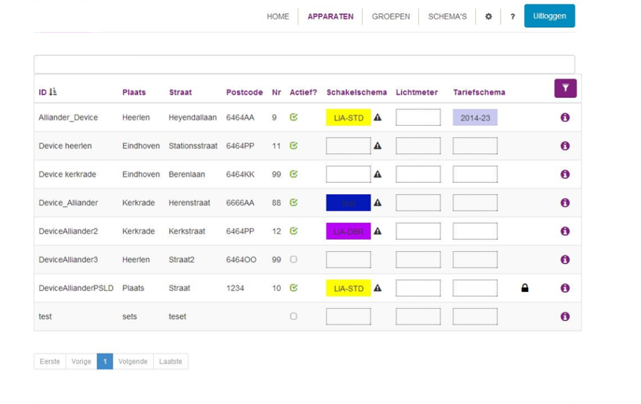

<!--
SPDX-FileCopyrightText: Contributors to the Documentation project

SPDX-License-Identifier: Apache-2.0
-->

# Use cases

Up-to-date information on use-cases can be found on the [Grid eXchange Fabric website](https://www.lfenergy.org/projects/gxf/).

## Reference implementation in The Netherlands:  Flexible system for operating public lighting \(FlexOVL\)

FlexOVL, a new and flexible switching system of public lighting delivers more control for municipalities and is the first solution which is powered by the Open Smart Grid Platform.

**Technical drivers for Alliander**

* Replacing Ripple Control
* Decrease future investments
* Decrease outages

**Customer drivers \(Municipalities\)**

* Be more in control, by controlling switching times themselves
* Resolve power failures faster, through up-to-date information
* Reduction in costs, through energy saving and more efficient maintenance and management
* No vendor lock-in, not dependent on one supplier

**Implementation/roll-out**

* Small scale roll-out started January 2015
* 200 Sub Stations will be fitted with an SSLD to control public lighting and tariff switching
* 15 municipalities in the Liander grid operator area will be participating
* Goal is to allow municipalities to use the application, give feedback and to see if the services offered to municipalities are adequate
* Large scale roll-out will start around 2016
* The entire Liander grid operator area will use SSLD's to control all public lighting and tariff switching
* About 25.000 Sub Stations \(middenspanningsruimtes\)
* About 800.000 street lights will be switched by the SSLD's mounted in the 25.000 Sub Stations

**FlexOVL web application \(not open source available\)**

Municipalities are free to choose their own \(web\)application \(using the web services of the Open Smart Grid Platform\), or they could use the default web application developed by Alliander.

**Functionality of the default web application as used by grid operator Liander \(example\)**

* Create switching schedules and assign those schedules to one or more SSLD's
* Create groups of SSLD's in order to be able to assign schedules to many SSLD's at once
* On demand switching of public lighting
* Review current status of an SSLD in order to review public lighting and tariff switching states
* Abilities to monitor power consumption of public lighting \(available if the SSLD is fitted with an Electricity Meter\)
* Monthly report offering insight into switch moments and power consumption

