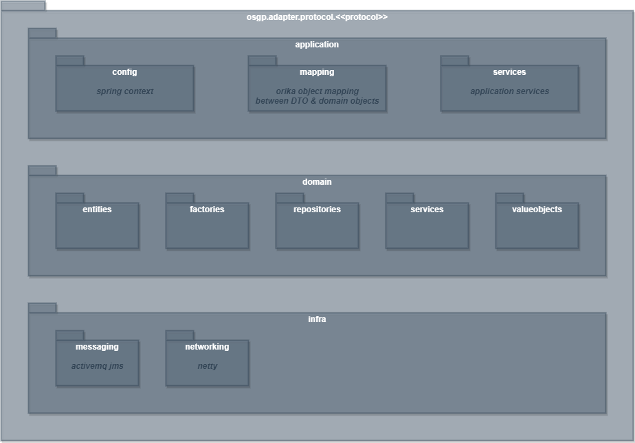

<!--
SPDX-FileCopyrightText: Contributors to the Documentation project

SPDX-License-Identifier: Apache-2.0
-->

# Protocols

The open smart grid platform supported protocols can be found in this section. Feel free to add your own protocol or improve an existing protocol adapter.

## Protocol Adapters

Protocol Adapter components translate a message from domain adapter components into a protocol message for a smart device. Protocol Adapter components send the protocol message to a smart device using a network connection. The response from the smart device is translated into a domain response message which will be sent to the Core components \(which will route it to the domain adapter which issued the request\).

### OSLP

For the OSLP implementation, 2 components are used. The first component is the protocol adapter for the protocol. It can translate message into the protocol message for SSLD's. Second there's the signing-server component. It is responsible for signing the protocol message using the private key of the platform. The components communicate using a queue-pair. The singing-server can handle multiple protocol adapter instances by utilizing a reply-to queue per protocol adapter instance. Since the protocol adapter component needs to be reachable from a network, it is a requirement that the private key may not be used by the protocol adapter directly. The singing-server component can be deployed in such a way that no network access is available to this component, as the only coupling needed are the queues / the message broker.

### DLMS

The DLMS protocol is used for \(mainly\) smart metering.

### IEC61850

The IEC61850 implementation is used for e.g. distribution automation, microgrids and public lighting.

### MQTT

The MQTT implementation is used in distribution automation

## Basic layout of a protocol adapter

The following diagram shows the basic structure of a protocol adapter. This however does not mean that all protocol adapters will be structured like this, but instead the diagram shows an example of how such a protocol adapter could be structured.

