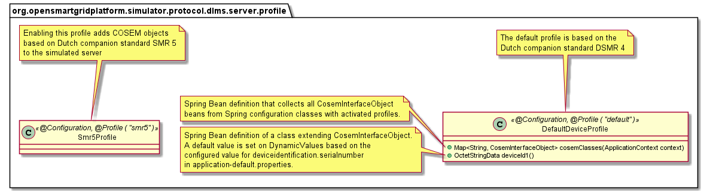
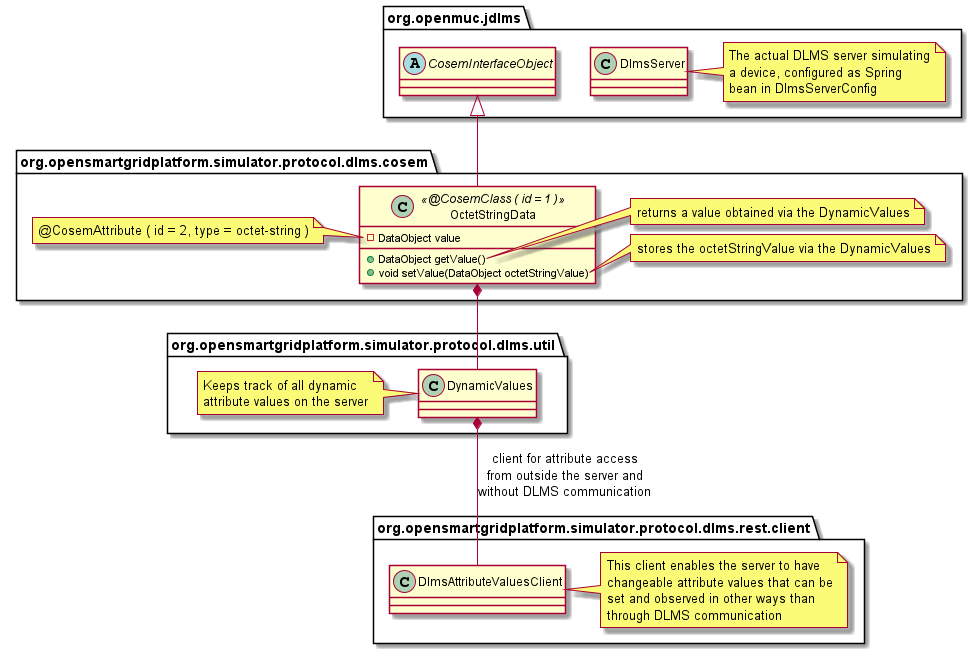
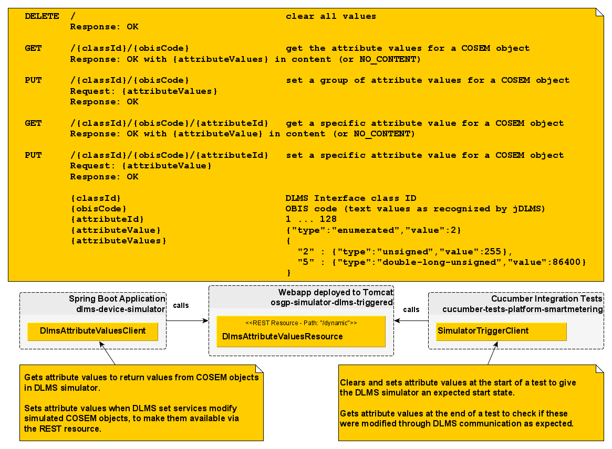

<!--
SPDX-FileCopyrightText: Contributors to the Documentation project

SPDX-License-Identifier: Apache-2.0
-->

# DLMS device simulator

The library that is used to connect to DLMS devices contains functionality to build a simulator for a device. The library offers the following core functionality.

* zero or more servers can be started on a host \(different ports\)
* zero or more logical devices can be registered with a server \(different device id\)
* zero or more annotated objects can be registered with a logical device
* these objects define available dlms classes, ObisCodes, attributeIds and methods for the device and can contain any logic
* authentication and encryption are supported

If you want to simulate a certain device you will prepare annotated classes and register instances of these with a logical device. Because you create plain Java you can make use of all functionality Java offers, for example databases. To try and make the simulation more realistic you may build in connection timeouts etc.

## General Usage

For each combination of a cosem class and obiscode you create a java class that you annotate with @CosemClass\(id = ..., obis = "x.x.x.x.x.255"\)

In these java classes you can add fields of type DataObject that you annotate with @CosemAttribute\(id = ..., type = Type.x\)

Also you can create getXXX and setXXX methods to intercept getting and setting data on a logical device. XXX will be the name of the corresponding field starting with a capital letter.

For example:

```java
@CosemClass(id = 3, obis = "1.0.1.8.0.255")
public class ImportValue {

    @CosemAttribute(id = 2, type = Type.DOUBLE_LONG_UNSIGNED)
    private DataObject d1 = DataObject.newUInteger32Data(10001);

    @CosemAttribute(id = 3, type = Type.STRUCTURE)
    private DataObject d2 = DataObject.newStructureData(DataObject.newInteger8Data((byte) -2),
            DataObject.newInteger8Data((byte) 30));

    public void setD1(DataObject newData) throws IllegalAttributeAccessException {
      // ....
    }
    public DataObject getD1() throws IllegalAttributeAccessException {
      return d1;
    }
}
```

The value of the field will be the response to get\(AttributeAddress...\) that is fired from osgp CommandExecutors. NOTE that these values can also be set! For example using the ClientConsole.

You can also annotate methods with or without a DataObject return value and with or without a DataObject parameter: @CosemMethod\(id = ..., consumes = Type.x\)

For example:

```java
    @CosemMethod(id = 1)
    public void hello() throws IllegalMethodAccessException {
        System.out.println("Has been called");
        return;
    }

    @CosemMethod(id = 2, consumes = Type.OCTET_STRING)
    public DataObject hello2(DataObject datO) throws IllegalMethodAccessException {
        throw new IllegalMethodAccessException(MethodResultCode.OTHER_REASON);
    }
```

Such a method will be called when osgp fires ClientConnection.action, the DataObject that may be returned will become available in osgp on the MethodResult object.

## GXF device simulators

GXF has an implementation of DLMS device simulators that builds on the DLMS COSEM Server concepts as
described in the [General Usage](#general-usage) section.

### dlms-device-simulator

This project contains the code to activate a DLMS COSEM server simulating a smart meter by running
the DeviceServer Spring Boot Application configure by settings defined in DlmsServerConfig.

More details about how to configure and start a simulator can be found in the [readme documentation
for simulators on GitHub](https://github.com/OSGP/open-smart-grid-platform/tree/development/osgp/protocol-adapter-dlms/osgp-protocol-simulator-dlms/simulator).

The following diagrams provides some insight into the different parts that together provide access
to COSEM interface object attributes and methods supported by the server.

Spring configuration classes define beans of type CosemInterfaceObject that are collected for
activated Spring profiles to define the objects on the simulated device.



A COSEM interface object like octet-string deviceid1 can have a readable and writable value, that is
made available outside the server and DLMS communication as well.



The role the DlmsAttributeValuesClient can play in a scenario where data is read and set from tests
is described with the DLMS Attribute Values REST Resource.

### DLMS Attribute Values REST Resource as used in Cucumber tests with a simulated smart meter

The Cucumber test implementation using simulated DLMS device for smart metering comprises of a
number of classes spread across the following projects:

* dlms-device-simulator
* osgp-simulator-dlms-triggered
* cucumber-tests-platform-smartmetering

Dynamic values in smart meters (changed by DLMS communication or getting/setting values from test
code) are implemented by using a REST resource, both from the simulated device and from the code
behind Cucumber step definitions.

The following picture describes the REST resource endpoints and the way the resource is used by the
different components.



