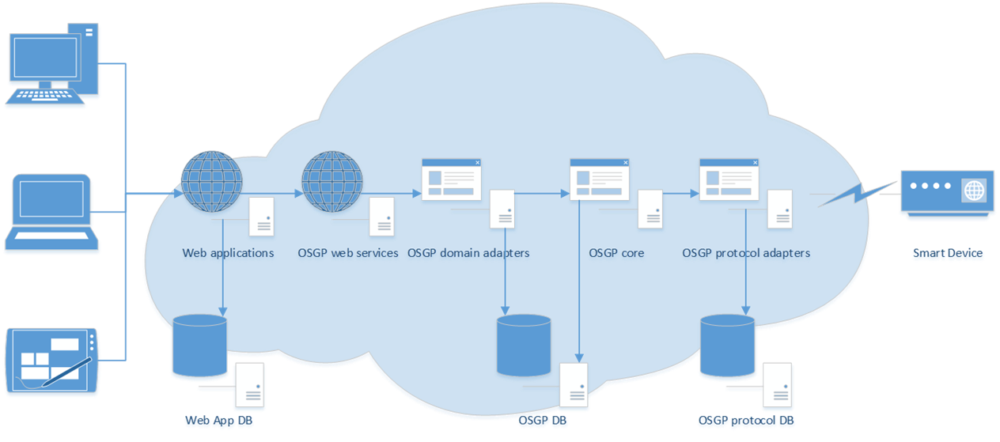

# Deployment

## Deployment options

Hosting the open smart grid platform in the cloud is possible, as well as on premises.

## Active-active setup over multiple datacenters

If you like to setup an active-active installation over multiple datacenters. Make sure that the open smart grid platform database runs redundant over both datacenters \(master-slave configuration\).

## Maintenance

There's not much maintenance that needs to be performed. Archiving some old log files, checking up on available disk space and creating a backup of the databases. Looking into the queues to see if there are no messages in the dead letter queue.

