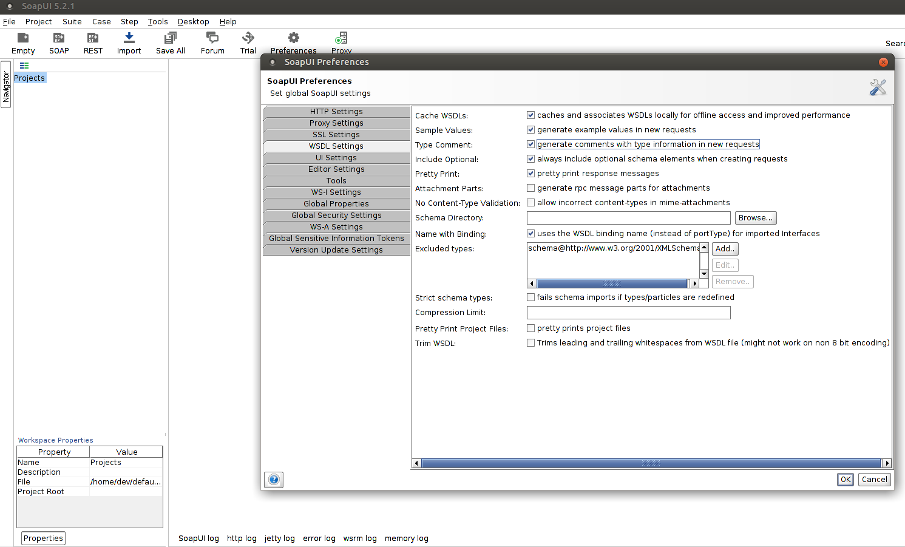
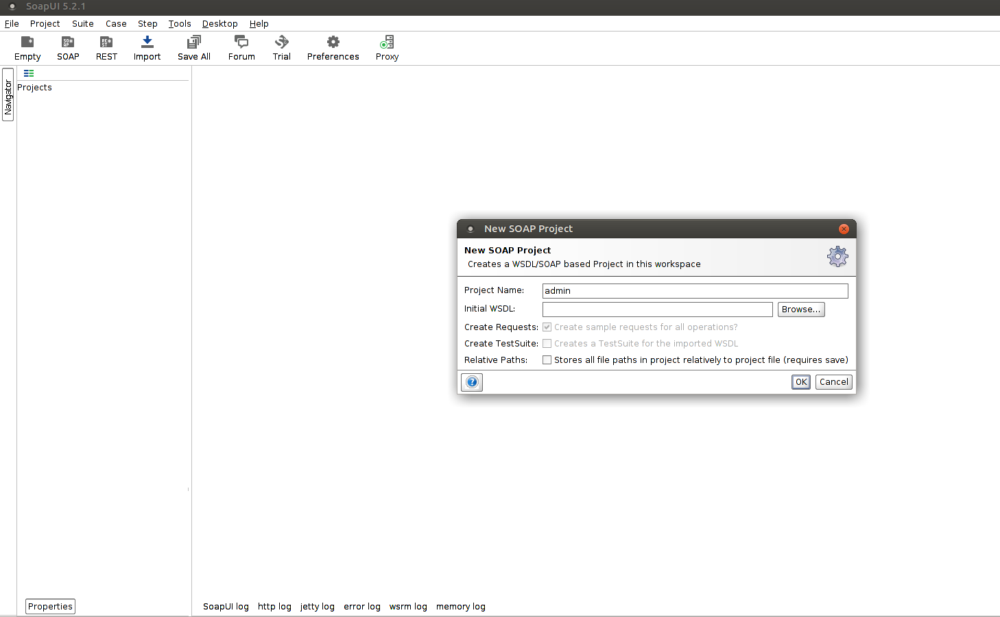
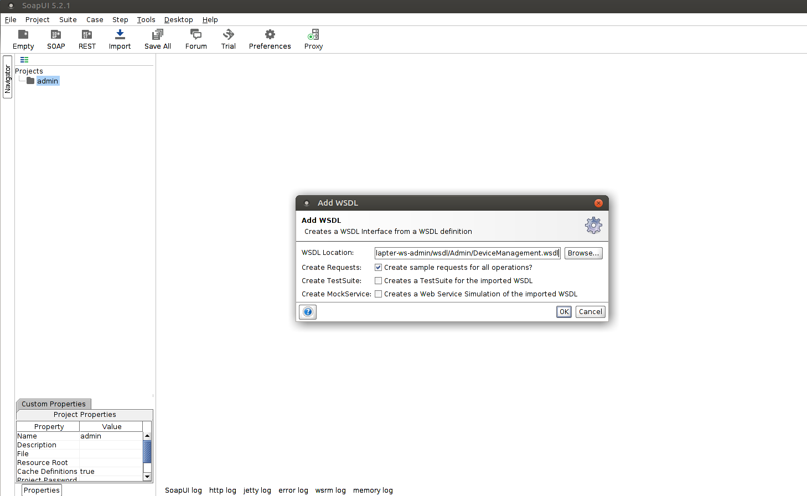
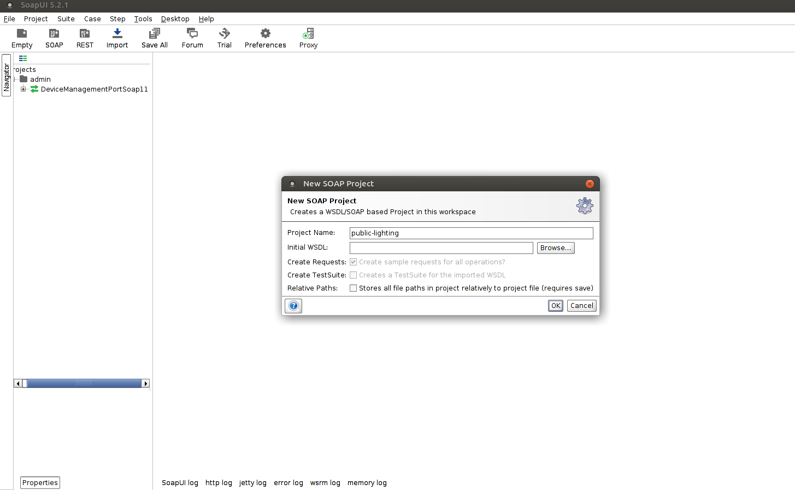
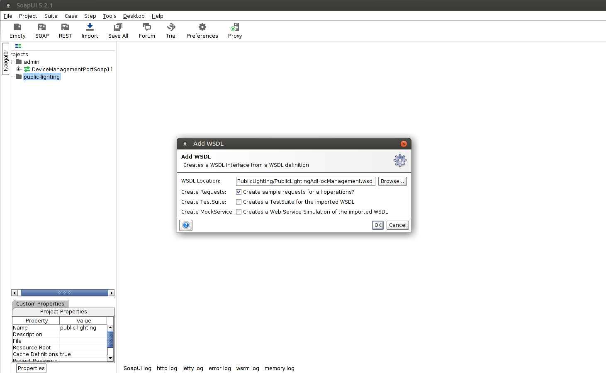
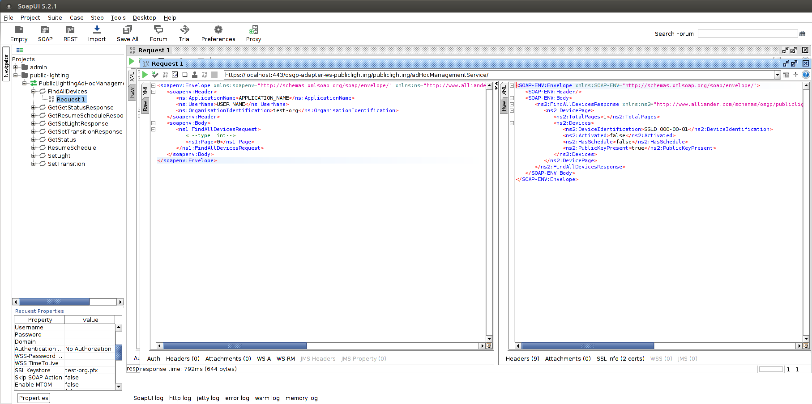
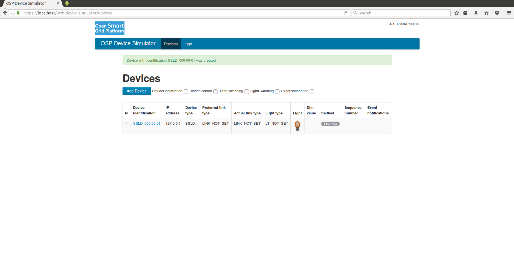
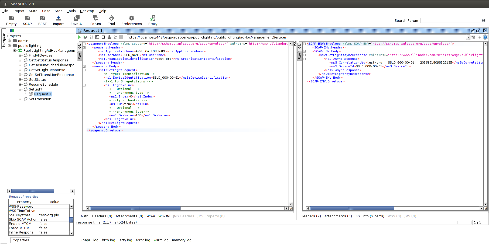

<!--
SPDX-FileCopyrightText: Contributors to the GXF project

SPDX-License-Identifier: Apache-2.0
-->

# Using SoapUi

## Testing the platform

This chapter will describe the steps needed to test the Open Smart Grid Platform.

## Setting Up SoapUI

Start SoapUI by double clicking the shortcut on the Desktop or run it manually by typing the following command in a terminal:

```text
/home/dev/Tools/SoapUI/bin/soapui.sh
```

Go to File -&gt; Preferences -&gt; SSL Settings, and browse for the KeyStore to `/home/dev/Sources/OSGP/Config/certificates/osgp-ca/certs/test-org.pfx` and fill out the password \(the password is 1234\) 

Go to WSDL Settings and check 'Generate Example Values in New Requests' and 'Generate Comments with Type Information in New Requests' 

## Add the SoapUI projects to SoapUI

There are several SoapUI project prepared, see `/home/dev/Sources/OSGP/Config/soapui/`. Import all SoapUI projects present in the folder mentioned above. Below, 2 projects are shown as examples.

## Adding the 'Admin' Soap project

Import the 'admin' project by clicking File -&gt; Import project. Browse to `/home/dev/Sources/OSGP/Config/soapui/`, select 'admin-soapui-project.xml' and click open.

Alternatively you can create the 'admin' project yourself by following the steps below:

* Create a new SOAP Project and call it 'admin' 
* Open the Project View by double-clicking on the 'admin' project. Go to 'WS-Security Configurations' and select the 'Keystores' Tab. Click on the '+' to add the `test-org.pfx` in `/home/dev/Sources/OSGP/Config/certificates/osgp-ca/certs/`
* Fill out the password \(1234\) and click Ok and close the Project View window. 
* Right click the 'admin' project and choose 'Add WSDL'. Enter the following URL in the WSDL Location field:

  ```text
  /home/dev/Sources/OSGP/open-smart-grid-platform/osgp/shared/osgp-ws-admin/src/main/resources/AdminDeviceManagement.wsdl
  ```

* Make sure the box 'Create sample requests for all operations' is checked, and click OK. 

## Adding the 'Public Lighting' Soap project.

Import the 'public-lighting' project by clicking File -&gt; Import project. Browse to `/home/dev/Sources/OSGP/Config/soapui/`, select 'public-lighting-soapui-project.xml' and click open.

Alternatively you can create the 'public-lighting' project yourself by following the steps below:

* Create another new SOAP Project and call it 'public-lighting' 
* Open the Project View by double-clicking on the 'public-lighting' project. Go to 'WS-Security Configurations' and select the 'Keystores' Tab. Click on the '+' to add the `test-org.pfx` in `/home/dev/Sources/OSGP/Config/certificates/osgp-ca/certs/`
* Fill out the password \(1234\) and click Ok and close the Project View window. 
* Right click the 'public-lighting' project and choose 'Add WSDL'. Enter the following URL in the WSDL Location field:

  ```text
  /home/dev/Sources/OSGP/open-smart-grid-platform/osgp/shared/osgp-ws-publiclighting/src/main/resources/PublicLightingAdHocManagement.wsdl
  ```

* Make sure the box 'Create sample requests for all operations' is checked, and click OK. 

## First SOAP requests to add a device to the open smart grid platform

Before sending the request, the test-org.pfx should be added as SSL Keystore: Go to the properties interface for the request \(bottom left of the screen, after selecting 'Request 1' under UpdateKey in the 'admin' project'\), and choose `test-org.pfx` from the drop-down box.

## Note

* This has to be done for each request!


An SSLD needs to be added to the platform, as well as a manufacturer and a public key for the SSLD. A couple of steps need to be performed to realize this.

1 Add manufacturer 2 Add device model 3 Add SSLD 4 Setup a protocol for the SSLD to use 5 Set the public key for the SSLD \(in case of OSLP\)

The AddManufacturer function adds a new manufacturer to OSGP. All devices are coupled to a manufacturer.

```markup
<soapenv:Envelope xmlns:soapenv="http://schemas.xmlsoap.org/soap/envelope/" xmlns:ns="http://www.opensmartgridplatform.org/schemas/common/2014/10" xmlns:ns1="http://www.opensmartgridplatform.org/schemas/common/firmwaremanagement/2014/10">
   <soapenv:Header>
      <ns:ApplicationName>APPLICATION_NAME</ns:ApplicationName>
      <ns:UserName>USER_NAME</ns:UserName>
      <ns:OrganisationIdentification>test-org</ns:OrganisationIdentification>
   </soapenv:Header>
   <soapenv:Body>
      <ns1:AddManufacturerRequest>
         <ns1:Manufacturer>
            <!--type: int-->
            <ns1:Id>3</ns1:Id>
            <!--anonymous type-->
            <ns1:Code>MAN</ns1:Code>
            <!--anonymous type-->
            <ns1:Name>Manufacturer01</ns1:Name>
            <!--type: boolean-->
            <ns1:UsePrefix>false</ns1:UsePrefix>
         </ns1:Manufacturer>
      </ns1:AddManufacturerRequest>
   </soapenv:Body>
</soapenv:Envelope>
```

The AddDeviceModel function adds a new device model to OSGP. All devices are coupled to a device model.

```markup
<soapenv:Envelope xmlns:soapenv="http://schemas.xmlsoap.org/soap/envelope/" xmlns:ns="http://www.opensmartgridplatform.org/schemas/common/2014/10" xmlns:ns1="http://www.opensmartgridplatform.org/schemas/common/firmwaremanagement/2014/10">
   <soapenv:Header>
      <ns:ApplicationName>APPLICATION_NAME</ns:ApplicationName>
      <ns:UserName>USER_NAME</ns:UserName>
      <ns:OrganisationIdentification>test-org</ns:OrganisationIdentification>
   </soapenv:Header>
   <soapenv:Body>
      <ns1:AddDeviceModelRequest>
         <ns1:DeviceModel>
            <ns1:Manufacturer>MAN</ns1:Manufacturer>
            <!--Optional:-->
            <ns1:ModelCode>MOD01</ns1:ModelCode>
            <!--Optional:-->
            <ns1:Description>Device model MOD01.</ns1:Description>
         </ns1:DeviceModel>
      </ns1:AddDeviceModelRequest>
   </soapenv:Body>
</soapenv:Envelope>
```

The AddDevice function adds a new SSLD to OSGP. The device is coupled to a device model and a manufacturer.

```markup
<soapenv:Envelope xmlns:soapenv="http://schemas.xmlsoap.org/soap/envelope/" xmlns:ns="http://www.opensmartgridplatform.org/schemas/common/2014/10" xmlns:ns1="http://www.opensmartgridplatform.org/schemas/deviceinstallation/2014/10">
   <soapenv:Header>
      <ns:ApplicationName>APPLICATION_NAME</ns:ApplicationName>
      <ns:UserName>USER_NAME</ns:UserName>
      <ns:OrganisationIdentification>test-org</ns:OrganisationIdentification>
   </soapenv:Header>
   <soapenv:Body>
      <ns1:AddDeviceRequest>
         <ns1:Device>
            <ns1:DeviceIdentification>SSLD_000-00-01</ns1:DeviceIdentification>
            <!--Optional:-->
            <ns1:Owner>test-org</ns1:Owner>
            <!--Optional:-->
            <ns1:Activated>false</ns1:Activated>
            <!--Optional:-->
            <ns1:HasSchedule>false</ns1:HasSchedule>
            <!--Optional:-->
            <ns1:PublicKeyPresent>false</ns1:PublicKeyPresent>
            <ns1:DeviceModel>
               <!--anonymous type-->
               <ns1:Manufacturer>MAN</ns1:Manufacturer>
               <!--Optional:-->
               <!--anonymous type-->
               <ns1:ModelCode>MOD01</ns1:ModelCode>
               <!--Optional:-->
               <!--anonymous type-->
               <ns1:Description>Test device.</ns1:Description>
            </ns1:DeviceModel>
         </ns1:Device>
      </ns1:AddDeviceRequest>
   </soapenv:Body>
</soapenv:Envelope>
```

The function UpdateDeviceProtocol sets a protocol for a device.

```markup
<soapenv:Envelope xmlns:soapenv="http://schemas.xmlsoap.org/soap/envelope/" xmlns:ns="http://www.opensmartgridplatform.org/schemas/common/2014/10" xmlns:ns1="http://www.opensmartgridplatform.org/schemas/admin/devicemanagement/2014/10">
   <soapenv:Header>
      <ns:ApplicationName>APPLICATION_NAME</ns:ApplicationName>
      <ns:UserName>USER_NAME</ns:UserName>
      <ns:OrganisationIdentification>test-org</ns:OrganisationIdentification>
   </soapenv:Header>
   <soapenv:Body>
      <ns1:UpdateDeviceProtocolRequest>
         <ns1:DeviceIdentification>SSLD_000-00-01</ns1:DeviceIdentification>
         <ns1:ProtocolInfo>
            <ns1:Id>4</ns1:Id>
            <ns1:Protocol>OSLP ELSTER</ns1:Protocol>
            <ns1:ProtocolVersion>1.0</ns1:ProtocolVersion>
         </ns1:ProtocolInfo>
      </ns1:UpdateDeviceProtocolRequest>
   </soapenv:Body>
</soapenv:Envelope>
```

The UpdateKey function of the admin webservice sets a public key for a device. Double click 'Request 1' under UpdateKey in the 'admin' project. Add the following request:

```markup
<soapenv:Envelope xmlns:soapenv="http://schemas.xmlsoap.org/soap/envelope/" xmlns:ns="http://www.opensmartgridplatform.org/schemas/common/2014/10" xmlns:ns1="http://www.opensmartgridplatform.org/schemas/admin/devicemanagement/2014/10">
   <soapenv:Header>
      <ns:ApplicationName>APPLICATION_NAME</ns:ApplicationName>
      <ns:UserName>USER_NAME</ns:UserName>
      <ns:OrganisationIdentification>test-org</ns:OrganisationIdentification>
   </soapenv:Header>
   <soapenv:Body>
      <ns1:UpdateKeyRequest>
         <!--type: Identification-->
         <ns1:DeviceIdentification>SSLD_000-00-01</ns1:DeviceIdentification>
         <!--type: string-->
         <ns1:PublicKey>MFkwEwYHKoZIzj0CAQYIKoZIzj0DAQcDQgAEFhUImXFJdqmputquVAc2CPdnn9Ju00M3m/Ice7wABNN+oAYKQbw/OceqvZmFF1+r4nO/vCm/f1JO5nEorE2jNQ==</ns1:PublicKey>
         <!--type: long-->
         <ns1:ProtocolInfoId>1</ns1:ProtocolInfoId>
      </ns1:UpdateKeyRequest>
   </soapenv:Body>
</soapenv:Envelope>
```


Click the 'play' button to submit the request to the endpoint. You should receive similar response as shown in the screenshot below: 

After the SSLD has been added, let's see if the function FindAllDevices shows the SSLD. Continue with the FindAllDevices request from the public-lighting project. Since this is not the same project, we have to change the endpoint; in this case in [https://localhost:443/osgp-adapter-ws-publiclighting/publiclighting/adHocManagementService/](https://localhost:443/osgp-adapter-ws-publiclighting/publiclighting/adHocManagementService/). Do not forget to set the SSL keystore in the Request Properties. Use the following parameters in the request:

```markup
<soapenv:Envelope xmlns:soapenv="http://schemas.xmlsoap.org/soap/envelope/" xmlns:ns="http://www.opensmartgridplatform.org/schemas/common/2014/10" xmlns:ns1="http://www.opensmartgridplatform.org/schemas/publiclighting/adhocmanagement/2014/10">
   <soapenv:Header>
      <ns:ApplicationName>APPLICATION_NAME</ns:ApplicationName>
      <ns:UserName>USER_NAME</ns:UserName>
      <ns:OrganisationIdentification>test-org</ns:OrganisationIdentification>
   </soapenv:Header>
   <soapenv:Body>
      <ns1:FindAllDevicesRequest>
         <!--type: int-->
         <ns1:Page>0</ns1:Page>
      </ns1:FindAllDevicesRequest>
   </soapenv:Body>
</soapenv:Envelope>
```

After the request has been submitted, the response should include the SSLD device with ID SSLD\_000\_00\_01 

## Opening Device Simulator to Add a Device

In order to be able to use the SSLD-000-00-01 Device, the device needs to be simulated in the Device Simulator. To do this we have to create it. In the Firefox Browser, open the Device Simulator by going to the following URL:

```text
https://localhost/web-device-simulator/devices
```

If you encounter an Untrusted Connection page, go to 'I Understand the Risks' -&gt; Add Exception.. -&gt; Confirm Security Exception 

Click Add Device 

Fill out the fields like this:

* Device Identification: SSLD\_000-00-01
* IP Address: 127.0.0.1
* Device Type: SSLD
* Protocol: OSLP ELSTER

Click Create Device 

You should return to the Devices screen and see the message "Device with identification SSLD\_000-00-01 was created." 

## Registering a Device

Now click on the newly created device and click the 'Register Device' button. After a while the message "Device identification with identification SSLD\_000-00-01 was registered at XXXXXXXX" appears. 

Then click the 'Confirm Registration' button. The message should read: "Device with identification SSLD\_000-00-01 was confirmed to be registered." 

## Using 'SetLight' SOAP Request to Switch the Light On

Now that the Device is known in the platform, and simulated in the Device-Simulator, the device can be used. Let's switch on the Light. Using SoapUI, click on Request 1 under SetLight at the public-lighting project. Set the following parameters in the request \(And do not forget to set the Keystore in the request properties\):

```markup
<soapenv:Envelope xmlns:soapenv="http://schemas.xmlsoap.org/soap/envelope/" xmlns:ns="http://www.opensmartgridplatform.org/schemas/common/2014/10" xmlns:ns1="http://www.opensmartgridplatform.org/schemas/publiclighting/adhocmanagement/2014/10">
   <soapenv:Header>
      <ns:ApplicationName>APPLICATION_NAME</ns:ApplicationName>
      <ns:UserName>USER_NAME</ns:UserName>
      <ns:OrganisationIdentification>test-org</ns:OrganisationIdentification>
   </soapenv:Header>
   <soapenv:Body>
      <ns1:SetLightRequest>
         <!--type: Identification-->
         <ns1:DeviceIdentification>SSLD_000-00-01</ns1:DeviceIdentification>
         <!--1 to 6 repetitions:-->
         <ns1:LightValue>
            <!--Optional:-->
            <!--anonymous type-->
            <ns1:Index>0</ns1:Index>
            <!--type: boolean-->
            <ns1:On>true</ns1:On>
            <!--Optional:-->
            <!--anonymous type-->
            <ns1:DimValue>100</ns1:DimValue>
         </ns1:LightValue>
      </ns1:SetLightRequest>
   </soapenv:Body>
</soapenv:Envelope>
```

Submit the request. Take note of the CorrelationUid in the response. You can use this Id in another request to ask the server for the status of this request. 

In the home screen of the OSLP device simulator, the lightbulb should light up for SSLD\_000-00-01. This means that the request succeeded. 

The last request concerns the response from the previous SetLight request. In SoapUi open Request 1 under 'GetSetLightResponse' in the 'public-lighting' project. Set the following parameters in the request \(And the keystore in the request properties\). Make sure to replace the CorrelationUid with the value from the respons from the SetLight request.

```markup
<soapenv:Envelope xmlns:soapenv="http://schemas.xmlsoap.org/soap/envelope/" xmlns:ns="http://www.opensmartgridplatform.org/schemas/common/2014/10" xmlns:ns1="http://www.opensmartgridplatform.org/schemas/publiclighting/adhocmanagement/2014/10">
   <soapenv:Header>
      <ns:ApplicationName>APPLICATION_NAME</ns:ApplicationName>
      <ns:UserName>USER_NAME</ns:UserName>
      <ns:OrganisationIdentification>test-org</ns:OrganisationIdentification>
   </soapenv:Header>
   <soapenv:Body>
      <ns1:SetLightAsyncRequest>
         <ns1:AsyncRequest>
            <!--type: CorrelationUid-->
            <ns:CorrelationUid>test-org|||SSLD_000-00-01|||20160721083641940</ns:CorrelationUid>
            <!--type: Identification-->
            <ns:DeviceId>SSLD_000-00-01</ns:DeviceId>
         </ns1:AsyncRequest>
      </ns1:SetLightAsyncRequest>
   </soapenv:Body>
</soapenv:Envelope>
```

### Note

* Do not forget to set the CorrelationUid to value in the response you received from the setLight request.


The server replied Ok, indicicating that the SetLight request has been processed succesfully.

This step also concludes the installation manual.

