<!--
SPDX-FileCopyrightText: Contributors to the Documentation project

SPDX-License-Identifier: Apache-2.0
-->

# Using the Demo App

## Testing the platform using the Web Demo

This chapter will describe the steps needed to test the Open Smart Grid Platform using the Web Demo Application.

If you followed the steps from the 'Platform Setup' then you can skip the following installation steps, because the Web Demo will already be available.

### Installing the Web Demo

* Open Eclipse and import the following folder as Maven project  `/home/dev/Sources/OSGP/open-smart-grid-platform/public-lighting-demo-app/`
* Add the PublicLightingDemoApp components to the Tomcat Server.
* \(Re\)Start the Tomcat Server.

## Creating a device

To access the Demo App go to the following URL: `https://localhost/web-demo-app/`

If you encounter an Untrusted Connection page, go to 'I Understand the Risks' -&gt; Add Exception.. -&gt; Confirm Security Exception 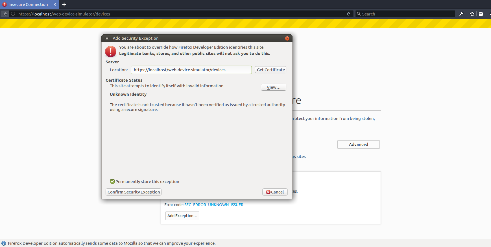

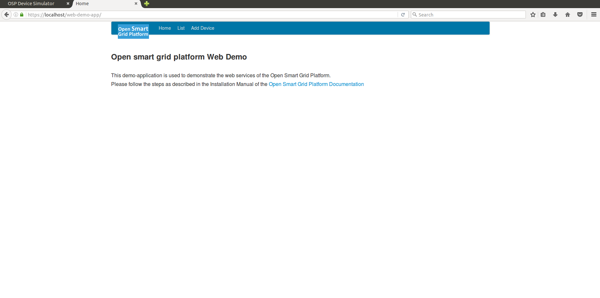

Click the Add a Device button in the Menu bar, and enter `SSLD_000-00-01` at the Device Identification field and press Submit.

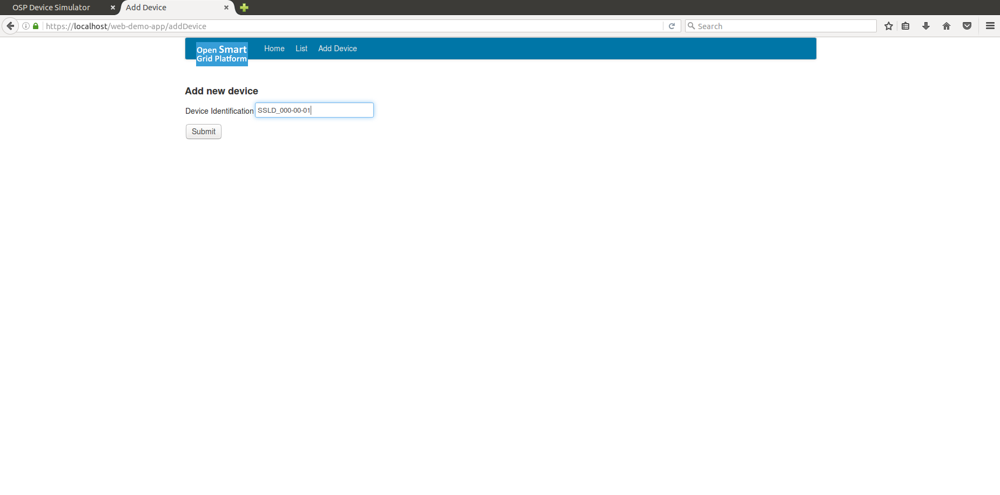

The following screen will appear, it shows that the device has been successfully added to the Platform.

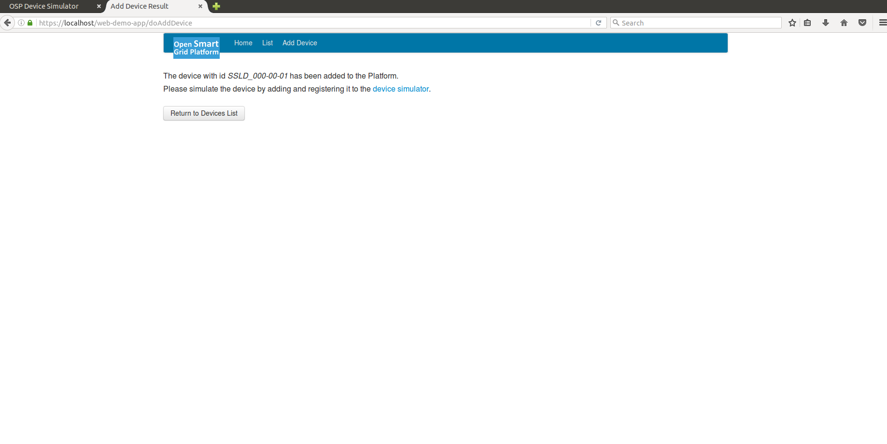

## Opening Device Simulator to Add a Device

In order to be able to use the SSLD-000-00-01 Device, the device needs to be simulated in the Device Simulator. To do this we have to create it. In the Firefox Browser, open the Device Simulator by going to the following URL:

```text
https://localhost/web-device-simulator/devices
```

Click Add Device 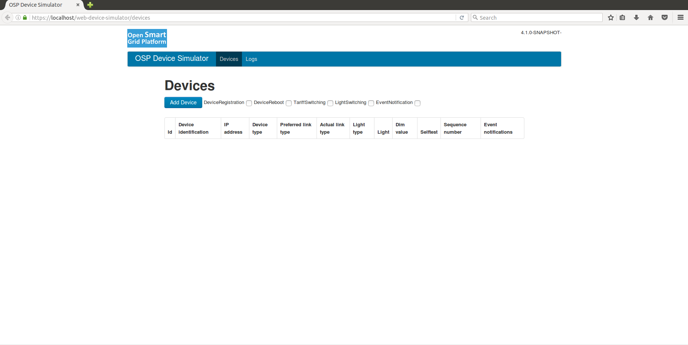

Fill out the fields like this:

* Device Identification: SSLD\_000-00-01
* IP Address: 127.0.0.1
* Device Type: SSLD
* Protocol: OSLP\_ELSTER

Click Create Device 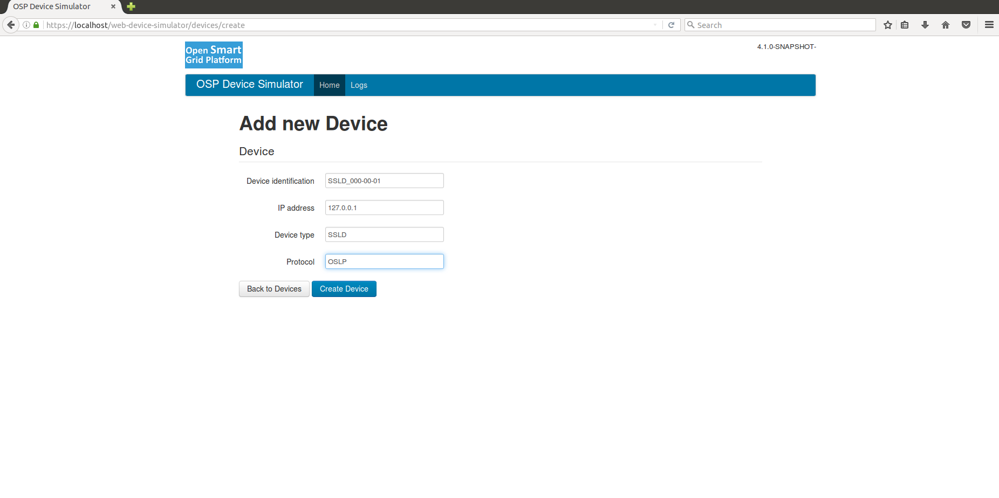

You should return to the Devices screen and see the message "Device with identification SSLD\_000-00-01 was created."

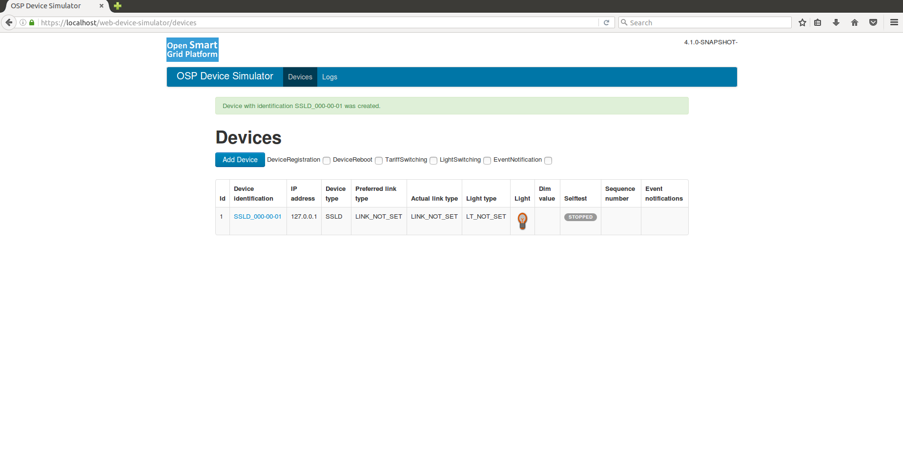

## Registering a Device

Now click on the newly created device and click the 'Register Device' button. After a while the message "Device identification with identification SSLD\_000-00-01 was registered at XXXXXXXX" appears. 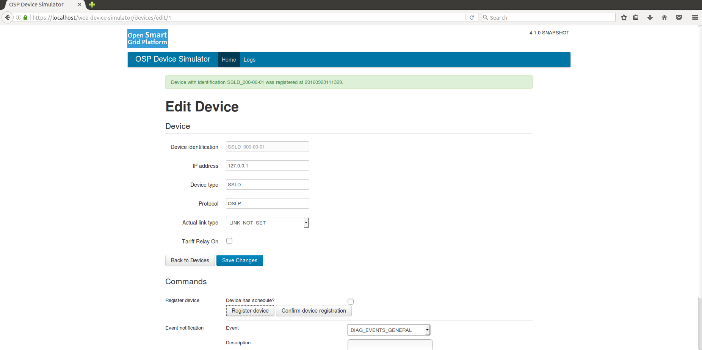

Then click the 'Confirm Registration' button. The message should read: "Device with identification SSLD\_000-00-01 was confirmed to be registered."

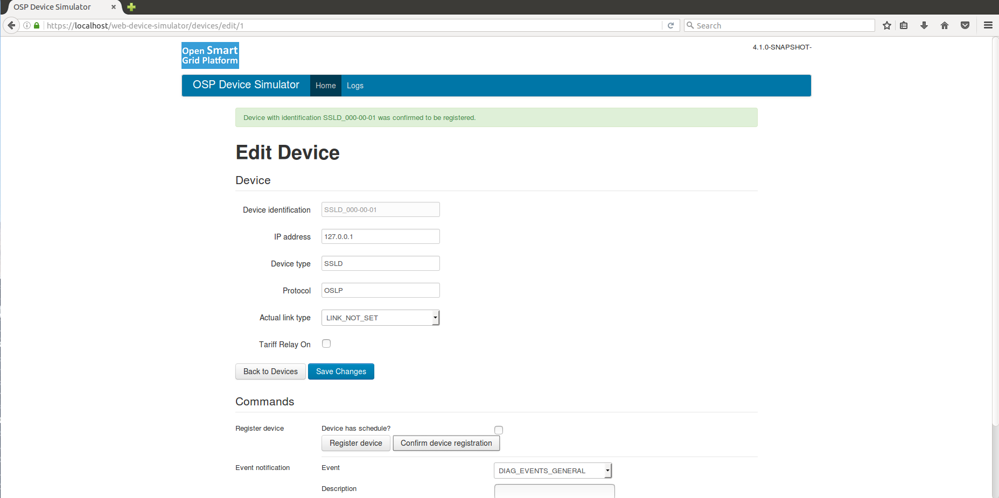

## Using 'SetLight' Switch the Light On

Now that the Device is known in the platform, and simulated in the Device-Simulator, the device can be used. Let's switch on the Light. Go to the Demo App and press the List button in the Menu. A list should appear, showing the device that has just been added using the Add Device button.

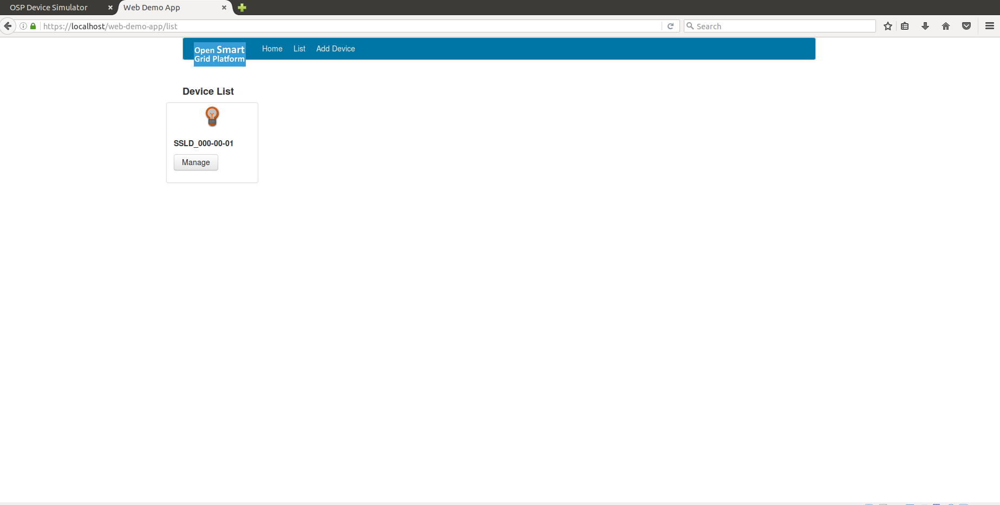

Click on the Manage button to access the Device Details.

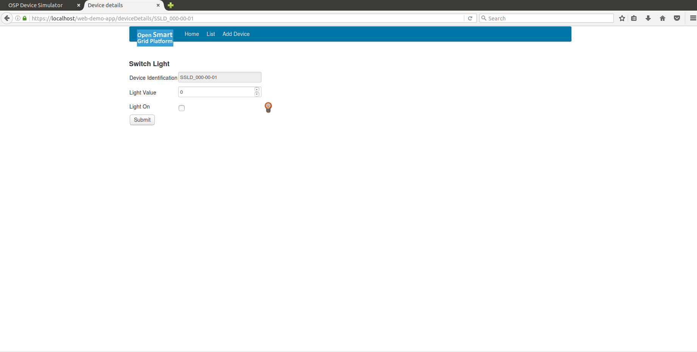

Switch on the Light by setting the Light Value to 100 and by checking the 'LightOn' checkbox \(as shown in the screenshot below\)

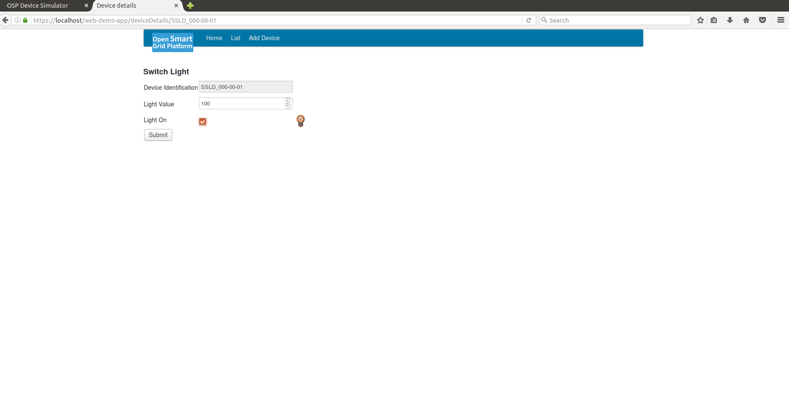

Hit submit to submit the request to the Platform. The following screen should appear:

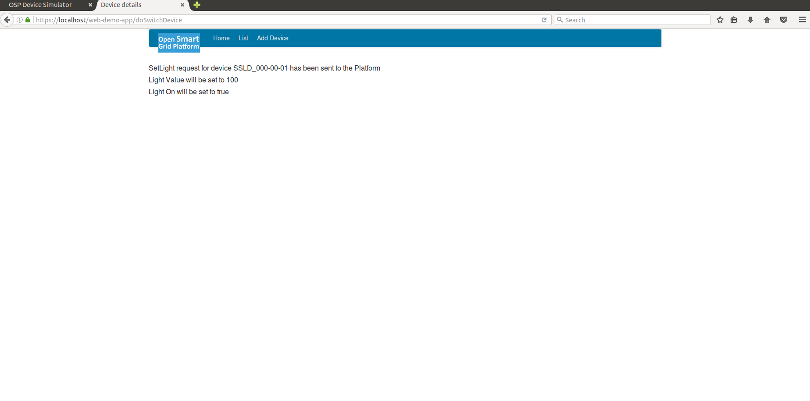

In the home screen of the OSLP device simulator, the lightbulb should light up for SSLD\_000-00-01. This means that the request succeeded.

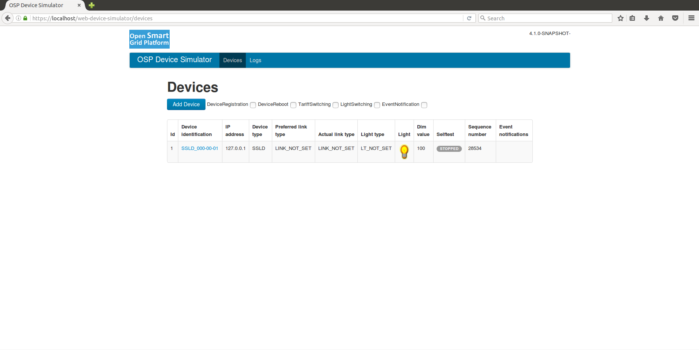

This step also concludes the installation manual.

