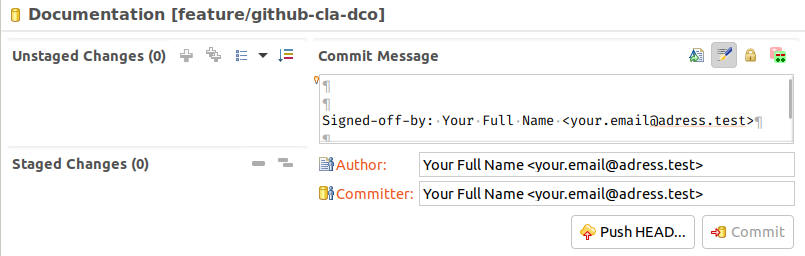
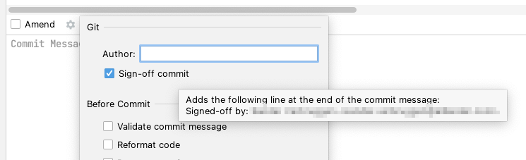

# GitHub configuration

## Basic configuration

In order to use git correctly you need to execute the following commands in a terminal if you haven't done so already:

```text
git config --global user.name "your full name"
git config --global user.email yourEmailAddress
```

## Contributors License Agreement \(CLA\)

GXF is covered by [LFE's CLA](https://easycla.lfx.linuxfoundation.org/). You have to sign/agree to it in order to commit changes. Most likely you will have to sign the individual agreement, unless you work for a licensed company.

Your pull request will detect if you haven't signed it yet and instructions are given on how to continue.

## Developer Certificate of Origin \(DCO\)

GXF uses GitHub's [DCO](https://github.com/apps/dco) application, so you need to sign-off your commits.

Your pull request will detect if you haven't signed-off your commits and instructions are given on how to continue.

### Command line

Just add `-s` to `git commit ...`.

Note this is the lower case `-s` \(short for `--signoff`\).

With `git merge ...` you can add `--signoff` as the shorter `-s` is used to set the merge strategy.

### Eclipse

In some versions of Eclipse you can click the button to "Add Signed-off-by" in the Git Staging view: 

### IntelliJ

In the commit toolwindow, click the settings icon and check the 'Sign-off commit' checkbox: 

