# Platform Setup

## Setting Up the Open Smart Grid Platform Development environment

This chapter describes all the steps needed to finalize the open smart grid platform development environment.

## Lombok

The platform uses Lombok annotations to generate extra Java methods. Without Lombok the project is not imported correctly by Maven and will not run. If you used the Vagrant installation method it should already be installed. To check if Lombok is properly installed to go `Help > About Eclipse IDE` and scroll down. Here you will see: `Lombok <version> "<version name>" is installed. https://projectlombok.org/`. If not follow this [guide](https://projectlombok.org/setup/eclipse) to install Lombok.

## Importing Maven Projects into Eclipse

Open Eclipse by clicking the shortcut on the Desktop and import the projects.

Go to File -&gt; Import -&gt; Existing Maven Projects, browse to folder `/home/dev/Sources/OSGP`

Import the projects from location `/home/dev/Sources/OSGP/open-smart-grid-platform`.

## Creating an Apache Tomcat Server

In Eclipse go to Window -&gt; Open Perspective -&gt; Debug 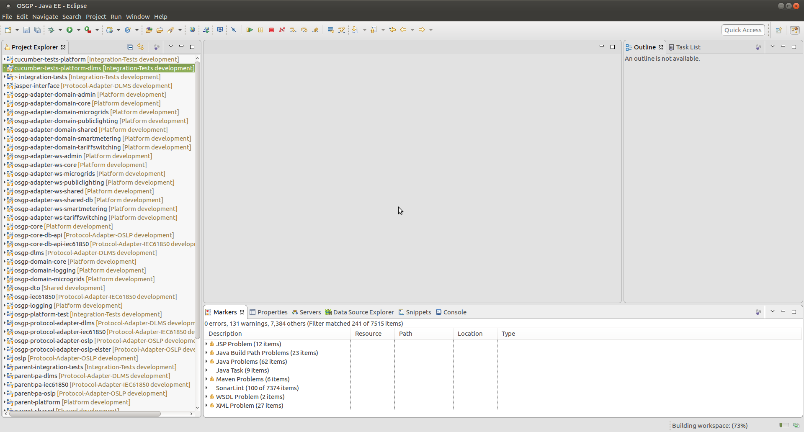

In the 'Debug' perspective, go to the 'Servers' view and add a new Apache Tomcat server, Tomcat is available in the folder `/home/dev/Tools/tomcat` \(or in another location if you didn't set up a VM using Vagrant, the latest version usually works fine\).

Click on Next 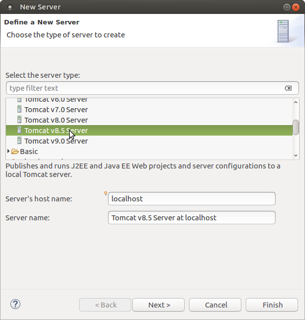

Click on Finish 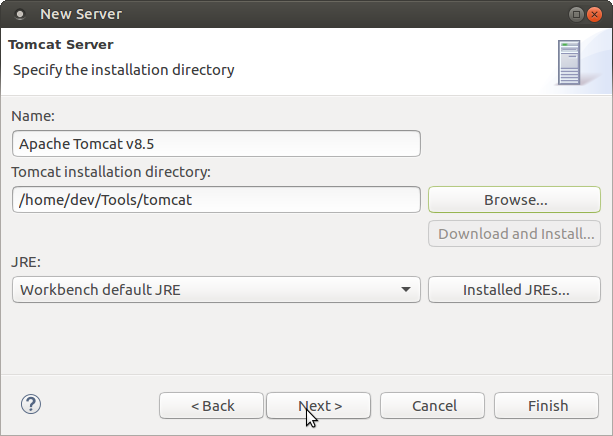

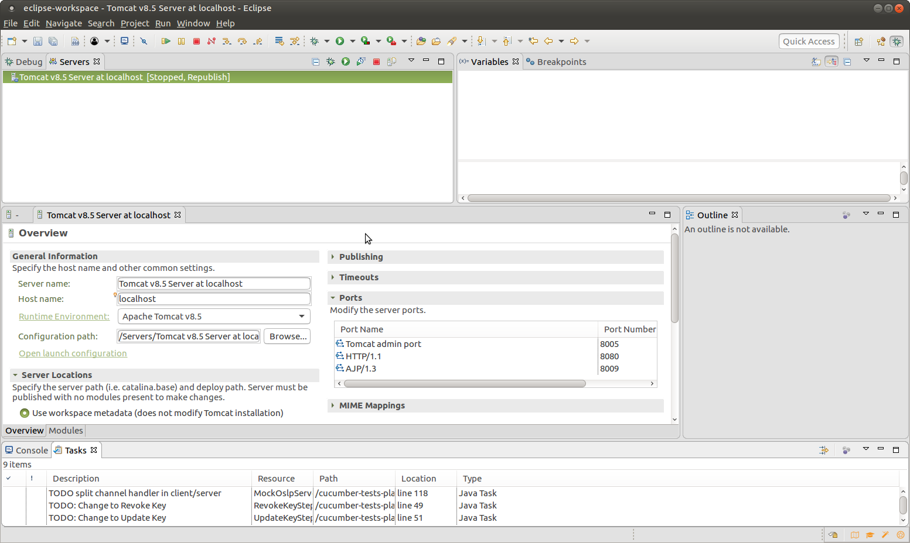 After adding the server, double click on the Tomcat server in the 'Servers' view and set the following configuration: under 'Timeouts' set 'Start' to 600 and 'Stop' to 30. 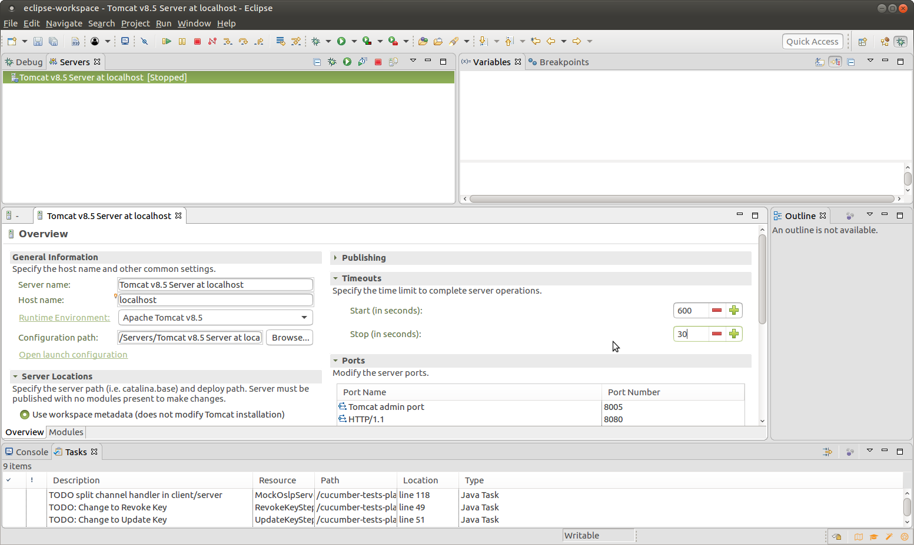

Make sure that Tomcat is using the correct Java Runtime Environment:

Click on 'Runtime Environment', 'Installed JREs' and click 'Add'. Choose 'next' with 'Standard VM' highlighted. Click 'Directory' and in the folder browser that is shown, use the key combination 'Ctrl + h' to show hidden files. Choose '.sdkman/candidates/java/current' and select 'Open' and 'Finish'. In the 'Installed JREs' screen, unselect the default JVM (which will be an Eclipse hotspot JVM) and select '/home/dev/.sdkman/candidates/java/current' then close the screen by clicking 'Apply and Close'. The last step is to choose the new JRE which was just added in the dropdown of the 'Runtime Environment' screen by selecting '17.0.5'. Click 'Finish' to apply.

Click on 'Open launch configuration', click on the 'Arguments' tab and add the following at the end of the 'VM arguments': `-Xms512m -Xmx2048m -Xss512k -XX:MaxMetaspaceSize=1024m -XX:+CMSClassUnloadingEnabled -XX:+UseConcMarkSweepGC -Dcom.sun.management.jmxremote=true` 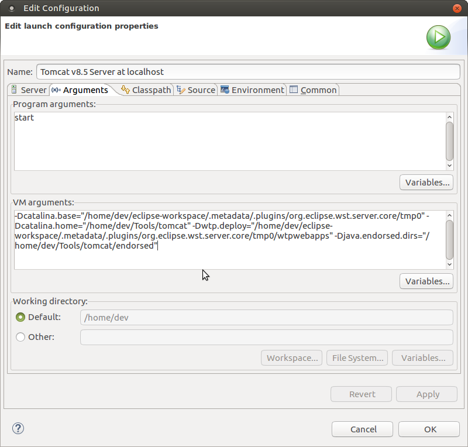

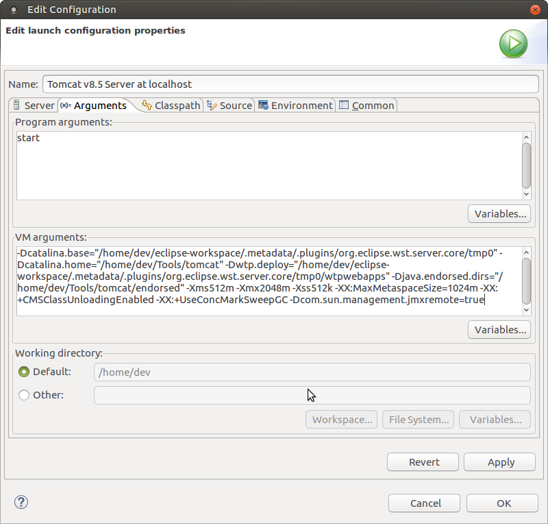

## Setting Up Apache Tomcat Server Context

All modules contain their own context.xml. In the module specific context.xml are the environment variables defined where the global and module specific configuration files are located. Default they will point to a location in _/etc/osp/_.

If you want to deviate from this, you might set up the context.xml in Tomcat to be able to redirect in one file to different locations. This is optional and not required. In order to use a custom context.xml, copy the entries in `/home/dev/Sources/OSGP/Config/tomcat/context.xml.sample` to the Tomcat context.xml in the eclipse Servers folder, to map configuration file names to file paths. 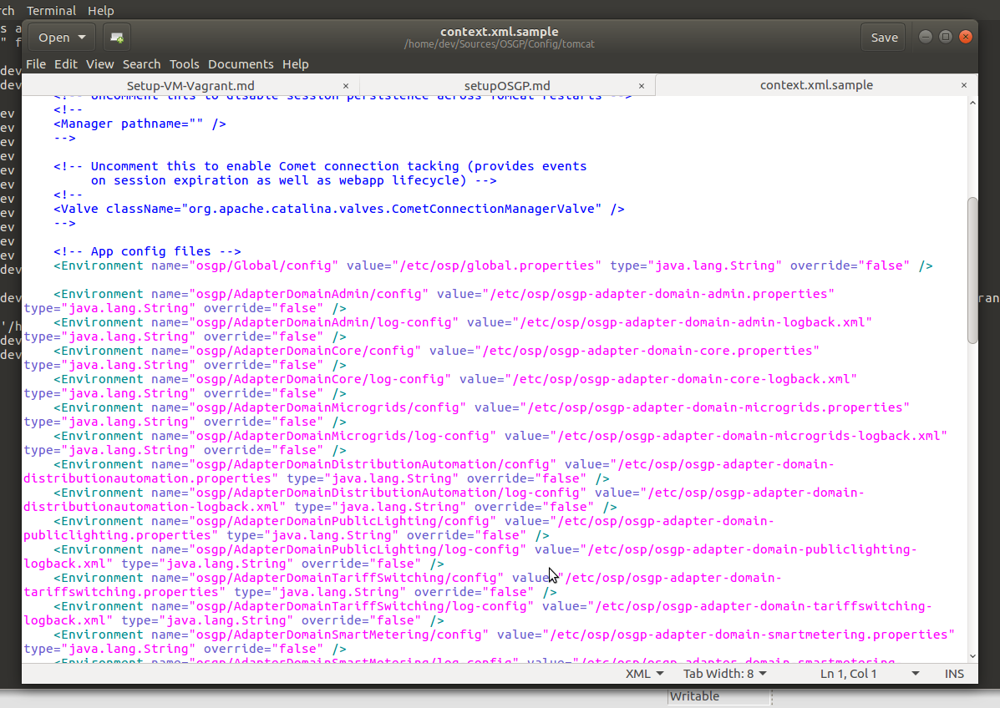

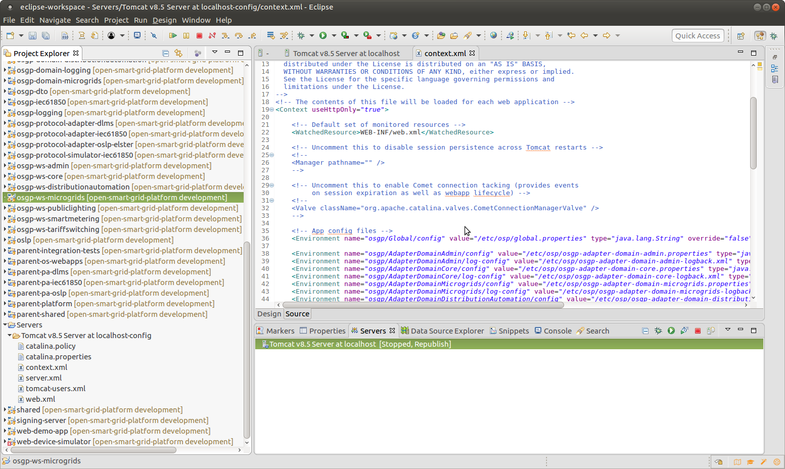

## Deploying all Open Smart Grid Platform components to Apache Tomcat Server

Continue by adding the Maven Projects to the Tomcat server by right clicking on the Tomcat server and choosing 'Add and Remove'. Select all available resources, except for osgp-protocol-simulator-61850 \(which is for advanced use and requires additional configuration\), then click the 'Add' button. 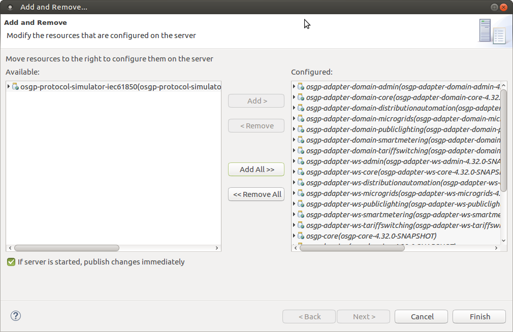 At this point, eclipse's auto-build should have built the projects, and the Tomcat server has been setup.

## Starting Apache ActiveMQ

Continue with starting Apache ActiveMQ. If you installed an environment as described with Vagrant, you can double click the ActiveMQ shortcut on the desktop.

Alternatively you can open a terminal and run the executable manually by using the following command: \(the executable can be found in the folder `/home/dev/Tools/activemq/bin/linux-x86-64`\)

```text
sudo ./activemq console
```

This starts ActiveMQ as a terminal process \(this way, ActiveMQ doesn't detach from the terminal and starts running as a daemon\). 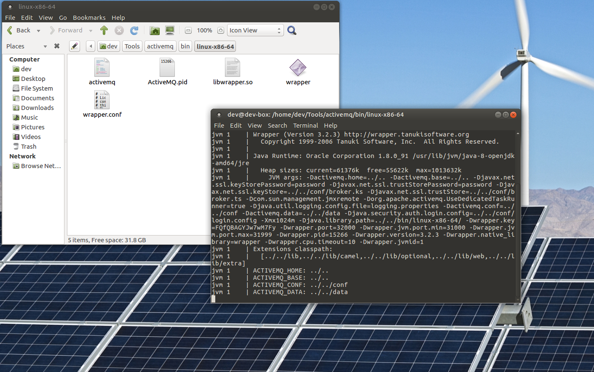

## Starting Apache Tomcat Server

With ActiveMQ running, the Tomcat server can be started. Go to Eclipse, go to the Servers tab in the Debug view, and right click on the Tomcat server and select 'Start'.

> **note:** In case of an error starting up for the very first time, try and start up only the module: 'osgp.core' first. This makes sure the database scripts are executed.

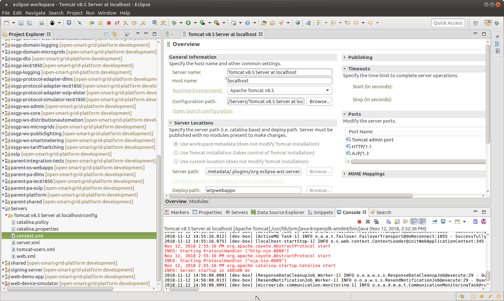

## Probe

This is an optional program that shows the status of the Tomcat resources in real time. To install Probe you can follow this [guide](https://github.com/psi-probe/psi-probe/wiki/InstallationApacheTomcat). Note that you need to add the Tomcat users in the guide's Security part in the tomcat-users.xml in your Eclipse environment. To download the war file go to: [https://github.com/psi-probe/psi-probe/releases](https://github.com/psi-probe/psi-probe/releases). You need to copy the war file to: `/home/dev/<your Eclipse workspace>/.metadata/.plugins/org.eclipse.wst.server.core/tmp0/webapps`.

## Starting pgAdmin III and Connect to PostgreSQL

Open pgAdminIII and configure a connection: choose the 'Add a connection to a server.' and fill out the fields using

* Host: localhost
* Port: 5432
* Username: osp\_admin
* Password: 1234


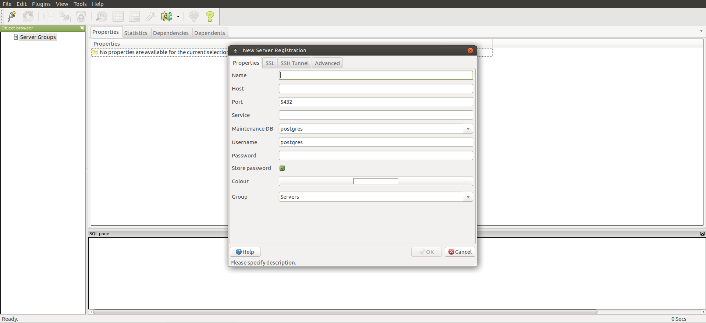

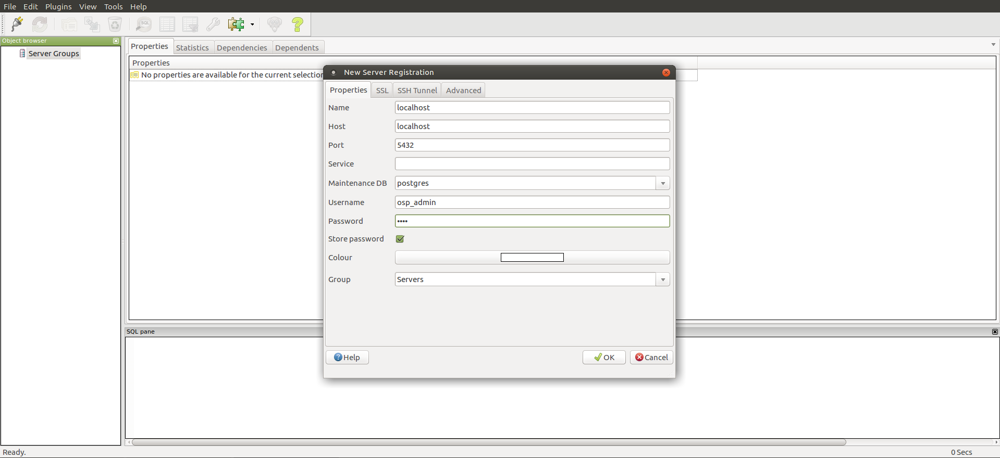

## Creating the 'test-org' Organization \(in database osgp-core\)

Run the script in `/home/dev/Sources/OSGP/Config/sql/create-test-org.sql` to insert 'test-org' organization into the organisation table of the osgp\_core database.

```text
psql -U osp_admin -h localhost -d osgp_core -f /home/dev/Sources/OSGP/Config/sql/create-test-org.sql
```

If asked for a password, enter `1234`

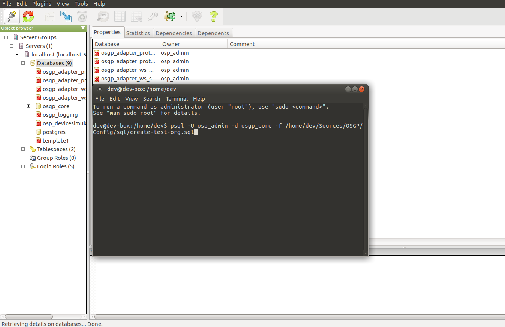

Go back to PgAdmin III, expand servers, select localhost -&gt; databases -&gt; osgp\_core -&gt; Schemas -&gt; public -&gt; Tables. Right click the organisation table and select to view data for the top 100 rows. Confirm that the test-org organisation has been added to the Database.

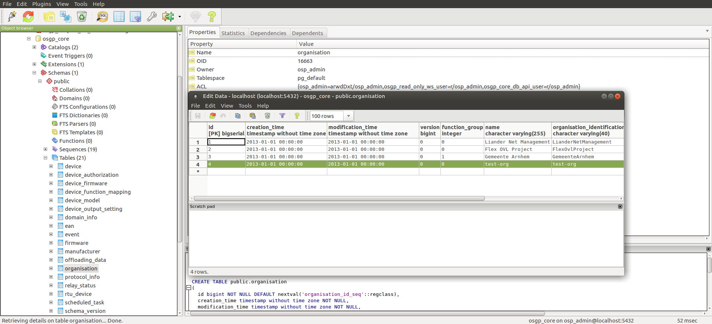

Now that everything has been set up, continue to the next chapter to start testing the Platform by sending it some requests.

